# 하이닉스 OLTP Mart 기반 Text2SQL 에이전트 설계 문서 v2

> **변경 이력**
> - v2.4 (2026-01-08): Multi-Fab UNION ALL 패턴 지원 추가, fab_id를 fab_ids 리스트로 확장
> - v2.3 (2026-01-08): Chainlit 채팅 UI 및 Multiturn 지원 추가, Google A2A 프로토콜 도입
> - v2.2 (2026-01-06): LangChain 1.x create_agent API 기반 구현으로 마이그레이션, Tool 정의 추가
> - v2.1 (2026-01-05): 테이블 suffix 규칙 상세화 (Site/Fab ID, 공정 suffix), 표준 단어사전 섹션 추가
> - v2 (2026-01-04): 구조 개선, Mermaid 다이어그램 추가, 세부사항 구체화

---

## 📌 개요

하이닉스 OLTP Mart 기반 Text2SQL 에이전트는 **2단계 에이전트 파이프라인**으로 설계한다:

1. **1단계**: 샘플 SQL 기반 유사 질의 추천
2. **2단계**: 전문가 사고과정 모사 Text2SQL

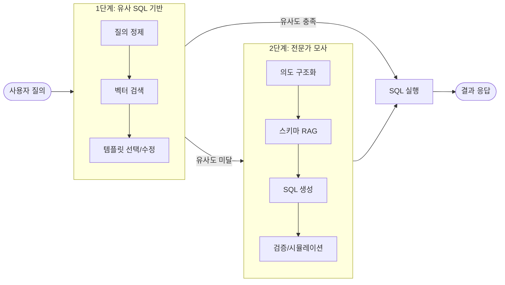

---

## 1. 전체 목표와 전제

### 1.1 대상 시스템

| 항목 | 상세 |
|------|------|
| **대상 DB** | 하이닉스 생산 OLTP Mart |
| **특징** | 수많은 테이블, 비정형 컬럼명, 외래키 거의 없음 |
| **테이블 네이밍 규칙** | 테이블명은 suffix로 `fab_id` 또는 `site_id+공정명` 조합을 사용 |
| **Site 종류** | IC (이천), CJ (청주), WX (우시) |
| **Fab ID (Site별)** | 이천: M10, M14, M16, R3, WLP / 청주: M11, M15, WLP3 / 우시: C2 |

#### 테이블 Suffix 규칙

테이블명의 suffix는 두 가지 유형으로 구분됩니다:

| Suffix 유형 | 형식 | 예시 |
|-------------|------|------|
| **유형 1** | fab_id만 사용 | `MES_BIZ_LOTHOLD_INF_M10`, `MES_BIZ_LOTHOLD_INF_M14` |
| **유형 2** | site_id + 공정명 조합 | `MES_BIZ_LOTHOLD_INF_ICWT`, `MES_BIZ_LOTHOLD_INF_CJPNT` |

**공정 Suffix 예시**:

| Suffix | Site | 공정명 | 설명 |
|--------|------|--------|------|
| ICWT | IC | 웨이퍼 테스트 | 이천 웨이퍼 테스트 공정 |
| CJRNDWT | CJ | R&D 웨이퍼 테스트 | 청주 연구개발 웨이퍼 테스트 |
| CJPNT | CJ | 패키징 AND 테스트 | 청주 패키징 AND 테스트 공정 |

> **예시 테이블**: `MES_BIZ_LOTHOLD_INF_XXX`
> - **설명**: 공정 진행 중인 로트(lot)에 hold 원인이 발생한 것에 대한 처리와 분석 정보 관리
> - XXX는 위의 suffix 규칙에 따라 `M10`, `ICWT` 등으로 대체됨

#### Multi-Fab UNION ALL 패턴

여러 Fab의 데이터를 동시에 조회할 때 **UNION ALL 패턴**을 사용합니다:

```sql
-- M10, M11, M14 Fab의 데이터를 동시에 조회
SELECT lot_id, fab_id, create_dt, yield_rate 
FROM MES_PRD_M10 
WHERE create_dt >= :start_date AND create_dt < :end_date
UNION ALL
SELECT lot_id, fab_id, create_dt, yield_rate 
FROM MES_PRD_M11 
WHERE create_dt >= :start_date AND create_dt < :end_date
UNION ALL
SELECT lot_id, fab_id, create_dt, yield_rate 
FROM MES_PRD_M14 
WHERE create_dt >= :start_date AND create_dt < :end_date
```

| 특징 | 설명 |
|------|------|
| **동일 구조** | 모든 SELECT 절의 컬럼 구조가 동일해야 함 |
| **동일 조건** | WHERE 조건은 모든 Fab 테이블에 동일하게 적용 |
| **템플릿 저장** | UNION ALL 패턴이 포함된 SQL을 하나의 템플릿으로 저장 |
| **Fab 조합별** | 자주 사용되는 Fab 조합(예: 이천 전체, Site별 등)마다 별도 템플릿 가능 |

> **참고**: Phase 1에서는 UNION ALL이 포함된 템플릿을 그대로 저장하고 검색합니다.
> Phase 2에서는 단일 Fab 템플릿에서 여러 Fab 조합으로 동적 확장하는 기능을 추가합니다.

### 1.2 기술 스택

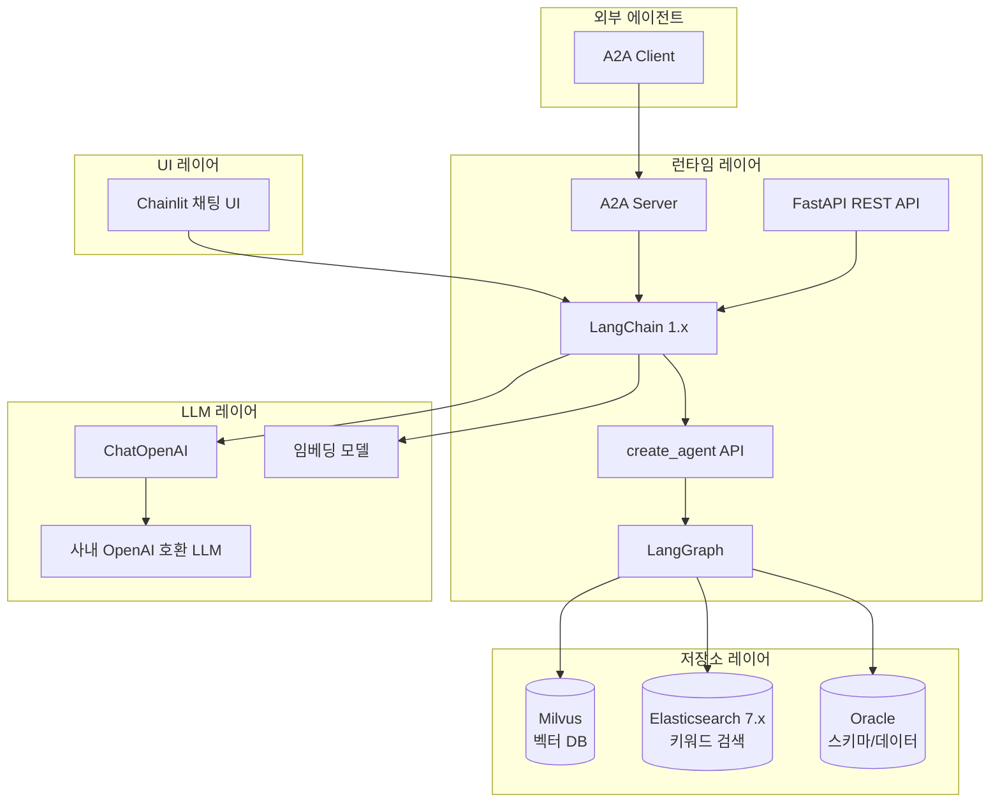

| 구분 | 기술 |
|------|------|
| **언어** | Python 3.10+ |
| **프레임워크** | LangChain >=1.2.0, LangGraph >=0.2.0 |
| **Agent API** | `create_agent` (LangChain 1.x) |
| **LLM 클라이언트** | `langchain_openai.ChatOpenAI` |
| **API** | FastAPI 기반 REST API |
| **채팅 UI** | Chainlit >=1.0.0 (Multiturn 대화 지원) |
| **에이전트 통신** | Google A2A 프로토콜 (Agent-to-Agent) |
| **벡터 DB** | Milvus |
| **검색 엔진** | Elasticsearch 7.x (BM25) |
| **데이터베이스** | Oracle (스키마/데이터 저장) |
| **LLM** | 사내 오픈소스 모델 (OpenAI 호환 HTTP API) |

### 1.3 설계 원칙

- **POC 우선**: 간단한 코드로 시작하여 점증적 구현
- **안전성 우선**: 검증된 SQL 템플릿 우선 사용
- **가정 금지**: 필수 정보 없이 LLM이 가정하여 처리하는 것 금지

---

## 2. 전체 아키텍처

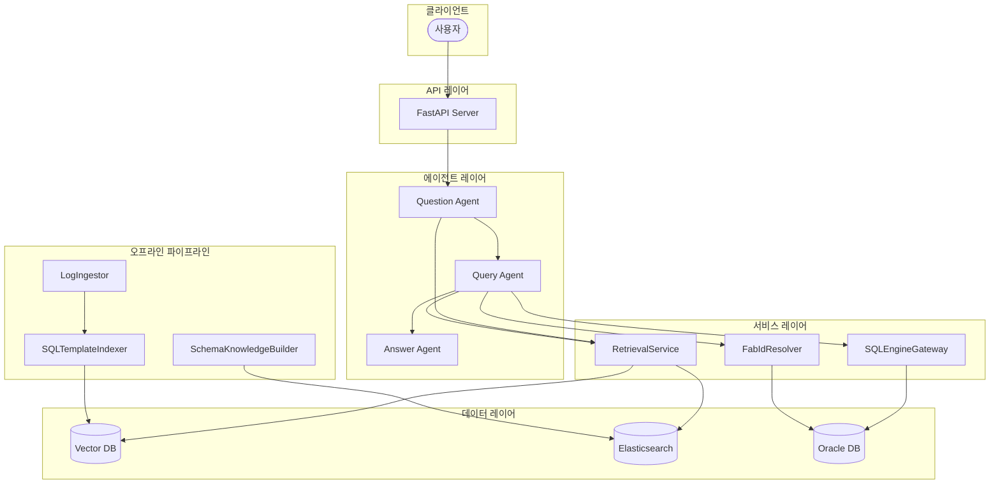

---

## 3. 데이터 레이어 상세

### 3.1 메타데이터 인덱스 구조

#### `meta_schema` 인덱스 (테이블/컬럼 스키마)

```json
{
  "object_type": "table | column",
  "db_name": "string",
  "schema_name": "string", 
  "table_name": "string",
  "table_comment": "string",
  "column_name": "string (nullable)",
  "column_comment": "string (nullable)",
  "data_type": "string (nullable)",
  "domain_tags": ["공정", "제품", "설비"],
  "business_terms": ["string"],
  "updated_at": "datetime"
}
```

#### `meta_glossary` 인덱스 (비즈니스 사전)

```json
{
  "term_id": "string",
  "term_type": "process | product | equipment",
  "term_code": "string",
  "term_name": "string",
  "aliases": ["string"],
  "description": "string",
  "related_tables": ["string"],
  "related_columns": ["string"],
  "business_rules": "string",
  "last_updated_at": "datetime"
}
```

#### `sql_logs` 인덱스 (SQL 로그)

```json
{
  "sql_id": "string",
  "sql_text": "string",
  "sql_text_normalized": "string (바인딩 값 제거)",
  "db_name": "string",
  "schema_name": "string",
  "tables": ["string"],
  "columns": ["string"],
  "operation": "SELECT | INSERT | UPDATE | DELETE",
  "created_at": "datetime",
  
  "exec_count": "integer",
  "rows_avg": "float",
  "exec_time_avg_ms": "float",
  "exec_time_p95_ms": "float",
  "last_executed_at": "datetime",
  "error_count": "integer",
  "last_error_at": "datetime",
  
  "business_intent": "string (사람이 단 요약)",
  "domain_tags": ["string"],
  "user_group": "string",
  "system_name": "string"
}
```

### 3.2 검색 전략

| 대상 | 검색 방식 |
|------|-----------|
| **스키마** | BM25 텍스트 검색 + domain_tags 필터링 |
| **비즈니스 사전** | term_code 정확 매칭 우선 + multi_match 조합 |
| **SQL 로그** | business_intent/sql_text_normalized multi_match + exec_count 정렬 |

### 3.3 표준 데이터 단어사전

OLTP Mart에서 사용되는 표준 데이터 단어사전으로, CSV 형태로 관리됩니다.

#### 단어사전 구조

| 항목 | 설명 |
|------|------|
| **물리명** | 테이블/컬럼의 물리적 명칭 |
| **물리의미** | 물리명의 의미/약어 풀이 |
| **설명** | 상세 설명 및 비즈니스 컨텍스트 |

#### 활용 용도

- **키워드 검색**: 사용자 질의어와 물리명/물리의미 매칭
- **테이블명 suffix 정보 탐색**: suffix 결정에 필요한 정보 조회
- **비즈니스 용어 ↔ 물리명 매핑**: 자연어와 DB 스키마 간 연결

---

## 4. 오프라인 파이프라인

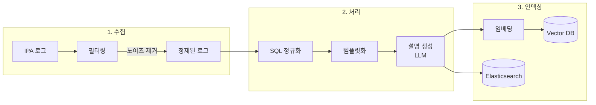

### 4.1 로그 수집 & 필터링

**제외 대상**:
- 실패 쿼리 (error_count > 0)
- DDL/DML (CREATE, ALTER, DROP, INSERT, UPDATE, DELETE)
- 배치성 내부 쿼리

**우선 선정 기준**:
- 자주 실행되는 TOP-N 쿼리 (exec_count 기준)
- 분석적 쿼리 (집계/윈도우 함수 포함)

### 4.2 SQL 정규화/템플릿화

리터럴 파라미터를 placeholder로 치환:

```sql
-- Before
SELECT * FROM MES_PRD_M11 WHERE lot_id = 'LOT001' AND create_dt > '2024-01-01'

-- After
SELECT * FROM MES_PRD_M11 WHERE lot_id = :1 AND create_dt > :2
```

### 4.3 임베딩 문서 생성

각 쿼리당 생성되는 문서 구조:

```json
{
  "sql_template": "SELECT ...",
  "tables": ["MES_PRD_M11", "MES_EQP_M11"],
  "columns": ["lot_id", "create_dt", "yield_rate"],
  "description": "M11 fab의 월별 불량률을 공정별로 집계하는 쿼리"
}
```

---

## 5. 런타임 컴포넌트

### 5.1 API 서버

```python
# 예시 엔드포인트 구조
POST /api/v1/query          # 자연어 질의 처리
POST /api/v1/query/execute  # SQL 직접 실행
GET  /api/v1/session/{id}   # 세션 상태 조회
POST /api/v1/feedback       # 피드백 제출
```

### 5.2 LLM API 클라이언트

LangChain `ChatOpenAI`를 사용하여 사내 OpenAI 호환 API에 연결합니다:

```python
from langchain_openai import ChatOpenAI

chat_model = ChatOpenAI(
    base_url="http://internal-llm-server/v1",
    api_key="internal-api-key",
    model="internal-model-name",
    temperature=0.1,
    max_tokens=4096,
)
```

| 설정 | 값 (예시) |
|------|-----------|
| **모델명** | (사내 모델명) |
| **Temperature** | 0.0 ~ 0.3 (SQL 생성 시 낮게) |
| **Max Tokens** | 4096 |
| **시스템 프롬프트** | Agent별 개별 설정 (create_agent의 prompt 파라미터) |

### 5.3 SQL 실행 엔진

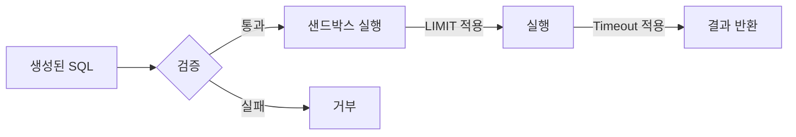

**보안 정책**:
- SELECT 쿼리만 허용
- 화이트리스트 패턴 검사
- Row limit 강제 (기본값: 1000)
- Timeout 강제 (기본값: 30초)

### 5.4 Fab ID 조회 Tool

사용자가 fab_id 없이 조회 시도할 때 자동으로 fab_id를 결정합니다.
LangChain의 `@tool` 데코레이터를 사용하여 정의됩니다:

```python
from langchain.tools import tool

@tool
async def get_fab_id_from_eqp_id(eqp_id: str) -> str:
    """설비 ID에서 Fab ID를 조회합니다."""
    ...

@tool
async def get_fab_id_from_lot_id(lot_id: str) -> str:
    """Lot ID에서 Fab ID를 조회합니다."""
    ...

@tool
async def get_fab_id_from_product_id(product_id: str) -> str:
    """제품 ID에서 Fab ID를 조회합니다."""
    ...
```

#### 전체 Tool 목록

| Tool | 용도 | 사용 Agent |
|------|------|------------|
| `search_sql_templates` | SQL 템플릿 벡터 검색 | Query Agent |
| `search_schema_metadata` | 스키마 메타데이터 검색 | Query Agent |
| `search_glossary` | 비즈니스 용어 사전 검색 | Question Agent |
| `get_fab_id_from_lot_id` | Lot ID → Fab ID 조회 | Query Agent |
| `get_fab_id_from_eqp_id` | 설비 ID → Fab ID 조회 | Query Agent |
| `get_fab_id_from_product_id` | 제품 ID → Fab ID 조회 | Query Agent |
| `execute_sql` | SQL 실행 | Answer Agent |
| `validate_sql` | SQL 검증 (EXPLAIN) | Query Agent |

---

## 6. 에이전트 아키텍처

### 6.0 LangChain create_agent 기반 구현

모든 에이전트는 LangChain 1.x의 `create_agent` API를 사용하여 구현됩니다:

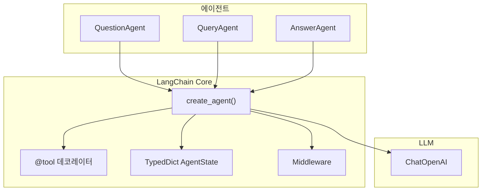

#### AgentState 정의

```python
from typing import TypedDict
from langchain.agents import AgentState

class Text2SQLState(AgentState):
    """Text2SQL 에이전트 전체 상태."""
    query_intent: dict | None
    sql: str | None
    result: dict | None
    needs_clarification: bool
    clarifying_question: str | None
    needs_stage2: bool
    stage2_reason: str | None
```

#### Tool 정의

```python
from langchain.tools import tool

@tool
async def search_sql_templates(query: str) -> list[dict]:
    """SQL 템플릿을 검색합니다."""
    ...

@tool
async def get_fab_id_from_lot_id(lot_id: str) -> str:
    """Lot ID에서 Fab ID를 조회합니다."""
    ...

@tool
async def execute_sql(sql: str) -> dict:
    """SQL을 실행하고 결과를 반환합니다."""
    ...
```

### 6.0.1 에이전트 흐름 다이어그램

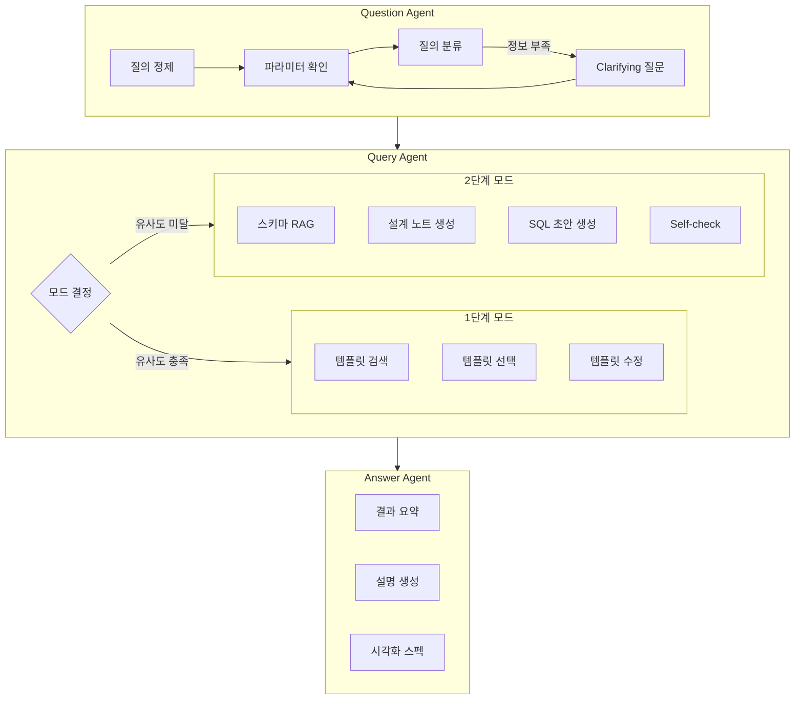

### 6.1 Question Agent

**역할**: 사용자 자연어 질의 정제 및 필수 정보 수집

**질의 분류 기준**:

| 유형 | 설명 | 예시 |
|------|------|------|
| **일반** | 쿼리 튜닝, 문법 변경 | "이 쿼리 속도 개선해줘" |
| **검색** | 테이블/컬럼 찾기 | "불량률 관련 테이블 뭐 있어?" |
| **생성** | 조건에 맞는 SQL 생성 | "지난달 M11 수율 보여줘" |
| **개선** | SQL 오류 수정 | "이 쿼리 에러 수정해줘" |
| **복합** | 위 유형의 조합 | "A 테이블 찾아서 B 조회해줘" |

**핵심 원칙**:
> ⚠️ SQL 생성을 위한 필수 정보가 없는 상태에서 LLM이 특정 상황을 '가정'하여 처리하는 것을 **금지**

### 6.2 Query Agent

#### 1단계 모드 (유사 SQL 기반)

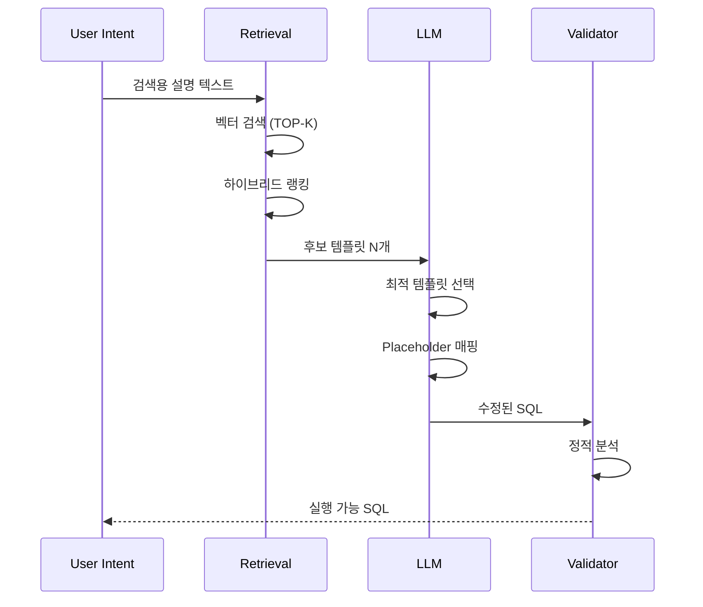

**핵심 포인트**:
- "검색용 쿼리 설명 텍스트" 품질이 핵심 KPI
- 유사도 임계값 미달 시 SQL 생성 중단
- 새로운 조인/테이블 추가는 2단계로 위임

#### 2단계 모드 (전문가 사고 모사)

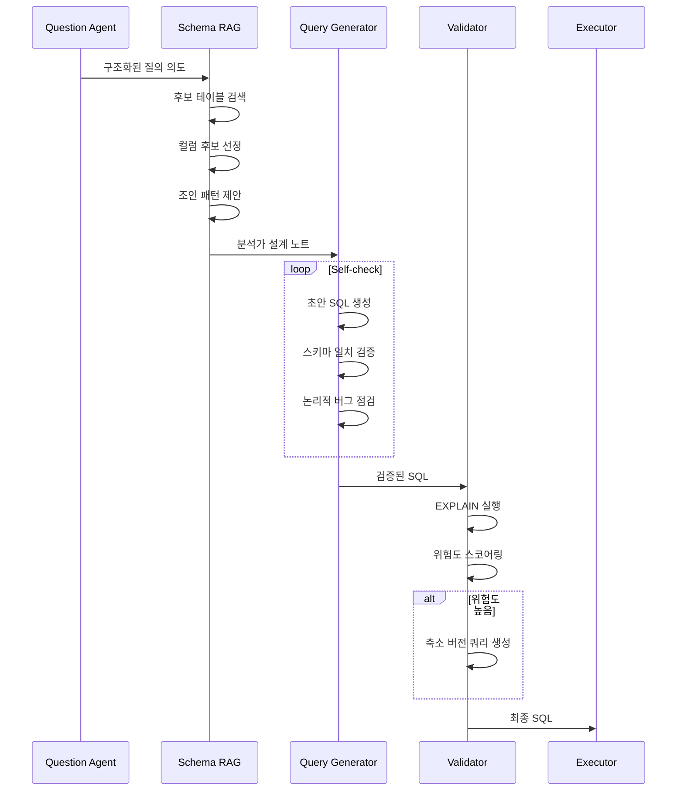

**분석가 설계 노트 구조**:

```json
{
  "tables": [
    {"name": "MES_PRD_M11", "role": "주 테이블", "description": "..."}
  ],
  "join_plan": [
    {"from": "MES_PRD_M11", "to": "MES_EQP_M11", "key": "eqp_id", "type": "LEFT"}
  ],
  "filters": ["fab_id = 'M11'", "create_dt >= :start_date"],
  "aggregation": {"level": "daily", "columns": ["yield_rate"]}
}
```

### 6.3 Answer Agent

**역할**: SQL 결과를 사용자 친화적으로 변환

**출력 형식**:
- 결과 테이블 (Markdown)
- 자연어 요약
- 시각화 스펙 (선택적)

```json
{
  "summary": "지난 달 M11 라인의 일일 불량률은 평균 2.3%였습니다.",
  "visualization": {
    "type": "line_chart",
    "x_axis": "date",
    "y_axis": "defect_rate",
    "title": "M11 일일 불량률 추이"
  }
}
```

---

## 7. 1단계 → 2단계 전환 로직

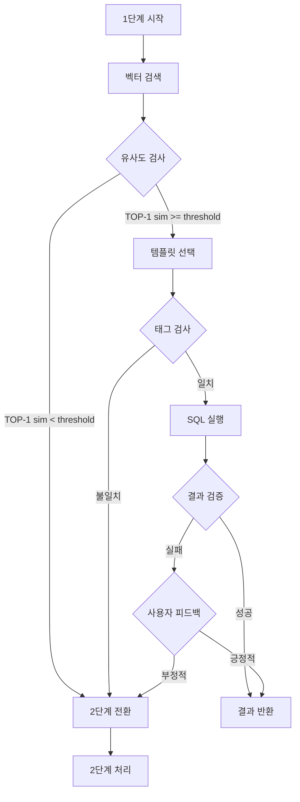

**전환 조건**:

| 조건 유형 | 상세 |
|-----------|------|
| **유사도 기반** | TOP-1 cosine similarity < threshold (기본: 0.8) |
| **태그 불일치** | 템플릿의 집계 granularity가 질의 의도와 다름 |
| **실행 실패** | 1단계 템플릿들로 생성된 SQL 전부 실패 |
| **사용자 피드백** | 결과가 맞지 않다는 명시적 피드백 |

---

## 8. 모듈 구조

### 8.1 주요 모듈

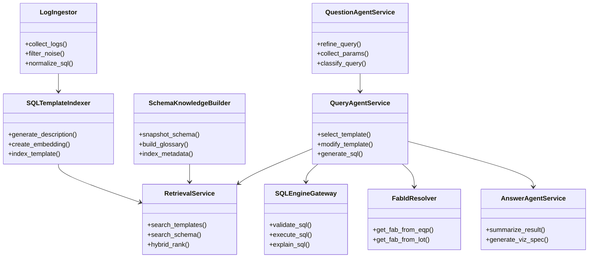

### 8.2 추상화 레이어

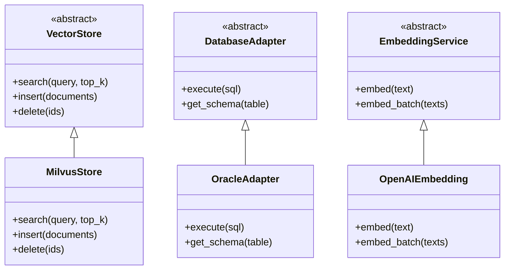

---

## 9. 설정 및 파라미터

### 9.1 시스템 설정

| 파라미터 | 기본값 | 설명 |
|----------|--------|------|
| `SIMILARITY_THRESHOLD` | 0.8 | 1단계 유사도 임계값 |
| `TOP_K_TEMPLATES` | 5 | 검색할 템플릿 개수 |
| `SQL_ROW_LIMIT` | 1000 | SQL 결과 row 상한 |
| `SQL_TIMEOUT_SEC` | 30 | SQL 실행 timeout |
| `SESSION_TTL_MIN` | 60 | 세션 만료 시간 |
| `MAX_CLARIFY_TURNS` | 3 | Clarifying 질문 최대 횟수 |
| `MAX_SELF_CHECK_LOOPS` | 3 | Self-check 최대 반복 횟수 |

### 9.2 LLM 설정 (Agent별)

| Agent | Temperature | Max Tokens | 특이사항 |
|-------|-------------|------------|----------|
| Question Agent | 0.3 | 1024 | 파라미터 추출용 |
| Query Agent (1단계) | 0.0 | 2048 | 정확한 템플릿 매칭 |
| Query Agent (2단계) | 0.1 | 4096 | SQL 생성용 |
| Answer Agent | 0.5 | 2048 | 자연어 요약용 |

---

## 10. 확장 로드맵

### Phase 1: MVP
- [ ] 1단계 에이전트 (유사 SQL 기반)
- [ ] 핵심 데이터 파이프라인
- [ ] 기본 API 엔드포인트
- [ ] 기본 Fab 지원 (Multi-Fab UNION ALL 템플릿 포함)

### Phase 2: 안정화
- [ ] Fab 조합 동적 생성 지원 (템플릿에서 Fab 확장)
- [ ] Fab ID 자동 조회 Tool
- [ ] 2단계 에이전트 (전문가 모사)
- [ ] 피드백 수집

### Phase 3: 고도화
- [ ] 복합 질의 처리
- [ ] 결과 시각화
- [ ] 모니터링/대시보드
- [ ] LLM 파인튜닝

### Phase 4: 통합 및 확장
- [ ] Chainlit 채팅 UI 도입
- [ ] Multiturn 대화 지원
- [ ] A2A 프로토콜 서버 구현
- [ ] A2A 클라이언트 샘플 제공

---

## 11. Chainlit 채팅 UI

### 11.1 개요

에이전트를 단독으로 실행하고 테스트할 수 있도록 **Chainlit** 라이브러리를 사용하여 웹 기반 채팅 UI를 제공합니다. Chainlit은 Python 기반의 오픈소스 프레임워크로, LangChain/LangGraph와 원활하게 통합됩니다.

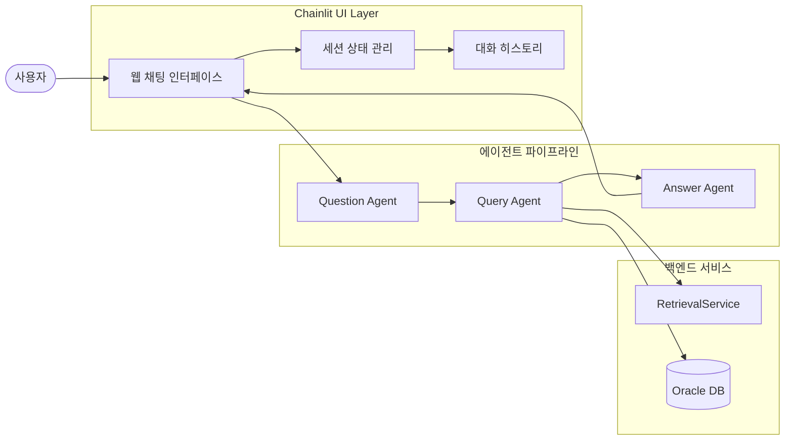

### 11.2 디렉토리 구조

```
src/text2sql/ui/
├── __init__.py
├── app.py              # Chainlit 메인 앱 (엔트리포인트)
├── handlers.py         # 메시지 핸들러 및 콜백
└── session_manager.py  # 세션 상태 관리

.chainlit/
└── config.toml         # Chainlit UI 설정
```

### 11.3 핵심 구현

#### Chainlit 앱 구조

```python
import chainlit as cl
from text2sql.agents import QuestionAgent, QueryAgent, AnswerAgent

@cl.on_chat_start
async def on_chat_start():
    """채팅 세션 시작 시 초기화."""
    # 에이전트 인스턴스 생성 및 세션에 저장
    cl.user_session.set("question_agent", QuestionAgent())
    cl.user_session.set("query_agent", QueryAgent())
    cl.user_session.set("answer_agent", AnswerAgent())
    cl.user_session.set("conversation_history", [])
    
    await cl.Message(
        content="안녕하세요! Text2SQL 에이전트입니다. 데이터 조회를 도와드리겠습니다."
    ).send()

@cl.on_message
async def on_message(message: cl.Message):
    """사용자 메시지 처리."""
    # 대화 히스토리 업데이트
    history = cl.user_session.get("conversation_history")
    history.append({"role": "user", "content": message.content})
    
    # 에이전트 파이프라인 실행
    question_agent = cl.user_session.get("question_agent")
    query_agent = cl.user_session.get("query_agent")
    answer_agent = cl.user_session.get("answer_agent")
    
    # 처리 결과 반환
    response = await process_query(
        message.content,
        history,
        question_agent,
        query_agent,
        answer_agent
    )
    
    await cl.Message(content=response).send()
```

#### Multiturn 대화 상태 관리

```python
class ConversationState:
    """Multiturn 대화 상태 관리."""
    
    def __init__(self):
        self.history: list[dict] = []
        self.pending_clarification: bool = False
        self.context: dict = {}
    
    def add_turn(self, role: str, content: str):
        """대화 턴 추가."""
        self.history.append({
            "role": role,
            "content": content,
            "timestamp": datetime.now().isoformat()
        })
    
    def get_context_for_agent(self) -> dict:
        """에이전트에 전달할 컨텍스트 생성."""
        return {
            "history": self.history[-10:],  # 최근 10턴
            "pending_clarification": self.pending_clarification,
            **self.context
        }
```

### 11.4 Chainlit 설정

`.chainlit/config.toml` 파일:

```toml
[project]
enable_telemetry = false

[UI]
name = "Text2SQL Agent"
default_theme = "dark"
show_readme_as_default = false

[UI.theme]
primary_color = "#1E88E5"
background_color = "#1a1a2e"
font_family = "Inter, sans-serif"

[features]
prompt_playground = false
multi_modal = false
```

### 11.5 실행 방법

```bash
# 의존성 설치
pip install chainlit>=1.0.0

# Chainlit 앱 실행
chainlit run src/text2sql/ui/app.py --port 8501

# 개발 모드 (자동 리로드)
chainlit run src/text2sql/ui/app.py --port 8501 --watch
```

### 11.6 Multiturn 대화 흐름

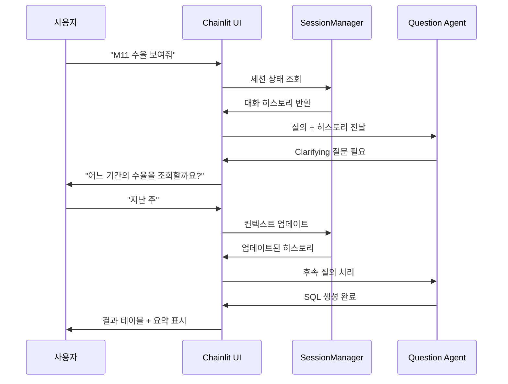

---

## 12. A2A 프로토콜 (Agent-to-Agent)

### 12.1 개요

타 에이전트 시스템에서 Text2SQL 에이전트와 통신할 수 있도록 **Google A2A (Agent-to-Agent) 프로토콜**을 도입합니다. A2A는 다양한 AI 에이전트 간의 표준화된 통신을 가능하게 하는 개방형 프로토콜입니다.

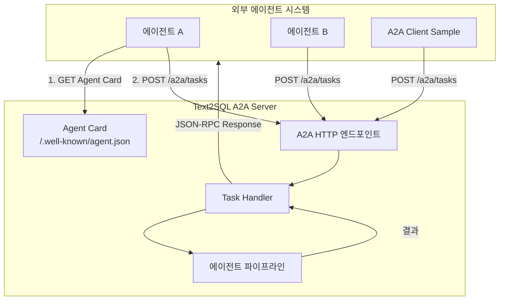

### 12.2 A2A 프로토콜 핵심 개념

| 개념 | 설명 |
|------|------|
| **Agent Card** | 에이전트의 기능, 스킬, 엔드포인트 URL, 인증 요구사항을 설명하는 메타데이터 (`/.well-known/agent.json`) |
| **Task** | 에이전트가 수행하는 작업 단위 (생성/조회/취소 가능) |
| **Message** | Task 내에서 교환되는 메시지 (사용자 입력, 에이전트 응답) |
| **Artifact** | Task의 결과물 (생성된 SQL, 실행 결과, 시각화 스펙 등) |
| **Skill** | 에이전트가 제공하는 기능 단위 |

### 12.3 A2A Server 구현

#### 디렉토리 구조

```
src/text2sql/a2a/
├── __init__.py
├── server.py           # A2A HTTP 엔드포인트 (FastAPI 라우터)
├── agent_card.py       # Agent Card 생성 및 관리
├── task_handler.py     # Task 처리 로직
├── models.py           # A2A 데이터 모델 (Pydantic)
└── utils.py            # 유틸리티 함수
```

#### Agent Card 스키마

`/.well-known/agent.json`:

```json
{
  "name": "Text2SQL Agent",
  "description": "하이닉스 OLTP Mart 기반 자연어 SQL 변환 에이전트",
  "version": "1.0.0",
  "protocol_version": "0.1",
  "url": "https://text2sql.hynix.internal",
  "authentication": {
    "schemes": ["bearer"]
  },
  "skills": [
    {
      "id": "text2sql",
      "name": "Text to SQL",
      "description": "자연어 질의를 SQL로 변환하고 실행 결과를 반환합니다",
      "input_modes": ["text"],
      "output_modes": ["text", "data"]
    },
    {
      "id": "schema_search",
      "name": "Schema Search",
      "description": "테이블/컬럼 스키마를 검색합니다",
      "input_modes": ["text"],
      "output_modes": ["text"]
    }
  ],
  "capabilities": {
    "streaming": false,
    "push_notifications": false
  }
}
```

#### A2A 엔드포인트 구현

```python
from fastapi import APIRouter, Request
from pydantic import BaseModel
from typing import Any

router = APIRouter(prefix="/a2a")

class TaskRequest(BaseModel):
    """A2A Task 요청."""
    jsonrpc: str = "2.0"
    method: str
    params: dict[str, Any]
    id: str | int

class TaskResponse(BaseModel):
    """A2A Task 응답."""
    jsonrpc: str = "2.0"
    result: dict[str, Any] | None = None
    error: dict[str, Any] | None = None
    id: str | int

@router.get("/.well-known/agent.json")
async def get_agent_card():
    """Agent Card 반환."""
    return generate_agent_card()

@router.post("/tasks")
async def handle_task(request: TaskRequest) -> TaskResponse:
    """A2A Task 처리."""
    if request.method == "tasks/create":
        return await create_task(request.params, request.id)
    elif request.method == "tasks/get":
        return await get_task(request.params, request.id)
    elif request.method == "tasks/cancel":
        return await cancel_task(request.params, request.id)
    else:
        return TaskResponse(
            id=request.id,
            error={"code": -32601, "message": "Method not found"}
        )

async def create_task(params: dict, request_id: str | int) -> TaskResponse:
    """새 Task 생성 및 처리."""
    task_id = generate_task_id()
    message = params.get("message", {})
    user_query = message.get("content", "")
    
    # Text2SQL 파이프라인 실행
    result = await execute_text2sql_pipeline(user_query)
    
    return TaskResponse(
        id=request_id,
        result={
            "task_id": task_id,
            "status": "completed",
            "artifacts": [
                {
                    "type": "text",
                    "content": result.summary
                },
                {
                    "type": "data",
                    "content": {
                        "sql": result.sql,
                        "rows": result.rows,
                        "columns": result.columns
                    }
                }
            ]
        }
    )
```

### 12.4 A2A Client Sample

#### 디렉토리 구조

```
samples/a2a_client/
├── README.md           # 사용 가이드
├── requirements.txt    # 의존성
├── client.py           # A2A 클라이언트 구현
└── example.py          # 사용 예제
```

#### 클라이언트 구현

`samples/a2a_client/client.py`:

```python
import httpx
from typing import Any
from dataclasses import dataclass

@dataclass
class A2AClient:
    """A2A 프로토콜 클라이언트."""
    
    base_url: str
    api_key: str | None = None
    
    async def get_agent_card(self) -> dict:
        """Agent Card 조회."""
        async with httpx.AsyncClient() as client:
            response = await client.get(
                f"{self.base_url}/.well-known/agent.json"
            )
            response.raise_for_status()
            return response.json()
    
    async def create_task(
        self,
        message: str,
        skill_id: str = "text2sql"
    ) -> dict:
        """새 Task 생성."""
        request = {
            "jsonrpc": "2.0",
            "method": "tasks/create",
            "params": {
                "skill_id": skill_id,
                "message": {
                    "role": "user",
                    "content": message
                }
            },
            "id": self._generate_request_id()
        }
        
        headers = {}
        if self.api_key:
            headers["Authorization"] = f"Bearer {self.api_key}"
        
        async with httpx.AsyncClient() as client:
            response = await client.post(
                f"{self.base_url}/a2a/tasks",
                json=request,
                headers=headers
            )
            response.raise_for_status()
            return response.json()
    
    async def get_task(self, task_id: str) -> dict:
        """Task 상태 조회."""
        request = {
            "jsonrpc": "2.0",
            "method": "tasks/get",
            "params": {"task_id": task_id},
            "id": self._generate_request_id()
        }
        
        async with httpx.AsyncClient() as client:
            response = await client.post(
                f"{self.base_url}/a2a/tasks",
                json=request
            )
            return response.json()
    
    def _generate_request_id(self) -> str:
        import uuid
        return str(uuid.uuid4())
```

#### 사용 예제

`samples/a2a_client/example.py`:

```python
import asyncio
from client import A2AClient

async def main():
    # 클라이언트 초기화
    client = A2AClient(
        base_url="http://localhost:8080",
        api_key="your-api-key"
    )
    
    # 1. Agent Card 조회
    agent_card = await client.get_agent_card()
    print(f"Agent: {agent_card['name']}")
    print(f"Skills: {[s['id'] for s in agent_card['skills']]}")
    
    # 2. Text2SQL Task 생성
    result = await client.create_task(
        message="지난 주 M11 fab의 일별 수율을 보여줘"
    )
    
    if result.get("result"):
        task_result = result["result"]
        print(f"Task ID: {task_result['task_id']}")
        print(f"Status: {task_result['status']}")
        
        for artifact in task_result.get("artifacts", []):
            if artifact["type"] == "text":
                print(f"Summary: {artifact['content']}")
            elif artifact["type"] == "data":
                print(f"SQL: {artifact['content']['sql']}")
    else:
        print(f"Error: {result.get('error')}")

if __name__ == "__main__":
    asyncio.run(main())
```

### 12.5 A2A 통신 흐름

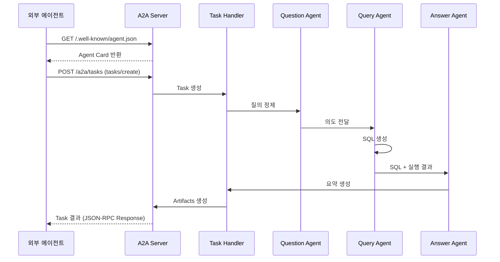

### 12.6 보안 및 인증

| 항목 | 설정 |
|------|------|
| **인증 방식** | Bearer Token (API Key) |
| **Rate Limiting** | 100 requests/minute per client |
| **Timeout** | Task 생성: 60초, Task 조회: 5초 |
| **CORS** | 허용된 Origin만 접근 가능 |

### 12.7 A2A 설정 파라미터

| 파라미터 | 기본값 | 설명 |
|----------|--------|------|
| `A2A_ENABLED` | true | A2A 엔드포인트 활성화 여부 |
| `A2A_RATE_LIMIT` | 100 | 분당 최대 요청 수 |
| `A2A_TASK_TIMEOUT_SEC` | 60 | Task 처리 타임아웃 |
| `A2A_MAX_HISTORY` | 100 | 유지할 최대 Task 히스토리 수 |

---

## 부록: 용어 정의

| 용어 | 정의 |
|------|------|
| **Fab** | Fabrication의 약자, 반도체 생산 라인 단위 |
| **Site ID** | 생산 공장 위치 식별자 (IC: 이천, CJ: 청주, WX: 우시) |
| **Fab ID** | Fab 단위 식별자, Site별로 구분됨 (예: M10, M11, C2) |
| **fab_ids** | 복수 Fab 지원을 위한 Fab ID 리스트 (예: ["M10", "M11", "M14"]) |
| **공정 Suffix** | Site ID와 공정명을 조합한 테이블 접미사 (예: ICWT, CJPNT) |
| **Multi-Fab UNION ALL** | 동일 구조의 SQL을 여러 Fab 테이블에서 UNION ALL로 결합하는 패턴 |
| **IPA** | SQL 실행 로그 수집 시스템 |
| **Template** | 리터럴 값이 placeholder로 치환된 SQL |
| **Hybrid Search** | 벡터 유사도 + 키워드 매칭을 조합한 검색 |
| **Self-check** | LLM이 자신의 출력을 검증하는 과정 |
| **표준 단어사전** | OLTP Mart의 물리명/물리의미/설명을 정의한 CSV 형태 사전 |
| **Chainlit** | Python 기반 대화형 AI 애플리케이션 UI 프레임워크 |
| **Multiturn** | 여러 턴에 걸쳐 컨텍스트를 유지하는 대화 방식 |
| **A2A** | Agent-to-Agent, Google이 제안한 에이전트 간 통신 표준 프로토콜 |
| **Agent Card** | A2A 프로토콜에서 에이전트의 기능과 엔드포인트를 설명하는 메타데이터 |
| **Task** | A2A 프로토콜에서 에이전트가 수행하는 작업 단위 |
| **Artifact** | A2A Task의 결과물 (SQL, 데이터, 시각화 스펙 등) |
| **Skill** | A2A 프로토콜에서 에이전트가 제공하는 기능 단위 |

