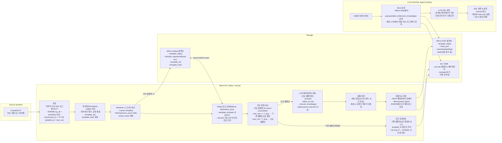

```markdown
# LLM/RAG 기반 Text2SQL 메타데이터 파이프라인 설계서

## 1. 목표

- 운영 SQL 로그로부터 **Text2SQL 에이전트용 메타데이터**(purpose, table_rel_info, domain_knowledges)를 자동 생성한다.
- 중복/유사 SQL 템플릿을 효율적으로 제거하고, **증분만 처리**하는 파이프라인을 구축한다.
- Milvus + MinHash LSH + 벡터 임베딩을 활용해 **RAG용 검색 품질**과 **성능**을 동시에 확보한다.

---

## 2. 전체 아키텍처 (Mermaid)



---

## 3. 데이터 모델 설계

### 3.1 Milvus Dedup 컬렉션 (템플릿 중복 판별용)

- 목적: **빠른 근사 중복 탐지** (MinHash LSH로 search-before-insert).
- 주요 필드:
  - template_id: INT64, PK
  - template_hash: VARCHAR (정규화된 SQL의 hash)
  - minhash_signature: BINARY_VECTOR (dim = MINHASH_DIM × HASH_BIT_WIDTH)
  - template_sql: VARCHAR (정규화된 SQL 텍스트)
  - created_at: DATETIME

- 인덱스:
  - minhash_signature: INDEX type = MINHASH_LSH, 파라미터(bands, dim_per_band)를 통해 성능/재현율 튜닝.

### 3.2 Milvus Main 컬렉션 (RAG용 메타데이터)

- 목적: Text2SQL 에이전트가 Retrieval하는 **핵심 지식 베이스**.
- 주요 필드:
  - template_id: INT64, PK (Dedup 컬렉션의 template_id와 동일)
  - meta_vector: FLOAT_VECTOR (LLM 임베딩)
  - meta_json: JSON / VARCHAR
    - purpose: STRING
    - table_rel_info: [STRING]
    - domain_knowledges: [OBJECT]
    - tables: [TABLE_NAME, desc, columns…]
    - stats: 사용 횟수, 마지막 실행 시각 등
  - created_at, updated_at

- 인덱스:
  - meta_vector: HNSW / IVF_FLAT 등 ANN 인덱스.

### 3.3 메타/로그 DB (ES 또는 RDB)

- sql_log:
  - sql_log_id, raw_sql, normalized_template_sql, template_id, exec_time, user_id, created_at…
- template_meta:
  - template_id, review_status(자동/검토중/승인), last_reviewer, comments 등.

---

## 4. 증분 & Dedup 처리 로직

### 4.1 증분 대상 추출

- 기준: 하루에 한 번 배치, 또는 시간 단위 배치.
- 조건 예시:
  - log_dt = yesterday
  - processed_yn = 'N' OR updated_at > last_run_ts

### 4.2 정규화 및 템플릿 해시

- sqlglot 등으로 파싱하여:
  - 바인드 변수/리터럴 제거 (WHERE COL = :B1, 날짜 상수 등).
  - 키워드/공백/대소문자 정규화.
- template_sql을 canonical form으로 만들고 hash(template_sql) → template_hash.

### 4.3 MinHash 기반 Dedup

- MinHash 시그니처 생성:
  - n-gram 토크나이징(예: 3~5 token shingles).
  - MinHash(num_perm=256) → hashvalues → binary vector.
- Milvus Dedup 컬렉션에서 search-before-insert:
  - MINHASH_LSH 인덱스를 사용해 **근사 유사 템플릿 후보**만 조회.
- 후보들에 대해:
  - 정규화된 template_sql과 비교하여 cosine/Levenshtein 등으로 정확 유사도 계산.
  - max_sim ≥ T_dup (예: 0.95) → 기존 template_id 재사용 (중복).
  - max_sim < T_dup → 신규 템플릿:
    - Dedup 컬렉션에 insert(template_id, minhash_signature, template_sql…).

이 방식으로 N_new × N_existing의 전체 비교 없이, LSH bucket 단위 후보만 비교해 **대규모에서도 선형에 가까운 비용**으로 중복 제거 가능.

---

## 5. LLM 메타데이터 생성 파이프라인

### 5.1 입력 프롬프트 구성

- 컨텍스트:
  - 정규화된 template_sql
  - 테이블/컬럼 메타데이터 (별도 API/카탈로그에서 조회)
  - 필요시 해당 템플릿을 사용하는 대표 실행 로그 샘플 (기간/유저 등).
- LLM에 요구하는 출력(JSON):

```json
{
  "purpose": "해당 SQL의 비즈니스 목적을 LLM이 이해하기 쉬운 자연어로 기술",
  "table_rel_info": [
    "TABLE_A와 TABLE_B는 EQUIP_ID를 기준으로 조인되며, 장비와 상태를 연결한다.",
    "TABLE_A와 TABLE_C는 LOT_ID를 기준으로 조인되어 공정 이력을 조회한다."
  ],
  "domain_knowledges": [
    {
      "name": "장비 다운 조건",
      "desc": "장비가 다운 상태인 행만 필터링",
      "sql_snippet": "MES_STAT_TYP = 'Down'"
    },
    {
      "name": "기본 AREA",
      "desc": "유저가 AREA를 지정하지 않은 경우 기본값은 ETCH",
      "sql_snippet": "AREA_ID = 'ETCH'"
    }
  ],
  "tables": [
    {
      "name": "R3_EQUIP_STATUS",
      "desc": "장비 상태 이력 테이블",
      "columns": [
        {"name": "EQUIP_ID", "desc": "장비 ID"},
        {"name": "MES_STAT_TYP", "desc": "장비 상태 타입"}
      ]
    }
  ]
}
```

### 5.2 검증/리뷰

- 자동 검증:
  - table_rel_info에 사용된 컬럼이 실제 스키마에 존재하는지 확인.
  - domain_knowledges.sql_snippet이 syntactically valid인지 체크.
- Human-in-the-loop:
  - 초기에는 high-traffic 템플릿 중심으로 도메인 전문가 검토 큐 구성, 승인 여부/수정 메모를 template_meta에 반영.

---

## 6. 저장 및 RAG 활용

### 6.1 메타데이터 임베딩 & Milvus Main 저장

- meta_json을 특정 스키마로 텍스트 풀어쓴 후 임베딩 생성.
- Milvus Main 컬렉션에 upsert(template_id, meta_vector, meta_json…).
- 필요한 경우 템플릿 중요도(실행 빈도, 최근 사용 등)를 score로 별도 저장해 re-ranking에 활용.

### 6.2 Text2SQL 에이전트에서의 사용

1. 사용자 질의 → 쿼리 임베딩 생성.
2. Milvus Main에서 top-k 메타데이터 검색 (purpose + table_rel_info + domain_knowledges).
3. 검색 결과를 프롬프트에 포함해 SQL 생성:
   - 어떤 테이블이 어떤 목적으로 사용되는지,
   - 어떤 조인 패턴이 일반적인지,
   - 어떤 도메인 규칙(예: 다운 조건, 기본 AREA)이 있는지 반영.
4. 필요시 ES/RDB에서 원본 SQL 템플릿과 대표 실행 로그를 추가로 검색해 few-shot 예시로 제공.

---

## 7. 운영 및 튜닝 포인트

- Dedup 임계값:
  - MinHash + 정밀 비교 조합에서 T_dup(예: 0.9~0.97) 튜닝.
- 배치 주기:
  - 하루 1회 → 초기 단계, 증가 시 시간 단위 배치/마이크로 배치 검토.
- 모니터링:
  - dedup ratio(패스되는 로그 비율), 신규 템플릿 수, LLM 호출 횟수/비용.
- 스케일링:
  - Milvus partition(날짜/도메인별) 활용, MinHash LSH 인덱스 파라미터(bands) 조정으로 성능/재현율 균형.

---

## 8. 향후 확장 아이디어

- 템플릿 클러스터링:
  - MinHash 후보 쌍에 Union-Find 등 적용해 **템플릿 클러스터**를 만들고, 대표 템플릿만 LLM 메타 생성.
- GraphRAG:
  - table_rel_info를 관계 그래프로 저장, 조인 경로 추천에 활용.
- Synthetic NL 쿼리 생성:
  - 템플릿 메타데이터로부터 가상 자연어 질의 생성 → Text2SQL 에이전트 평가/튜닝 데이터로 사용.
```

모든 web 링크와 citation을 제거한 깔끔한 설계 문서입니다. 바로 Markdown 파일로 저장해서 사용하실 수 있습니다.