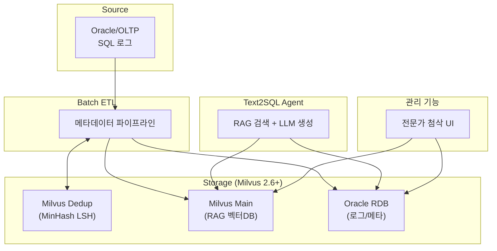
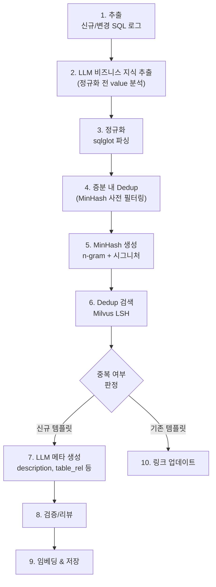
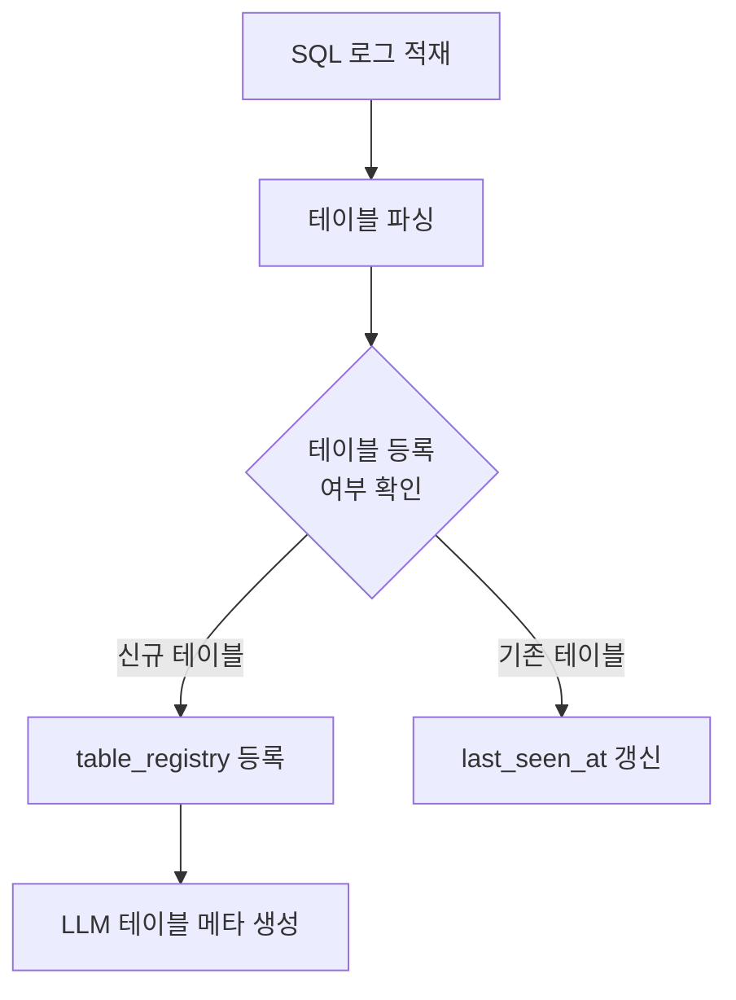
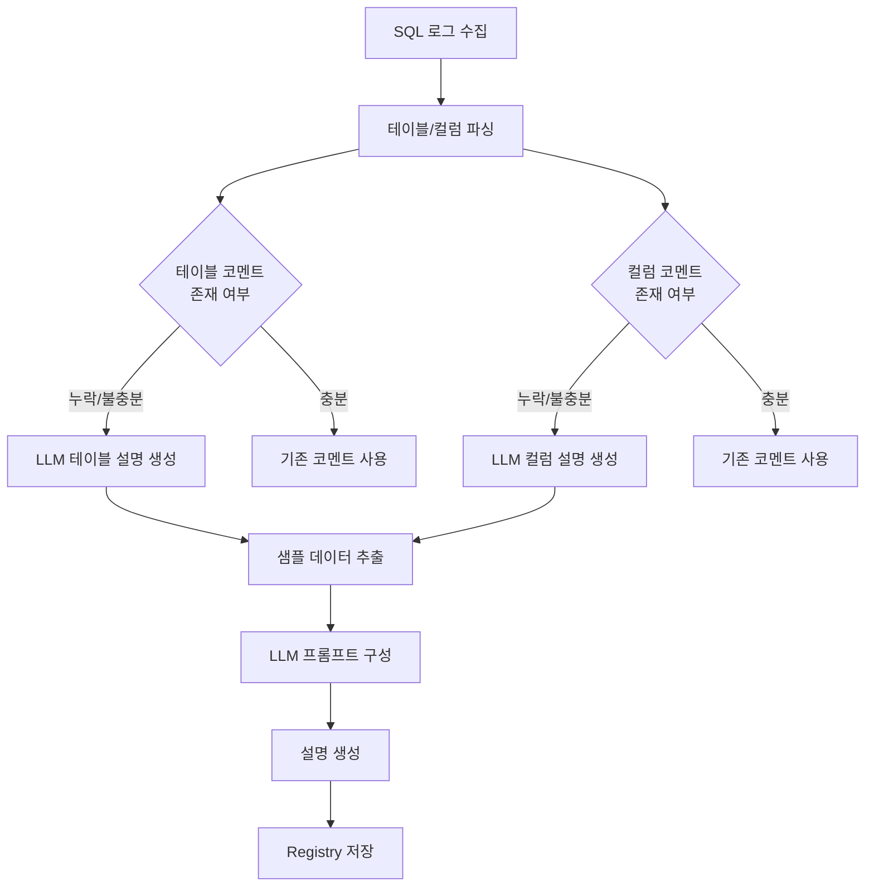
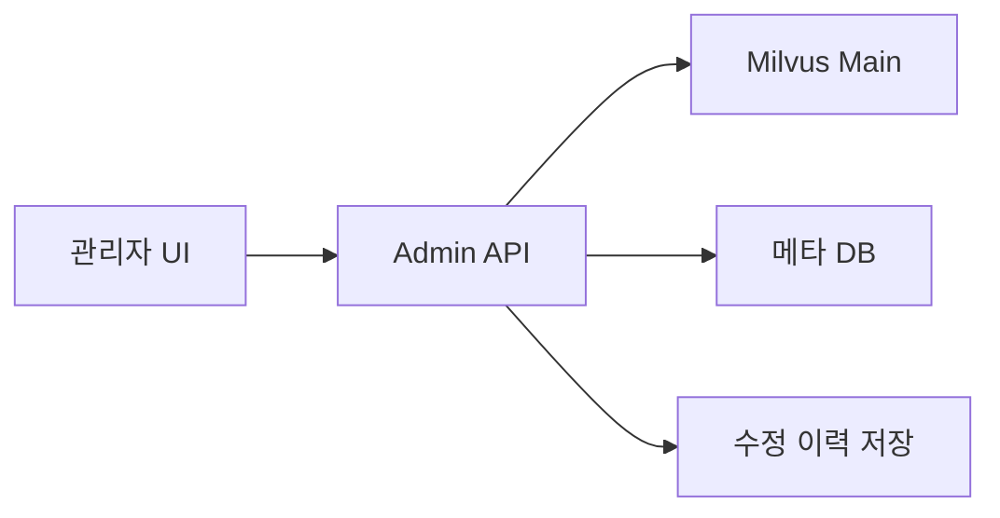

# LLM/RAG 기반 Text2SQL 메타데이터 파이프라인 설계서

> **문서 버전**: v0.3 (Draft)  
> **최종 수정**: 2026-01-29

---

## 목차

1. [목표](#1-목표)
2. [전체 아키텍처](#2-전체-아키텍처)
3. [데이터 모델 설계](#3-데이터-모델-설계)
4. [테이블 메타데이터 관리 전략](#4-테이블-메타데이터-관리-전략)
   - 4.1 [설계 원칙](#41-설계-원칙)
   - 4.2 [테이블 등록 흐름](#42-테이블-등록-흐름)
   - 4.3 [처리 시점](#43-처리-시점)
   - 4.4 [table_registry 스키마](#44-table_registry-스키마)
   - 4.5 [column_registry 스키마](#45-column_registry-스키마)
   - 4.6 [테이블/컬럼 메타데이터 자동 보강 전략](#46-테이블컬럼-메타데이터-자동-보강-전략)
5. [증분 & Dedup 처리 로직](#5-증분--dedup-처리-로직)
6. [LLM 메타데이터 생성 파이프라인](#6-llm-메타데이터-생성-파이프라인)
7. [저장 및 RAG 활용](#7-저장-및-rag-활용)
8. [관리 기능](#8-관리-기능)
9. [운영 및 튜닝 포인트](#9-운영-및-튜닝-포인트)
10. [향후 확장 아이디어](#10-향후-확장-아이디어)

---

## 1. 목표

- 운영 SQL 로그로부터 **LLM 증강 메타데이터**(description, table_rel_info, domain_knowledges)를 자동 생성한다.
- 중복/유사 SQL 템플릿을 효율적으로 제거하고, **증분만 처리**하는 파이프라인을 구축한다.
- **Milvus 2.6+** + MinHash LSH + 벡터 임베딩을 활용해 **RAG용 검색 품질**과 **성능**을 동시에 확보한다.
- 실제 SQL 로그에서 사용된 테이블만을 대상으로 메타데이터를 처리하여 **효율성을 극대화**한다.
- **테이블/컬럼 메타데이터 보강**: 원본 DB의 코멘트가 누락되거나 불충분한 경우, SQL 로그 분석과 샘플 데이터를 기반으로 LLM이 자동으로 설명을 생성한다.

---

## 2. 전체 아키텍처

### 2.1 시스템 개요

> **Note**: Milvus 2.6 이상 버전이 필요합니다. MinHash LSH 인덱싱은 Milvus 2.6+에서 지원됩니다.



### 2.2 ETL 파이프라인 상세

> **중요**: LLM 메타정보 증강은 정규화 전에 선행되어야 합니다. 정규화 후에는 value들을 통해 business knowledge를 추출하기 어렵기 때문입니다.



#### 파이프라인 단계 설명

| 단계 | 설명 |
|------|------|
| 1. 추출 | 신규/변경 SQL 로그 수집 (daily 증분) |
| 2. LLM 비즈니스 지식 추출 | **정규화 전** 원본 SQL의 value를 분석하여 도메인 지식 추출 |
| 3. 정규화 | sqlglot을 이용한 SQL 파싱 및 정규화 |
| 4. 증분 내 Dedup | 일일 증분 데이터 내에서 먼저 MinHash로 중복 제거 |
| 5. MinHash 생성 | 필터링된 데이터에 대해 MinHash 시그니처 생성 |
| 6. Dedup 검색 | 기존 Milvus 컬렉션과 중복 비교 |
| 7-10. 후속 처리 | 메타 생성, 검증, 저장, 링크 업데이트 |

### 2.3 Text2SQL Agent 흐름


---

## 3. 데이터 모델 설계

> **필수 요구사항**: Milvus 2.6 이상 버전 필요 (MinHash LSH 인덱싱 지원)

### 3.1 Milvus Dedup 컬렉션

> **목적**: 빠른 근사 중복 탐지 (MinHash LSH로 search-before-insert)

| 필드명 | 타입 | 설명 |
|--------|------|------|
| template_id | INT64 (PK) | 템플릿 고유 ID |
| template_hash | VARCHAR | 정규화된 SQL의 hash |
| minhash_signature | BINARY_VECTOR | MinHash 시그니처 (dim = MINHASH_DIM × HASH_BIT_WIDTH) |
| template_sql | VARCHAR | 정규화된 SQL 텍스트 |
| created_at | DATETIME | 생성 시각 |

- **인덱스**: `minhash_signature`에 MINHASH_LSH 인덱스 (bands, dim_per_band 튜닝)
- **Milvus 버전**: 2.6 이상 필수 (MINHASH_LSH 인덱스 지원)

### 3.2 Milvus Main 컬렉션

> **목적**: Text2SQL 에이전트가 Retrieval하는 핵심 지식 베이스 (LLM 증강 메타데이터)

| 필드명 | 타입 | 설명 |
|--------|------|------|
| template_id | INT64 (PK) | Dedup 컬렉션과 동일한 ID |
| meta_vector | FLOAT_VECTOR | LLM 임베딩 벡터 |
| meta_json | JSON | LLM 증강 메타데이터 (description, table_rel_info, domain_knowledges) |
| created_at | DATETIME | 생성 시각 |
| updated_at | DATETIME | 수정 시각 |
| reviewed_by | VARCHAR | 검토자 (전문가 첨삭 시) |
| review_status | VARCHAR | 검토 상태 (auto/pending/approved/modified) |

- **인덱스**: `meta_vector`에 HNSW / IVF_FLAT 등 ANN 인덱스

### 3.3 메타/로그 DB (Oracle RDB)

| 테이블 | 주요 필드 | 설명 |
|--------|-----------|------|
| sql_log | sql_log_id, raw_sql, normalized_template_sql, template_id, user_id, created_at | SQL 실행 로그 |
| template_meta | template_id, review_status(자동/검토중/승인), last_reviewer, comments | 템플릿 메타정보 |
| table_registry | table_name, schema_name, llm_description, system_comment, sql_count, meta_status | 테이블 메타정보 (4.4절 상세) |
| column_registry | table_name, column_name, llm_description, statistics, usage_context | 컬럼 메타정보 (4.5절 상세) |

---

## 4. 테이블 메타데이터 관리 전략

### 4.1 설계 원칙

> **핵심 원칙**: 모든 OLTP 테이블을 대상으로 하지 않고, **실제 SQL 로그에서 사용된 테이블만** 메타데이터 추출 및 LLM 증강 처리를 수행한다.

이 접근법의 장점:
- **효율성**: 수천 개의 테이블 중 실제 사용되는 테이블만 처리
- **품질 향상**: 실제 사용 패턴 기반의 메타데이터 생성

### 4.2 테이블 등록 흐름



### 4.3 처리 시점

| 시점 | 처리 내용 |
|------|-----------|
| 최초 적재 | SQL 로그에서 사용된 모든 테이블 식별 및 등록, LLM 메타데이터 생성 |
| Daily 증분 | 신규 발생 테이블만 추가 등록 및 메타데이터 생성 |
| 정기 갱신 | 장기 미사용 테이블 비활성화, 메타데이터 품질 점검 |

### 4.4 table_registry 스키마

| 필드명 | 타입 | 설명 |
|--------|------|------|
| table_name | VARCHAR (PK) | 테이블명 |
| schema_name | VARCHAR | 스키마명 |
| first_seen_at | DATETIME | 최초 발견 시각 |
| last_seen_at | DATETIME | 마지막 사용 시각 |
| sql_count | INT | 사용된 SQL 로그 수 |
| meta_status | VARCHAR | 메타 생성 상태 (pending/generated/reviewed) |
| llm_enriched_at | DATETIME | LLM 증강 처리 시각 |
| system_comment | VARCHAR | 원본 DB의 테이블 코멘트 (있는 경우) |
| llm_description | TEXT | LLM이 SQL 로그 분석을 통해 생성한 테이블 설명 |
| description_source | VARCHAR | 설명 출처 (system_comment/llm_generated/manual) |
| usage_summary | JSON | 사용 패턴 요약 (주 사용 목적, 빈도 등) |

### 4.5 column_registry 스키마

> **목적**: 실제 SQL 로그에서 사용된 컬럼만 추적하고, LLM을 통해 컬럼별 설명 및 통계 정보를 보강한다.

| 필드명 | 타입 | 설명 |
|--------|------|------|
| table_name | VARCHAR (PK) | 테이블명 |
| column_name | VARCHAR (PK) | 컬럼명 |
| data_type | VARCHAR | 데이터 타입 (VARCHAR, NUMBER, DATE 등) |
| system_comment | VARCHAR | 원본 DB의 컬럼 코멘트 (있는 경우) |
| llm_description | TEXT | LLM이 SQL 로그 분석을 통해 생성한 컬럼 설명 |
| first_seen_at | DATETIME | 최초 사용 시각 |
| last_seen_at | DATETIME | 마지막 사용 시각 |
| usage_count | INT | SQL 로그에서 사용된 횟수 |
| usage_context | JSON | 사용 컨텍스트 (SELECT/WHERE/JOIN/GROUP BY 등) |
| sample_values | JSON | 샘플 값 목록 (LLM 프롬프트용) |
| statistics | JSON | 컬럼 통계 정보 (NUMBER 타입: min/max/avg 등) |
| meta_status | VARCHAR | 메타 생성 상태 (pending/generated/reviewed) |
| llm_enriched_at | DATETIME | LLM 증강 처리 시각 |

### 4.6 테이블/컬럼 메타데이터 자동 보강 전략

> **문제 인식**: 원본 DB의 테이블/컬럼 코멘트(comment)가 충분히 자세하지 않거나 누락된 경우가 많다. 이를 SQL 로그 분석과 LLM을 통해 자동으로 보강한다.

#### 4.6.1 메타데이터 보강 흐름



#### 4.6.2 LLM 테이블 설명 생성 전략

테이블에 대한 설명이 없거나 불충분한 경우, SQL 로그 분석을 통해 자동으로 설명을 생성한다.

**입력 데이터 구성:**

| 입력 항목 | 설명 | 목적 |
|-----------|------|------|
| SQL 로그 샘플 | 해당 테이블이 사용된 대표 SQL N개 | 테이블의 사용 목적/패턴 파악 |
| 조인 패턴 | 해당 테이블과 자주 조인되는 테이블 목록 | 테이블 간 관계 파악 |
| WHERE 조건 패턴 | 자주 사용되는 필터 조건들 | 비즈니스 규칙 파악 |
| 컬럼 목록 | 테이블의 컬럼명 및 타입 | 테이블 구조 이해 |
| 샘플 데이터 (선택) | N개의 샘플 레코드 | 실제 데이터 패턴 파악 |

**LLM 프롬프트 예시:**

```json
{
  "task": "테이블 설명 생성",
  "table_name": "MES_EQUIP_STAT",
  "columns": ["EQUIP_ID", "STAT_CD", "STAT_TYP", "START_DT", "END_DT"],
  "sample_sqls": [
    "SELECT * FROM MES_EQUIP_STAT WHERE STAT_TYP = 'Down' AND START_DT > SYSDATE - 7",
    "SELECT E.EQUIP_ID, S.STAT_CD FROM MES_EQUIP E JOIN MES_EQUIP_STAT S ON E.EQUIP_ID = S.EQUIP_ID"
  ],
  "join_patterns": ["MES_EQUIP (EQUIP_ID)", "MES_LOT_HIST (EQUIP_ID)"],
  "sample_data": [
    {"EQUIP_ID": "EQ001", "STAT_CD": "RUN", "STAT_TYP": "Normal", "START_DT": "2026-01-01"},
    {"EQUIP_ID": "EQ002", "STAT_CD": "DOWN", "STAT_TYP": "Down", "START_DT": "2026-01-02"}
  ]
}
```

**기대 출력:**

```json
{
  "table_description": "장비별 상태 이력을 관리하는 테이블. 장비의 가동/정지/다운 상태와 해당 상태의 시작/종료 시점을 기록하며, MES_EQUIP 테이블의 장비 정보와 연계하여 장비 가동률 분석 및 다운타임 추적에 사용된다.",
  "primary_use_cases": ["장비 상태 모니터링", "다운타임 분석", "가동률 계산"],
  "related_domain": "MES/설비관리"
}
```

#### 4.6.3 LLM 컬럼 설명 생성 전략

> **핵심 원칙**: 실제 SQL 로그에서 **사용된 컬럼만** 대상으로 설명을 생성한다. 사용되지 않는 컬럼은 리소스 낭비를 방지하기 위해 처리 대상에서 제외한다.

**컬럼별 입력 데이터:**

| 데이터 타입 | 추가 입력 | 설명 |
|-------------|-----------|------|
| NUMBER/INTEGER | min, max, avg 값 | 숫자 범위 및 분포 파악 |
| VARCHAR/CHAR | 샘플 값 N개, distinct count | 코드/명칭 패턴 파악 |
| DATE/TIMESTAMP | min, max 값, 주요 패턴 | 시간 범위 및 사용 패턴 |
| 모든 타입 | 사용 컨텍스트 | SELECT/WHERE/JOIN/GROUP BY 사용 빈도 |

**통계 정보 예시 (statistics JSON):**

```json
{
  "column_name": "EQUIP_ID",
  "data_type": "VARCHAR",
  "sample_values": ["EQ001", "EQ002", "EQ003", "ETCH_01", "PHOTO_05"],
  "distinct_count": 1523,
  "null_rate": 0.0,
  "usage_context": {
    "select": 245,
    "where": 180,
    "join": 312,
    "group_by": 45
  }
}
```

```json
{
  "column_name": "PROCESS_TIME",
  "data_type": "NUMBER",
  "statistics": {
    "min": 0.5,
    "max": 3600.0,
    "avg": 125.3,
    "median": 98.2
  },
  "null_rate": 0.02,
  "usage_context": {
    "select": 89,
    "where": 23,
    "aggregate": 67
  }
}
```

#### 4.6.4 메타데이터 보강 우선순위

| 우선순위 | 대상 | 기준 |
|----------|------|------|
| 1 | 고빈도 사용 테이블 | sql_count 상위 20% |
| 2 | 코멘트 누락 테이블/컬럼 | system_comment IS NULL |
| 3 | 조인 허브 테이블 | 여러 테이블과 빈번히 조인되는 테이블 |
| 4 | 고빈도 사용 컬럼 | usage_count 상위 컬럼 |
| 5 | 저빈도 사용 컬럼 | 나머지 사용된 컬럼 |

#### 4.6.5 품질 관리

| 검증 항목 | 방법 |
|-----------|------|
| 자동 검증 | 생성된 설명이 최소 길이 충족, 테이블/컬럼명 정확성 |
| 일관성 검증 | 관련 테이블 간 설명의 논리적 일관성 |
| 주기적 갱신 | SQL 로그 패턴 변화 시 설명 재생성 트리거 |
| 전문가 리뷰 | 고빈도 테이블/컬럼은 도메인 전문가 검토 큐에 등록 |

---

## 5. 증분 & Dedup 처리 로직

### 5.1 증분 대상 추출

- 기준: 하루에 한 번 배치, 또는 시간 단위 배치.
- 조건 예시:
  - log_dt = yesterday
  - processed_yn = 'N' OR updated_at > last_run_ts

### 5.2 LLM 비즈니스 지식 추출 (정규화 전)

> **중요**: 이 단계는 정규화 전에 수행해야 합니다. 정규화 후에는 리터럴 값들이 제거되어 비즈니스 지식 추출이 어려워집니다.

- 원본 SQL에서 value 분석:
  - WHERE 절의 실제 값들 (예: `STATUS = 'ACTIVE'`, `AREA_ID = 'ETCH'`)
  - 날짜/시간 패턴 (예: `TRUNC(SYSDATE) - 7`)
  - 비즈니스 로직이 담긴 CASE 문의 조건값들
- LLM을 통한 도메인 지식 추출:
  - 해당 값들이 의미하는 비즈니스 컨텍스트
  - 암묵적 규칙 및 조건 식별

### 5.3 정규화 및 템플릿 해시

- sqlglot 등으로 파싱하여:
  - 바인드 변수/리터럴 제거 (WHERE COL = :B1, 날짜 상수 등).
  - 키워드/공백/대소문자 정규화.
- template_sql을 canonical form으로 만들고 hash(template_sql) → template_hash.

### 5.4 2단계 Dedup 전략

> **설계 원칙**: 매번 전체 Dedup 컬렉션과 비교하는 것은 비효율적입니다. **증분 내 사전 필터링 → 기존 데이터 비교** 2단계 전략을 사용합니다.

#### 5.4.1 1단계: 증분 내 Dedup (Batch 내 중복 제거)


- 일일 증분 데이터 내에서 먼저 MinHash로 상호 비교
- 증분 내 중복을 먼저 제거하여 **기존 컬렉션 비교 대상 축소**
- 처리량: N → N' (일반적으로 50~80% 감소 예상)

#### 5.4.2 2단계: 기존 컬렉션과 Dedup

- MinHash 시그니처 생성:
  - n-gram 토크나이징(예: 3~5 token shingles).
  - MinHash(num_perm=256) → hashvalues → binary vector.
- Milvus Dedup 컬렉션에서 search-before-insert:
  - MINHASH_LSH 인덱스를 사용해 **근사 유사 템플릿 후보**만 조회.
  - **Milvus 2.6+ 필수**: MINHASH_LSH 인덱스 지원
- 후보들에 대해:
  - 정규화된 template_sql과 비교하여 cosine/Levenshtein 등으로 정확 유사도 계산.
  - max_sim ≥ T_dup (예: 0.95) → 기존 template_id 재사용 (중복).
  - max_sim < T_dup → 신규 템플릿:
    - Dedup 컬렉션에 insert(template_id, minhash_signature, template_sql…).

이 2단계 방식으로 **N_new × N_existing 전체 비교 없이** 효율적인 중복 제거가 가능합니다.

---

## 6. LLM 메타데이터 생성 파이프라인

> **용어 정의**: 본 문서에서 "LLM 증강 메타데이터"란 LLM을 활용하여 SQL 로그로부터 자동 생성된 비즈니스 컨텍스트 정보를 의미합니다.

### 6.1 입력 프롬프트 구성

- 컨텍스트:
  - **원본 SQL** (정규화 전, 비즈니스 지식 추출용)
  - 테이블/컬럼 메타데이터 (실제 사용된 테이블에서 조회)
- LLM에 요구하는 출력(JSON):

```json
{
  "description": "해당 SQL의 비즈니스 목적과 기능을 자연어로 기술",
  "table_rel_info": [
    "TABLE_A와 TABLE_B는 EQUIP_ID를 기준으로 조인되며, 장비와 상태를 연결한다.",
    "TABLE_A와 TABLE_C는 LOT_ID를 기준으로 조인되어 공정 이력을 조회한다."
  ],
  "domain_knowledges": [
    {
      "name": "장비 다운 조건",
      "desc": "장비가 다운 상태인 행만 필터링",
      "sql_snippet": "MES_STAT_TYP = 'Down'",
      "source_value": "Down"
    },
    {
      "name": "기본 AREA",
      "desc": "유저가 AREA를 지정하지 않은 경우 기본값은 ETCH",
      "sql_snippet": "AREA_ID = 'ETCH'",
      "source_value": "ETCH"
    }
  ]
}
```


### 6.2 검증/리뷰

- 자동 검증:
  - table_rel_info에 사용된 컬럼이 실제 스키마에 존재하는지 확인.
  - domain_knowledges.sql_snippet이 syntactically valid인지 체크.
- Human-in-the-loop:
  - 초기에는 high-traffic 템플릿 중심으로 도메인 전문가 검토 큐 구성, 승인 여부/수정 메모를 template_meta에 반영.

---

## 7. 저장 및 RAG 활용

### 7.1 메타데이터 임베딩 & Milvus Main 저장

- meta_json을 특정 스키마로 텍스트 풀어쓴 후 임베딩 생성.
- Milvus Main 컬렉션에 upsert(template_id, meta_vector, meta_json…).

### 7.2 Text2SQL 에이전트에서의 사용

1. 사용자 질의 → 쿼리 임베딩 생성.
2. Milvus Main에서 top-k LLM 증강 메타데이터 검색 (description + table_rel_info + domain_knowledges).
3. **테이블/컬럼 메타데이터 조회**:
   - 관련 테이블의 `llm_description` 및 `usage_summary` 조회
   - 관련 컬럼의 `llm_description`, `statistics`, `sample_values` 조회
   - NUMBER 컬럼의 min/max/avg 정보를 통해 값 범위 제약 힌트 제공
4. 검색 결과를 프롬프트에 포함해 SQL 생성:
   - 어떤 테이블이 어떤 목적으로 사용되는지 (테이블 설명 활용),
   - 어떤 조인 패턴이 일반적인지,
   - 어떤 도메인 규칙(예: 다운 조건, 기본 AREA)이 있는지 반영,
   - 컬럼별 통계 정보를 통한 조건절 값 힌트 제공.
5. 필요시 Oracle RDB에서 원본 SQL 템플릿과 대표 실행 로그를 추가로 검색해 few-shot 예시로 제공.

---

## 8. 관리 기능

> **중요도**: 후순위 (기본 파이프라인 안정화 후 구현)

### 8.1 전문가 첨삭 기능

Vector DB에 저장된 LLM 증강 메타데이터는 도메인 전문가에 의해 수정/보완될 수 있어야 합니다.

#### 8.1.1 기능 요구사항

| 기능 | 설명 | 우선순위 |
|------|------|----------|
| 메타데이터 조회 | template_id 또는 검색으로 메타데이터 조회 | 필수 |
| 내용 수정 | description, domain_knowledges 등 직접 편집 | 필수 |
| 수정 이력 | 수정 전/후 버전 관리 및 이력 추적 | 권장 |
| 승인 워크플로우 | 수정 후 검토/승인 프로세스 | 선택 |
| 벌크 수정 | 다수 템플릿 일괄 수정 지원 | 선택 |

#### 8.1.2 관리 UI 아키텍처



#### 8.1.3 데이터 모델 추가

| 테이블 | 주요 필드 |
|--------|-----------|
| meta_edit_history | edit_id, template_id, field_name, old_value, new_value, editor_id, edited_at |
| approval_queue | approval_id, template_id, status, requester_id, approver_id, created_at |

---

## 9. 운영 및 튜닝 포인트

| 항목 | 설명 | 권장값/방향 |
|------|------|-------------|
| Milvus 버전 | MinHash LSH 인덱스 필수 | **2.6 이상 필수** |
| Dedup 임계값 (T_dup) | MinHash + 정밀 비교에서 중복 판정 기준 | 0.9 ~ 0.97 |
| 배치 주기 | 증분 처리 주기 | 초기: 1일 1회 → 확장 시 시간 단위 |
| 증분 내 Dedup | 일일 배치 내 사전 중복 제거 | 50~80% 후보 감소 기대 |
| 테이블 메타 전략 | 처리 대상 테이블 범위 | 실제 SQL 로그 사용 테이블만 |
| 컬럼 메타 전략 | 처리 대상 컬럼 범위 | 실제 SQL 로그에서 사용된 컬럼만 |
| 테이블/컬럼 샘플링 | LLM 프롬프트용 샘플 데이터 크기 | 테이블당 10~50개 레코드 권장 |
| 컬럼 통계 | NUMBER 타입 통계 수집 | min, max, avg, median (선택적) |
| 메타 보강 우선순위 | LLM 처리 대상 선정 | 고빈도 사용 + 코멘트 누락 우선 |
| 모니터링 지표 | 운영 상태 확인 | dedup ratio, 신규 템플릿 수, 신규 테이블 수, 메타 보강률, LLM 호출 횟수/비용 |
| 스케일링 | 대용량 대응 | Milvus partition (날짜/도메인별), LSH bands 파라미터 튜닝 |

---

## 10. 향후 확장 아이디어

- 템플릿 클러스터링:
  - MinHash 후보 쌍에 Union-Find 등 적용해 **템플릿 클러스터**를 만들고, 대표 템플릿만 LLM 메타 생성.
- GraphRAG:
  - table_rel_info를 관계 그래프로 저장, 조인 경로 추천에 활용.
- Synthetic NL 쿼리 생성:
  - 템플릿 메타데이터로부터 가상 자연어 질의 생성 → Text2SQL 에이전트 평가/튜닝 데이터로 사용.
- 전문가 첨삭 고도화:
  - AI 기반 메타데이터 품질 평가 및 자동 개선 제안
  - 도메인 전문가 피드백 학습을 통한 LLM 프롬프트 개선
