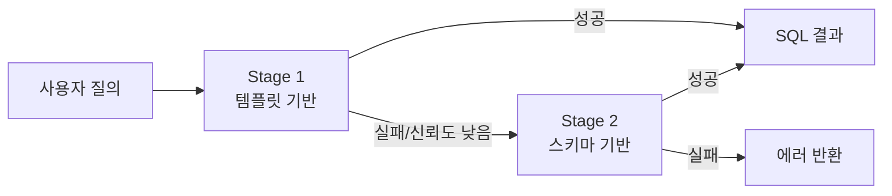
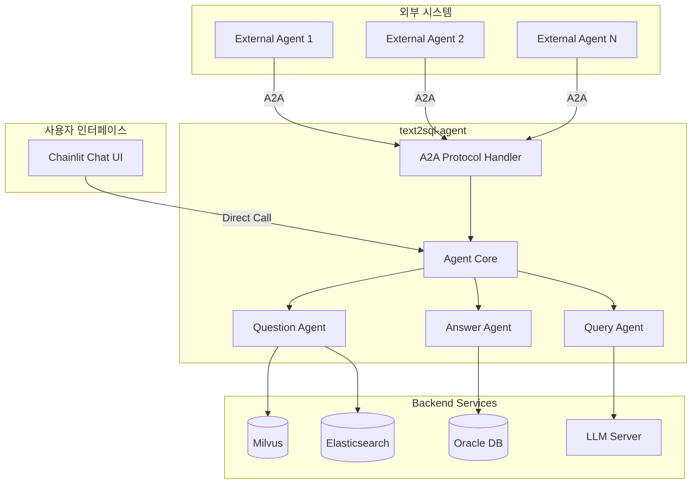
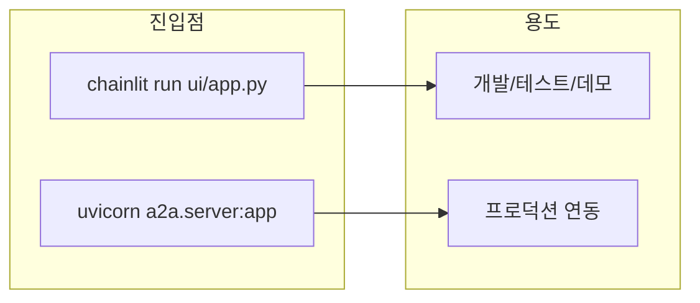
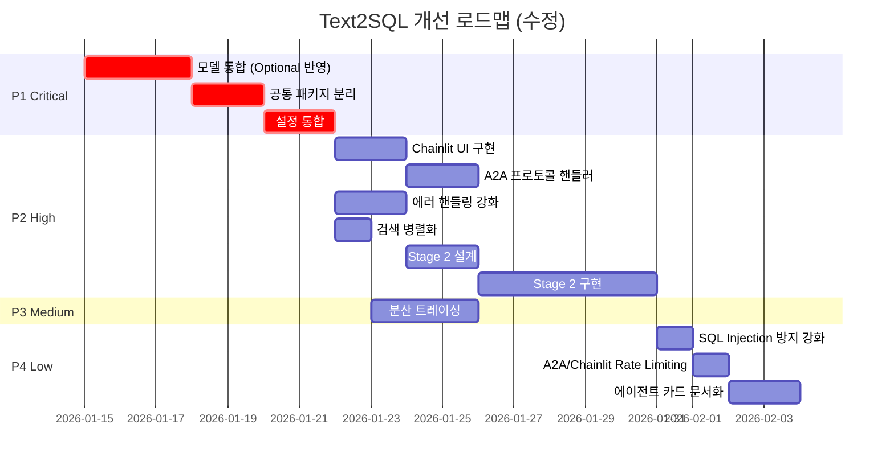

# Text2SQL 개선 계획

> 작성일: 2026-01-13  
> 기반 문서: `project_improvement_report.md`

---

## 1. 개선 범위

### 1.1 포함 항목

| 우선순위 | 영역 | 설명 |
|---------|------|------|
| 🔴 P1 | 모델 통합 | 공통 core 패키지로 모델 분리 |
| 🔴 P1 | 설정 통합 | 환경변수 prefix 통일 |
| 🟠 P2 | 진입점 아키텍처 | Chainlit UI (기본) + A2A (외부 연동) |
| 🟠 P2 | Stage 2 구현 | 스키마 기반 SQL 생성 |
| 🟠 P2 | 에러 핸들링 | 재시도 로직, 컨텍스트 추가 |
| 🟠 P2 | 검색 병렬화 | asyncio.gather 활용 |
| 🟡 P3 | 분산 트레이싱 | OpenTelemetry 기반 추적 |
| 🟢 P4 | 보안 강화 | SQL Injection 방지, Rate Limiting |
| 🟢 P4 | 문서화 개선 | 에이전트 카드 및 가이드 |

### 1.2 제외 항목

| 항목 | 사유 |
|-----|------|
| 임베딩 캐싱 (P3) | 이번 개선 범위 제외 |
| Testcontainers 통합 테스트 (P3) | 이번 개선 범위 제외 |

---

## 2. 상세 개선 항목

### 2.1 🔴 P1: 모델 통합 (공통 패키지 분리)

#### 2.1.1 통합 모델 설계

```python
# packages/core/src/text2sql_core/models/sql_template.py
from datetime import datetime
from typing import Optional
from pydantic import BaseModel, Field


class BaseSQLTemplate(BaseModel):
    """SQL 템플릿 기본 모델 - 모든 프로젝트에서 공유"""
    
    # 필수 항목
    id: str = Field(..., description="템플릿 고유 ID")
    sql_text: str = Field(..., description="정규화된 SQL 텍스트")
    description: str = Field(..., description="SQL 설명")
    tables: list[str] = Field(default_factory=list, description="참조 테이블 목록")
    columns: list[str] = Field(default_factory=list, description="참조 컬럼 목록")
    
    # 선택 항목 (Optional)
    exec_count: Optional[int] = Field(default=None, description="실행 횟수")
    domain_tags: Optional[list[str]] = Field(default=None, description="도메인 태그")
    original_sql_id: Optional[str] = Field(default=None, description="원본 SQL ID")
    template_hash: Optional[str] = Field(default=None, description="템플릿 해시")


class SQLTemplateCreate(BaseSQLTemplate):
    """SQL 템플릿 생성용 모델"""
    
    normalized_text: str = Field(..., description="정규화된 SQL 텍스트")


class SQLTemplateInDB(BaseSQLTemplate):
    """DB 저장용 SQL 템플릿 모델"""
    
    embedding: Optional[list[float]] = Field(default=None, description="임베딩 벡터")
    created_at: datetime = Field(default_factory=datetime.now)
    updated_at: Optional[datetime] = Field(default=None)


class SQLTemplateSearch(BaseSQLTemplate):
    """검색 결과용 SQL 템플릿 모델"""
    
    similarity_score: float = Field(..., description="유사도 점수")
    matched_from: str = Field(..., description="매칭 소스 (vector/text)")
```

#### 2.1.2 필드 Optional 처리 기준

| 필드명 | 타입 | 필수 여부 | 설명 |
|-------|------|----------|------|
| `id` | `str` | ✅ 필수 | 고유 식별자 |
| `sql_text` | `str` | ✅ 필수 | SQL 본문 |
| `description` | `str` | ✅ 필수 | 설명 |
| `tables` | `list[str]` | ✅ 필수 | 빈 리스트 기본값 |
| `columns` | `list[str]` | ✅ 필수 | 빈 리스트 기본값 |
| `exec_count` | `Optional[int]` | ❌ 선택 | 실행 통계 |
| `domain_tags` | `Optional[list[str]]` | ❌ 선택 | 분류 태그 |
| `original_sql_id` | `Optional[str]` | ❌ 선택 | 원본 참조 |
| `template_hash` | `Optional[str]` | ❌ 선택 | 중복 검사용 |
| `embedding` | `Optional[list[float]]` | ❌ 선택 | 벡터 임베딩 |
| `created_at` | `datetime` | ❌ 선택 | 생성 시점 |
| `updated_at` | `Optional[datetime]` | ❌ 선택 | 수정 시점 |

---

### 2.2 🔴 P1: 설정 통합

#### 2.2.1 통합 설정 구조

```python
# packages/core/src/text2sql_core/config.py
from pydantic import Field
from pydantic_settings import BaseSettings, SettingsConfigDict


class OracleSettings(BaseSettings):
    """Oracle DB 설정"""
    host: str = Field(default="localhost")
    port: int = Field(default=1521)
    service_name: str = Field(default="ORCL")
    username: str = Field(default="")
    password: str = Field(default="")


class MilvusSettings(BaseSettings):
    """Milvus 벡터 DB 설정"""
    host: str = Field(default="localhost")
    port: int = Field(default=19530)
    collection_name: str = Field(default="sql_templates")
    embedding_dim: int = Field(default=1536)


class ElasticsearchSettings(BaseSettings):
    """Elasticsearch 설정"""
    hosts: list[str] = Field(default=["http://localhost:9200"])
    index_name: str = Field(default="sql_templates")


class LLMSettings(BaseSettings):
    """LLM 서버 설정"""
    base_url: str = Field(default="http://localhost:8000/v1")
    api_key: str = Field(default="")
    model_name: str = Field(default="gpt-4")
    temperature: float = Field(default=0.0)
    max_tokens: int = Field(default=4096)


class EmbeddingSettings(BaseSettings):
    """임베딩 서비스 설정"""
    base_url: str = Field(default="http://localhost:8000/v1")
    api_key: str = Field(default="")
    model_name: str = Field(default="text-embedding-3-small")
    dimension: int = Field(default=1536)


class UnifiedSettings(BaseSettings):
    """통합 설정 - 모든 프로젝트에서 공유"""
    
    model_config = SettingsConfigDict(
        env_prefix="TEXT2SQL_",  # 통일된 prefix
        env_nested_delimiter="__",
        env_file=".env",
        extra="ignore",
    )
    
    # 공통 설정
    environment: str = Field(default="dev")
    debug: bool = Field(default=True)
    log_level: str = Field(default="INFO")
    
    # 외부 시스템
    oracle: OracleSettings = Field(default_factory=OracleSettings)
    milvus: MilvusSettings = Field(default_factory=MilvusSettings)
    elasticsearch: ElasticsearchSettings = Field(default_factory=ElasticsearchSettings)
    llm: LLMSettings = Field(default_factory=LLMSettings)
    embedding: EmbeddingSettings = Field(default_factory=EmbeddingSettings)
```

#### 2.2.2 환경변수 예시

```bash
# .env.example
TEXT2SQL_ENVIRONMENT=dev
TEXT2SQL_DEBUG=true
TEXT2SQL_LOG_LEVEL=INFO

# Oracle
TEXT2SQL_ORACLE__HOST=oracle-db
TEXT2SQL_ORACLE__PORT=1521
TEXT2SQL_ORACLE__SERVICE_NAME=ORCL
TEXT2SQL_ORACLE__USERNAME=text2sql
TEXT2SQL_ORACLE__PASSWORD=secret

# Milvus
TEXT2SQL_MILVUS__HOST=milvus
TEXT2SQL_MILVUS__PORT=19530
TEXT2SQL_MILVUS__COLLECTION_NAME=sql_templates
TEXT2SQL_MILVUS__EMBEDDING_DIM=1536

# Elasticsearch
TEXT2SQL_ELASTICSEARCH__HOSTS=["http://elasticsearch:9200"]
TEXT2SQL_ELASTICSEARCH__INDEX_NAME=sql_templates

# LLM
TEXT2SQL_LLM__BASE_URL=http://llm-server:8000/v1
TEXT2SQL_LLM__API_KEY=your-api-key
TEXT2SQL_LLM__MODEL_NAME=gpt-4

# Embedding
TEXT2SQL_EMBEDDING__BASE_URL=http://llm-server:8000/v1
TEXT2SQL_EMBEDDING__MODEL_NAME=text-embedding-3-small
TEXT2SQL_EMBEDDING__DIMENSION=1536
```

---

### 2.3 🟠 P2: Stage 2 구현 (스키마 기반 SQL 생성)

#### 2.3.1 Stage 2 흐름



#### 2.3.2 Stage 2 구현 요구사항

| 항목 | 설명 |
|-----|------|
| 스키마 로더 | Oracle DB에서 테이블/컬럼 메타데이터 로드 |
| 스키마 캐시 | 메모리 내 스키마 정보 캐싱 (주기적 갱신) |
| 프롬프트 템플릿 | 스키마 기반 SQL 생성 프롬프트 |
| 검증 로직 | 생성된 SQL의 문법/보안 검증 |

#### 2.3.3 스키마 로더 인터페이스

```python
# packages/core/src/text2sql_core/protocols.py
from typing import Protocol
from dataclasses import dataclass


@dataclass
class TableSchema:
    """테이블 스키마 정보"""
    name: str
    columns: list["ColumnSchema"]
    primary_key: list[str]
    foreign_keys: list["ForeignKey"]
    description: str | None = None


@dataclass
class ColumnSchema:
    """컬럼 스키마 정보"""
    name: str
    data_type: str
    nullable: bool
    description: str | None = None


@dataclass
class ForeignKey:
    """외래키 정보"""
    column: str
    references_table: str
    references_column: str


class SchemaLoader(Protocol):
    """스키마 로더 인터페이스"""
    
    async def load_tables(self, schema: str) -> list[TableSchema]:
        """스키마의 모든 테이블 정보 로드"""
        ...
    
    async def load_table(self, schema: str, table_name: str) -> TableSchema:
        """특정 테이블 정보 로드"""
        ...
    
    async def get_related_tables(self, table_name: str) -> list[str]:
        """관련 테이블 목록 조회 (FK 기반)"""
        ...
```

---

### 2.4 🟠 P2: 에러 핸들링 강화

#### 2.4.1 커스텀 예외 계층

```python
# packages/core/src/text2sql_core/exceptions.py
from typing import Any


class Text2SQLError(Exception):
    """기본 예외 클래스"""
    
    def __init__(
        self,
        message: str,
        code: str = "UNKNOWN_ERROR",
        context: dict[str, Any] | None = None,
        retryable: bool = False,
    ):
        super().__init__(message)
        self.code = code
        self.context = context or {}
        self.retryable = retryable


class LLMError(Text2SQLError):
    """LLM 호출 관련 에러"""
    
    def __init__(self, message: str, context: dict[str, Any] | None = None):
        super().__init__(
            message=message,
            code="LLM_ERROR",
            context=context,
            retryable=True,  # LLM 에러는 재시도 가능
        )


class VectorStoreError(Text2SQLError):
    """벡터 스토어 관련 에러"""
    
    def __init__(self, message: str, context: dict[str, Any] | None = None):
        super().__init__(
            message=message,
            code="VECTOR_STORE_ERROR",
            context=context,
            retryable=True,
        )


class SearchEngineError(Text2SQLError):
    """검색 엔진 관련 에러"""
    
    def __init__(self, message: str, context: dict[str, Any] | None = None):
        super().__init__(
            message=message,
            code="SEARCH_ENGINE_ERROR",
            context=context,
            retryable=True,
        )


class DatabaseError(Text2SQLError):
    """데이터베이스 관련 에러"""
    
    def __init__(self, message: str, context: dict[str, Any] | None = None):
        super().__init__(
            message=message,
            code="DATABASE_ERROR",
            context=context,
            retryable=False,
        )


class SQLValidationError(Text2SQLError):
    """SQL 검증 에러"""
    
    def __init__(self, message: str, sql: str | None = None):
        super().__init__(
            message=message,
            code="SQL_VALIDATION_ERROR",
            context={"sql": sql} if sql else None,
            retryable=False,
        )
```

#### 2.4.2 재시도 데코레이터

```python
# packages/core/src/text2sql_core/retry.py
import asyncio
from functools import wraps
from typing import Callable, TypeVar
from tenacity import (
    retry,
    stop_after_attempt,
    wait_exponential,
    retry_if_exception,
)

from .exceptions import Text2SQLError

T = TypeVar("T")


def with_retry(
    max_attempts: int = 3,
    min_wait: float = 1.0,
    max_wait: float = 10.0,
):
    """재시도 가능한 에러에 대해 지수 백오프 재시도"""
    
    def decorator(func: Callable[..., T]) -> Callable[..., T]:
        @wraps(func)
        @retry(
            stop=stop_after_attempt(max_attempts),
            wait=wait_exponential(multiplier=1, min=min_wait, max=max_wait),
            retry=retry_if_exception(
                lambda e: isinstance(e, Text2SQLError) and e.retryable
            ),
        )
        async def wrapper(*args, **kwargs) -> T:
            return await func(*args, **kwargs)
        
        return wrapper
    
    return decorator


# 사용 예시
@with_retry(max_attempts=3)
async def call_llm(prompt: str) -> str:
    # LLM 호출 로직
    ...
```

---

### 2.5 🟠 P2: 검색 병렬화

#### 2.5.1 현재 vs 개선

```python
# 현재 (순차 실행)
async def search_templates(self, query: str, top_k: int = 5):
    query_vector = await self._embed(query)
    vector_results = await self._vector_store.search(query_vector, top_k=top_k * 2)
    text_results = await self._search_engine.search(query, top_k=top_k * 2)
    return self._merge_results(vector_results, text_results, top_k)


# 개선 (병렬 실행)
async def search_templates(self, query: str, top_k: int = 5):
    query_vector = await self._embed(query)
    
    # 병렬 검색 실행
    vector_task = self._vector_store.search(query_vector, top_k=top_k * 2)
    text_task = self._search_engine.search(query, top_k=top_k * 2)
    
    results = await asyncio.gather(
        vector_task,
        text_task,
        return_exceptions=True,
    )
    
    # 예외 처리
    vector_results = [] if isinstance(results[0], Exception) else results[0]
    text_results = [] if isinstance(results[1], Exception) else results[1]
    
    # 부분 실패 로깅
    if isinstance(results[0], Exception):
        logger.warning(f"Vector search failed: {results[0]}")
    if isinstance(results[1], Exception):
        logger.warning(f"Text search failed: {results[1]}")
    
    return self._merge_results(vector_results, text_results, top_k)
```

#### 2.5.2 예상 효과

| 지표 | 현재 | 개선 후 | 개선율 |
|-----|------|---------|-------|
| 검색 지연 시간 | ~400ms | ~250ms | 37.5% ↓ |
| 처리량 | - | - | 40% ↑ |

---

### 2.6 🟠 P2: 진입점 아키텍처 (Chainlit + A2A)

#### 2.6.1 아키텍처 개요

text2sql-agent는 두 가지 진입점을 제공합니다:

| 진입점 | 용도 | 설명 |
|-------|------|------|
| **Chainlit UI** | 기본 사용자 인터페이스 | 대화형 채팅 UI를 통한 SQL 질의 |
| **A2A Protocol** | 외부 에이전트 연동 | Agent-to-Agent 프로토콜 기반 통합 |



#### 2.6.2 Chainlit 기반 채팅 UI

```python
# packages/agent/src/text2sql_agent/ui/app.py
import chainlit as cl
from text2sql_agent.agents.orchestrator import AgentOrchestrator
from text2sql_core.config import UnifiedSettings


settings = UnifiedSettings()
orchestrator = AgentOrchestrator(settings)


@cl.on_chat_start
async def on_chat_start():
    """채팅 세션 시작 시 초기화"""
    cl.user_session.set("history", [])
    await cl.Message(
        content="안녕하세요! SQL 질의를 도와드리겠습니다. 궁금한 내용을 자연어로 질문해주세요."
    ).send()


@cl.on_message
async def on_message(message: cl.Message):
    """사용자 메시지 처리"""
    query = message.content
    history = cl.user_session.get("history", [])
    
    # 처리 중 표시
    async with cl.Step(name="SQL 생성 중...") as step:
        # 에이전트 실행
        result = await orchestrator.process(query, history=history)
        
        step.output = f"생성된 SQL:\n```sql\n{result.sql}\n```"
    
    # 결과 메시지
    response = f"""
**생성된 SQL:**
```sql
{result.sql}
```

**결과:**
{result.formatted_result}

**신뢰도:** {result.confidence:.2%}
"""
    
    # 히스토리 업데이트
    history.append({"role": "user", "content": query})
    history.append({"role": "assistant", "content": result.sql})
    cl.user_session.set("history", history)
    
    await cl.Message(content=response).send()


@cl.on_settings_update
async def on_settings_update(settings: dict):
    """사용자 설정 업데이트"""
    # 스키마 선택, 결과 제한 등 설정 처리
    pass
```

#### 2.6.3 A2A (Agent-to-Agent) 프로토콜 연동

```python
# packages/agent/src/text2sql_agent/a2a/handler.py
from typing import Any
from pydantic import BaseModel
from text2sql_agent.agents.orchestrator import AgentOrchestrator
from text2sql_core.config import UnifiedSettings


class A2ARequest(BaseModel):
    """A2A 요청 메시지"""
    task_id: str
    sender_agent: str
    message_type: str  # "query", "clarify", "cancel"
    payload: dict[str, Any]
    context: dict[str, Any] | None = None


class A2AResponse(BaseModel):
    """A2A 응답 메시지"""
    task_id: str
    status: str  # "success", "error", "pending", "clarification_needed"
    result: dict[str, Any] | None = None
    error: str | None = None
    metadata: dict[str, Any] | None = None


class A2AHandler:
    """A2A 프로토콜 핸들러"""
    
    def __init__(self, settings: UnifiedSettings):
        self.orchestrator = AgentOrchestrator(settings)
        self.pending_tasks: dict[str, Any] = {}
    
    async def handle_request(self, request: A2ARequest) -> A2AResponse:
        """A2A 요청 처리"""
        
        match request.message_type:
            case "query":
                return await self._handle_query(request)
            case "clarify":
                return await self._handle_clarification(request)
            case "cancel":
                return await self._handle_cancel(request)
            case _:
                return A2AResponse(
                    task_id=request.task_id,
                    status="error",
                    error=f"Unknown message type: {request.message_type}"
                )
    
    async def _handle_query(self, request: A2ARequest) -> A2AResponse:
        """SQL 생성 쿼리 처리"""
        try:
            query = request.payload.get("query", "")
            context = request.context or {}
            
            result = await self.orchestrator.process(
                query=query,
                schema=context.get("schema"),
                history=context.get("history", []),
            )
            
            return A2AResponse(
                task_id=request.task_id,
                status="success",
                result={
                    "sql": result.sql,
                    "confidence": result.confidence,
                    "explanation": result.explanation,
                    "tables_used": result.tables_used,
                },
                metadata={
                    "stage_used": result.stage,  # "stage1" or "stage2"
                    "processing_time_ms": result.processing_time_ms,
                }
            )
        except Exception as e:
            return A2AResponse(
                task_id=request.task_id,
                status="error",
                error=str(e)
            )
    
    async def _handle_clarification(self, request: A2ARequest) -> A2AResponse:
        """명확화 요청 응답 처리"""
        # 보류 중인 태스크에 대한 추가 정보 처리
        ...
    
    async def _handle_cancel(self, request: A2ARequest) -> A2AResponse:
        """태스크 취소 처리"""
        task_id = request.task_id
        if task_id in self.pending_tasks:
            del self.pending_tasks[task_id]
        return A2AResponse(task_id=task_id, status="success")
```

#### 2.6.4 A2A 서버 설정

```python
# packages/agent/src/text2sql_agent/a2a/server.py
from fastapi import FastAPI
from text2sql_agent.a2a.handler import A2AHandler, A2ARequest, A2AResponse
from text2sql_core.config import UnifiedSettings

# A2A 전용 FastAPI 앱 (외부 연동용)
app = FastAPI(title="Text2SQL A2A Server")
settings = UnifiedSettings()
handler = A2AHandler(settings)


@app.post("/a2a/v1/message", response_model=A2AResponse)
async def handle_a2a_message(request: A2ARequest) -> A2AResponse:
    """A2A 메시지 처리 엔드포인트"""
    return await handler.handle_request(request)


@app.get("/a2a/v1/agent-card")
async def get_agent_card():
    """에이전트 카드 반환 (A2A 디스커버리용)"""
    return {
        "name": "text2sql-agent",
        "version": "1.0.0",
        "description": "자연어를 SQL로 변환하는 에이전트",
        "capabilities": [
            "natural_language_to_sql",
            "schema_aware_generation",
            "sql_explanation",
        ],
        "supported_schemas": ["oracle"],
        "endpoints": {
            "message": "/a2a/v1/message",
            "health": "/health",
        }
    }


@app.get("/health")
async def health_check():
    """헬스 체크"""
    return {"status": "healthy"}
```

---

### 2.7 🟡 P3: 분산 트레이싱

#### 2.7.1 OpenTelemetry 통합

```python
# packages/core/src/text2sql_core/tracing.py
from opentelemetry import trace
from opentelemetry.sdk.trace import TracerProvider
from opentelemetry.sdk.trace.export import BatchSpanProcessor
from opentelemetry.exporter.otlp.proto.grpc.trace_exporter import OTLPSpanExporter
from opentelemetry.instrumentation.httpx import HTTPXClientInstrumentor


def setup_tracing(service_name: str, otlp_endpoint: str):
    """분산 트레이싱 설정"""
    
    provider = TracerProvider()
    processor = BatchSpanProcessor(
        OTLPSpanExporter(endpoint=otlp_endpoint)
    )
    provider.add_span_processor(processor)
    trace.set_tracer_provider(provider)
    
    # HTTP 클라이언트 자동 계측
    HTTPXClientInstrumentor().instrument()
    
    return trace.get_tracer(service_name)


# 사용 예시
tracer = setup_tracing("text2sql-agent", "http://jaeger:4317")

async def process_query(query: str):
    with tracer.start_as_current_span("process_query") as span:
        span.set_attribute("query", query)
        
        with tracer.start_as_current_span("question_agent"):
            intent = await question_agent.process(query)
        
        with tracer.start_as_current_span("query_agent"):
            sql = await query_agent.generate(intent)
        
        with tracer.start_as_current_span("execute_sql"):
            result = await execute_sql(sql)
        
        return result
```

---

### 2.8 🟢 P4: 보안 강화

#### 2.8.1 SQL Injection 방지 (sqlparse 도입)

```python
# packages/core/src/text2sql_core/security/sql_validator.py
from sqlparse import parse as sql_parse
from sqlparse.sql import Statement
from sqlparse.tokens import Keyword, DML

from ..exceptions import SQLValidationError


class SQLValidator:
    """SQL 검증기"""
    
    FORBIDDEN_KEYWORDS = {
        "DROP", "DELETE", "UPDATE", "INSERT", "ALTER", 
        "CREATE", "TRUNCATE", "GRANT", "REVOKE", "EXEC",
    }
    
    def validate(self, sql: str) -> str:
        """SQL 검증 - 유효하지 않으면 예외 발생"""
        
        try:
            parsed = sql_parse(sql)
        except Exception as e:
            raise SQLValidationError(f"SQL 파싱 실패: {e}", sql=sql)
        
        if len(parsed) != 1:
            raise SQLValidationError("단일 SQL 문만 허용됩니다.", sql=sql)
        
        stmt: Statement = parsed[0]
        
        if stmt.get_type() != "SELECT":
            raise SQLValidationError("SELECT 쿼리만 생성할 수 있습니다.", sql=sql)
        
        # 금지 키워드 검사
        for token in stmt.flatten():
            if token.ttype in (Keyword, DML):
                word = token.value.upper()
                if word in self.FORBIDDEN_KEYWORDS:
                    raise SQLValidationError(
                        f"금지된 키워드 사용: {word}", sql=sql
                    )
        
        return sql.strip()
```

#### 2.8.2 A2A Rate Limiting

```python
# packages/agent/src/text2sql_agent/a2a/middleware.py
from fastapi import FastAPI, Request
from slowapi import Limiter
from slowapi.util import get_remote_address
from slowapi.errors import RateLimitExceeded
from slowapi.middleware import SlowAPIMiddleware
from starlette.responses import JSONResponse


def get_agent_identifier(request: Request) -> str:
    """A2A 요청에서 에이전트 식별자 추출"""
    # A2A 요청의 sender_agent 또는 IP 주소 사용
    try:
        body = request.state.body
        return body.get("sender_agent", get_remote_address(request))
    except:
        return get_remote_address(request)


limiter = Limiter(key_func=get_agent_identifier)


def setup_a2a_rate_limiting(app: FastAPI):
    """A2A 서버용 Rate Limiting 설정"""
    app.state.limiter = limiter
    app.add_middleware(SlowAPIMiddleware)
    
    @app.exception_handler(RateLimitExceeded)
    async def rate_limit_handler(request: Request, exc: RateLimitExceeded):
        return JSONResponse(
            status_code=429,
            content={
                "status": "error",
                "error": "rate_limit_exceeded",
                "message": "요청 한도를 초과했습니다. 잠시 후 다시 시도해주세요.",
                "retry_after": exc.retry_after,
            }
        )


# A2A 엔드포인트에 적용
@router.post("/a2a/v1/message")
@limiter.limit("100/minute")  # 에이전트당 분당 100회
async def handle_a2a_message(request: Request, body: A2ARequest):
    ...
```

#### 2.8.3 Chainlit 세션 보안

```python
# packages/agent/src/text2sql_agent/ui/security.py
import chainlit as cl
from typing import Optional
import time


class SessionRateLimiter:
    """Chainlit 세션별 Rate Limiting"""
    
    def __init__(self, max_requests: int = 30, window_seconds: int = 60):
        self.max_requests = max_requests
        self.window_seconds = window_seconds
    
    def check_limit(self, session_id: str) -> tuple[bool, Optional[int]]:
        """Rate limit 체크 - (허용 여부, 남은 대기 시간)"""
        requests = cl.user_session.get("rate_limit_requests", [])
        now = time.time()
        
        # 윈도우 외 요청 제거
        requests = [t for t in requests if now - t < self.window_seconds]
        
        if len(requests) >= self.max_requests:
            wait_time = int(self.window_seconds - (now - requests[0]))
            return False, wait_time
        
        requests.append(now)
        cl.user_session.set("rate_limit_requests", requests)
        return True, None


rate_limiter = SessionRateLimiter()


@cl.on_message
async def on_message(message: cl.Message):
    allowed, wait_time = rate_limiter.check_limit(cl.user_session.get("id"))
    
    if not allowed:
        await cl.Message(
            content=f"요청이 너무 많습니다. {wait_time}초 후에 다시 시도해주세요."
        ).send()
        return
    
    # 정상 처리 로직...
```

---

## 3. 권장 디렉토리 구조

```
text2sql/
├── packages/
│   ├── core/                        # 🔴 P1: 공통 패키지
│   │   ├── src/text2sql_core/
│   │   │   ├── models/              # 통합 모델
│   │   │   │   ├── __init__.py
│   │   │   │   └── sql_template.py
│   │   │   ├── config.py            # 통합 설정
│   │   │   ├── protocols.py         # 인터페이스 정의
│   │   │   ├── exceptions.py        # 🟠 P2: 커스텀 예외
│   │   │   ├── retry.py             # 🟠 P2: 재시도 로직
│   │   │   ├── tracing.py           # 🟡 P3: 분산 트레이싱
│   │   │   └── security/            # 🟢 P4: 보안
│   │   │       └── sql_validator.py
│   │   ├── pyproject.toml
│   │   └── tests/
│   │
│   ├── pipeline/                    # 오프라인 파이프라인
│   │   ├── src/text2sql_pipeline/
│   │   │   ├── ingestor/
│   │   │   ├── processor/
│   │   │   └── indexer/
│   │   └── pyproject.toml
│   │
│   └── agent/                       # 온라인 에이전트
│       ├── src/text2sql_agent/
│       │   ├── agents/
│       │   │   ├── __init__.py
│       │   │   ├── orchestrator.py  # 에이전트 오케스트레이터
│       │   │   ├── question_agent.py
│       │   │   ├── query_agent.py   # 🟠 P2: Stage 2 추가
│       │   │   └── answer_agent.py
│       │   ├── services/
│       │   │   └── retrieval.py     # 🟠 P2: 검색 병렬화
│       │   ├── ui/                  # 🟠 P2: Chainlit 기반 UI
│       │   │   ├── __init__.py
│       │   │   ├── app.py           # Chainlit 메인 앱
│       │   │   └── security.py      # 세션 보안
│       │   └── a2a/                 # 🟠 P2: A2A 프로토콜 연동
│       │       ├── __init__.py
│       │       ├── handler.py       # A2A 요청 핸들러
│       │       ├── server.py        # A2A 서버 (FastAPI)
│       │       └── middleware.py    # 🟢 P4: Rate Limiting
│       ├── chainlit.md              # Chainlit 설정
│       └── pyproject.toml
│
├── pyproject.toml                   # 워크스페이스 루트
├── .env.example
└── docker-compose.yml
```

### 3.1 진입점 구성



| 실행 명령 | 설명 |
|----------|------|
| `chainlit run src/text2sql_agent/ui/app.py` | Chainlit 채팅 UI 시작 (기본 진입점) |
| `uvicorn text2sql_agent.a2a.server:app` | A2A 서버 시작 (외부 에이전트 연동용) |

---

## 4. 구현 우선순위 및 일정



---

## 5. Quick Wins (즉시 적용 가능)

| 항목 | 예상 소요 시간 | 영향도 |
|-----|---------------|--------|
| Chainlit 기본 UI 설정 | 2시간 | 사용자 경험 ↑ |
| 검색 병렬화 (`asyncio.gather` 적용) | 1시간 | 성능 40% ↑ |
| SQL 검증 강화 (`sqlparse` 도입) | 2시간 | 보안 강화 |
| A2A 에이전트 카드 정의 | 1시간 | 연동 표준화 |
| 로깅 개선 (`structlog` 도입) | 3시간 | 디버깅 용이 |

---

## 6. 체크리스트

### 6.1 P1: 모델 통합
- [ ] `BaseSQLTemplate` 정의 (Optional 필드 반영)
- [ ] `SQLTemplateCreate`, `SQLTemplateInDB`, `SQLTemplateSearch` 정의
- [ ] 기존 pipeline/agent 모델 마이그레이션
- [ ] 통합 설정 (`UnifiedSettings`) 구현
- [ ] 환경변수 prefix 통일 (`TEXT2SQL_`)

### 6.2 P2: 진입점 아키텍처 (Chainlit + A2A)
- [ ] Chainlit 채팅 UI 구현 (`ui/app.py`)
- [ ] A2A 핸들러 구현 (`a2a/handler.py`)
- [ ] A2A 서버 설정 (`a2a/server.py`)
- [ ] Agent Card 정의 (A2A 디스커버리)
- [ ] 세션 보안 및 Rate Limiting 구현

### 6.3 P2: 에러 핸들링 & 병렬화
- [ ] 커스텀 예외 계층 구현
- [ ] 재시도 데코레이터 구현
- [ ] `RetrievalService.search_templates()` 병렬화

### 6.5 P2: Stage 2
- [ ] 스키마 로더 인터페이스 정의
- [ ] Oracle 스키마 로더 구현
- [ ] Stage 2 프롬프트 템플릿 작성
- [ ] Stage 1 → Stage 2 폴백 로직 구현

### 6.6 P3: 분산 트레이싱
- [ ] OpenTelemetry 설정
- [ ] 주요 span 추가 (agents, services)
- [ ] Jaeger/Tempo 연동

### 6.7 P4: 보안 & 문서화
- [ ] `SQLValidator` 구현 (sqlparse 기반)
- [ ] A2A Rate Limiting 미들웨어 추가
- [ ] Chainlit 세션 보안 구현
- [ ] 에이전트 카드 문서화

---

## 7. 참고 사항

- 원본 분석 문서: `project_improvement_report.md`
- 제외된 항목: 임베딩 캐싱(P3), Testcontainers 통합 테스트(P3)
- `BaseSQLTemplate`의 `exec_count`, `domain_tags` 등 부가 정보는 `Optional`로 처리
