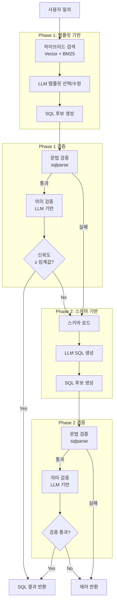
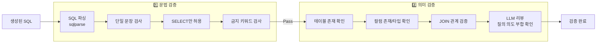
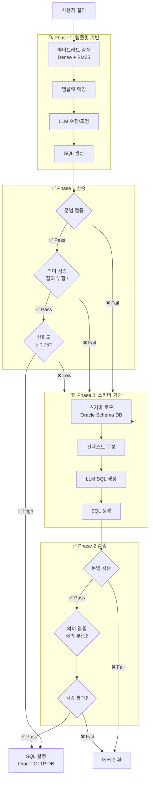
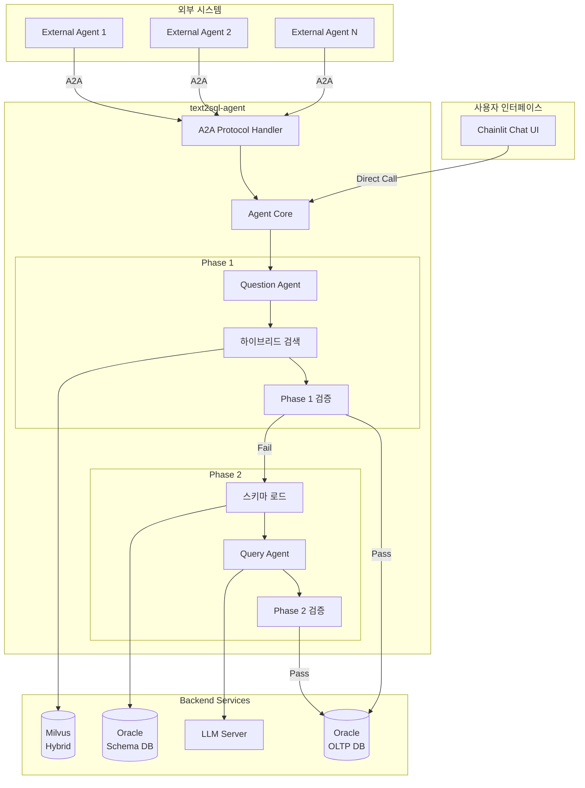
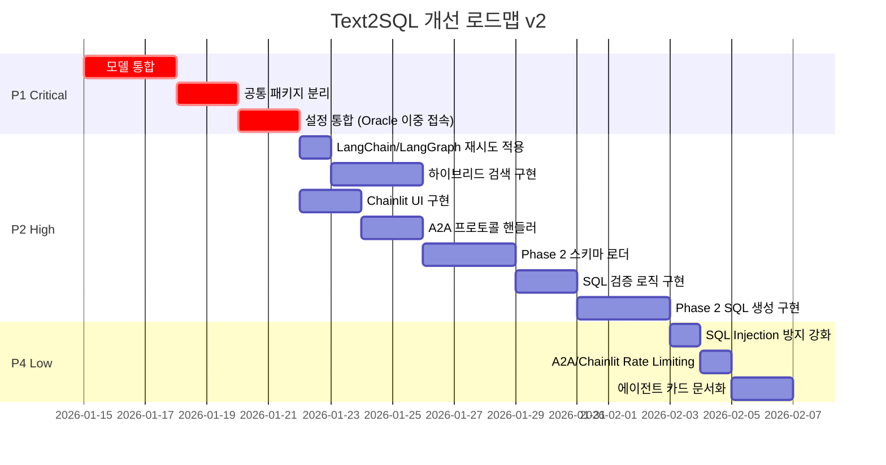

# Text2SQL 개선 계획 v2

> 작성일: 2026-01-13  
> 기반 문서: `project_improvement_report.md`, `improvement_plan.md`

---

## 1. 개선 범위

### 1.1 포함 항목

| 우선순위 | 영역 | 설명 |
|---------|------|------|
| 🔴 P1 | 모델 통합 | 공통 core 패키지로 모델 분리 |
| 🔴 P1 | 설정 통합 | 환경변수 prefix 통일 + Oracle 이중 접속정보 |
| 🟠 P2 | 진입점 아키텍처 | Chainlit UI (기본) + A2A (외부 연동) |
| 🟠 P2 | Phase 2 구현 | 스키마 기반 SQL 생성 |
| 🟠 P2 | 에러 핸들링 | LangChain/LangGraph 내장 재시도 활용 |
| 🟠 P2 | 하이브리드 검색 | LangChain Milvus BM25 통합 |
| 🟢 P4 | 보안 강화 | SQL Injection 방지, Rate Limiting |
| 🟢 P4 | 문서화 개선 | 에이전트 카드 및 가이드 |

### 1.2 제외 항목

| 항목 | 사유 |
|-----|------|
| 분산 트레이싱 (P3) | 이번 개선 범위 제외 |
| 임베딩 캐싱 (P3) | 이번 개선 범위 제외 |
| Testcontainers 통합 테스트 (P3) | 이번 개선 범위 제외 |

---

## 2. 전체 아키텍처 흐름

### 2.1 Phase 1 + Phase 2 통합 플로우 (SQL 검증 포함)



### 2.2 SQL 검증 상세 절차



---

## 3. 상세 개선 항목

### 3.1 🔴 P1: 모델 통합 (공통 패키지 분리)

#### 3.1.1 통합 모델 설계

```python
# packages/core/src/text2sql_core/models/sql_template.py
from datetime import datetime
from typing import Optional
from pydantic import BaseModel, Field


class BaseSQLTemplate(BaseModel):
    """SQL 템플릿 기본 모델 - 모든 프로젝트에서 공유"""
    
    # 필수 항목
    id: str = Field(..., description="템플릿 고유 ID")
    sql_text: str = Field(..., description="정규화된 SQL 텍스트")
    description: str = Field(..., description="SQL 설명")
    tables: list[str] = Field(default_factory=list, description="참조 테이블 목록")
    columns: list[str] = Field(default_factory=list, description="참조 컬럼 목록")
    
    # 선택 항목 (Optional)
    exec_count: Optional[int] = Field(default=None, description="실행 횟수")
    domain_tags: Optional[list[str]] = Field(default=None, description="도메인 태그")
    original_sql_id: Optional[str] = Field(default=None, description="원본 SQL ID")
    template_hash: Optional[str] = Field(default=None, description="템플릿 해시")


class SQLTemplateCreate(BaseSQLTemplate):
    """SQL 템플릿 생성용 모델"""
    
    normalized_text: str = Field(..., description="정규화된 SQL 텍스트")


class SQLTemplateInDB(BaseSQLTemplate):
    """DB 저장용 SQL 템플릿 모델"""
    
    embedding: Optional[list[float]] = Field(default=None, description="임베딩 벡터")
    created_at: datetime = Field(default_factory=datetime.now)
    updated_at: Optional[datetime] = Field(default=None)


class SQLTemplateSearch(BaseSQLTemplate):
    """검색 결과용 SQL 템플릿 모델"""
    
    similarity_score: float = Field(..., description="유사도 점수")
    matched_from: str = Field(..., description="매칭 소스 (vector/text/hybrid)")
```

---

### 3.2 🔴 P1: 설정 통합 (Oracle 이중 접속정보 포함)

#### 3.2.1 통합 설정 구조

오라클의 경우 **스키마 조회용**과 **OLTP SQL 실행용** 접속정보가 분리되어야 합니다.

```python
# packages/core/src/text2sql_core/config.py
from pydantic import Field
from pydantic_settings import BaseSettings, SettingsConfigDict


class OracleConnectionSettings(BaseSettings):
    """Oracle 개별 접속 설정"""
    host: str = Field(default="localhost")
    port: int = Field(default=1521)
    service_name: str = Field(default="ORCL")
    username: str = Field(default="")
    password: str = Field(default="")
    
    @property
    def dsn(self) -> str:
        """Oracle DSN 문자열 생성"""
        return f"{self.host}:{self.port}/{self.service_name}"


class OracleSettings(BaseSettings):
    """Oracle DB 설정 - 스키마 조회용과 OLTP 실행용 분리"""
    
    # 스키마 메타데이터 조회용 (읽기 전용, 시스템 테이블 접근)
    schema: OracleConnectionSettings = Field(
        default_factory=OracleConnectionSettings,
        description="스키마 조회용 접속정보 (메타데이터, 테이블/컬럼 정보)"
    )
    
    # OLTP SQL 실행용 (실제 데이터 조회)
    oltp: OracleConnectionSettings = Field(
        default_factory=OracleConnectionSettings,
        description="OLTP SQL 실행용 접속정보 (실제 데이터 조회)"
    )


class MilvusSettings(BaseSettings):
    """Milvus 벡터 DB 설정"""
    host: str = Field(default="localhost")
    port: int = Field(default=19530)
    collection_name: str = Field(default="sql_templates")
    embedding_dim: int = Field(default=1536)
    
    # 하이브리드 검색 설정
    enable_hybrid_search: bool = Field(default=True, description="하이브리드 검색 활성화")
    dense_weight: float = Field(default=0.6, description="Dense vector 가중치")
    sparse_weight: float = Field(default=0.4, description="Sparse(BM25) vector 가중치")


class LLMSettings(BaseSettings):
    """LLM 서버 설정"""
    base_url: str = Field(default="http://localhost:8000/v1")
    api_key: str = Field(default="")
    model_name: str = Field(default="gpt-4")
    temperature: float = Field(default=0.0)
    max_tokens: int = Field(default=4096)
    
    # 재시도 설정 (LangChain with_retry 활용)
    max_retries: int = Field(default=3)
    retry_wait_multiplier: float = Field(default=1.0)
    retry_wait_max: float = Field(default=10.0)


class EmbeddingSettings(BaseSettings):
    """임베딩 서비스 설정"""
    base_url: str = Field(default="http://localhost:8000/v1")
    api_key: str = Field(default="")
    model_name: str = Field(default="text-embedding-3-small")
    dimension: int = Field(default=1536)


class UnifiedSettings(BaseSettings):
    """통합 설정 - 모든 프로젝트에서 공유"""
    
    model_config = SettingsConfigDict(
        env_prefix="TEXT2SQL_",  # 통일된 prefix
        env_nested_delimiter="__",
        env_file=".env",
        extra="ignore",
    )
    
    # 공통 설정
    environment: str = Field(default="dev")
    debug: bool = Field(default=True)
    log_level: str = Field(default="INFO")
    
    # 외부 시스템
    oracle: OracleSettings = Field(default_factory=OracleSettings)
    milvus: MilvusSettings = Field(default_factory=MilvusSettings)
    llm: LLMSettings = Field(default_factory=LLMSettings)
    embedding: EmbeddingSettings = Field(default_factory=EmbeddingSettings)
    
    # Phase 전환 임계값
    phase1_confidence_threshold: float = Field(
        default=0.75, 
        description="Phase 1 신뢰도 임계값 (이하면 Phase 2로 전환)"
    )
```

#### 3.2.2 환경변수 예시

```bash
# .env.example
TEXT2SQL_ENVIRONMENT=dev
TEXT2SQL_DEBUG=true
TEXT2SQL_LOG_LEVEL=INFO

# Oracle - 스키마 조회용 (시스템 테이블 접근 권한 필요)
TEXT2SQL_ORACLE__SCHEMA__HOST=oracle-meta-db
TEXT2SQL_ORACLE__SCHEMA__PORT=1521
TEXT2SQL_ORACLE__SCHEMA__SERVICE_NAME=ORCL
TEXT2SQL_ORACLE__SCHEMA__USERNAME=schema_reader
TEXT2SQL_ORACLE__SCHEMA__PASSWORD=schema_secret

# Oracle - OLTP SQL 실행용 (실제 데이터 조회)
TEXT2SQL_ORACLE__OLTP__HOST=oracle-oltp-db
TEXT2SQL_ORACLE__OLTP__PORT=1521
TEXT2SQL_ORACLE__OLTP__SERVICE_NAME=OLTP
TEXT2SQL_ORACLE__OLTP__USERNAME=oltp_user
TEXT2SQL_ORACLE__OLTP__PASSWORD=oltp_secret

# Milvus
TEXT2SQL_MILVUS__HOST=milvus
TEXT2SQL_MILVUS__PORT=19530
TEXT2SQL_MILVUS__COLLECTION_NAME=sql_templates
TEXT2SQL_MILVUS__EMBEDDING_DIM=1536
TEXT2SQL_MILVUS__ENABLE_HYBRID_SEARCH=true
TEXT2SQL_MILVUS__DENSE_WEIGHT=0.6
TEXT2SQL_MILVUS__SPARSE_WEIGHT=0.4

# LLM
TEXT2SQL_LLM__BASE_URL=http://llm-server:8000/v1
TEXT2SQL_LLM__API_KEY=your-api-key
TEXT2SQL_LLM__MODEL_NAME=gpt-4
TEXT2SQL_LLM__MAX_RETRIES=3

# Embedding
TEXT2SQL_EMBEDDING__BASE_URL=http://llm-server:8000/v1
TEXT2SQL_EMBEDDING__MODEL_NAME=text-embedding-3-small
TEXT2SQL_EMBEDDING__DIMENSION=1536

# Phase 설정
TEXT2SQL_PHASE1_CONFIDENCE_THRESHOLD=0.75
```

---

### 3.3 🟠 P2: 에러 핸들링 (LangChain/LangGraph 내장 활용)

기존 계획에서 tenacity 기반 커스텀 재시도 데코레이터 대신, **LangChain과 LangGraph에 내장된 재시도 기능**을 활용합니다.

#### 3.3.1 LangChain Runnable.with_retry() 활용

```python
# packages/core/src/text2sql_core/llm/client.py
from langchain_openai import ChatOpenAI
from langchain_core.runnables import RunnableConfig
from text2sql_core.config import UnifiedSettings


def create_llm_with_retry(settings: UnifiedSettings) -> ChatOpenAI:
    """재시도 기능이 내장된 LLM 클라이언트 생성"""
    
    base_llm = ChatOpenAI(
        base_url=settings.llm.base_url,
        api_key=settings.llm.api_key,
        model=settings.llm.model_name,
        temperature=settings.llm.temperature,
        max_tokens=settings.llm.max_tokens,
    )
    
    # LangChain 내장 with_retry 활용
    # - retry_if_exception_type: 재시도할 예외 타입 지정
    # - wait_exponential_jitter: 지수 백오프 + 지터
    # - stop_after_attempt: 최대 재시도 횟수
    llm_with_retry = base_llm.with_retry(
        retry_if_exception_type=(
            ConnectionError,
            TimeoutError,
            Exception,  # 일반적인 API 에러
        ),
        wait_exponential_jitter=True,
        stop_after_attempt=settings.llm.max_retries,
    )
    
    return llm_with_retry


# 사용 예시
async def generate_sql(query: str, context: dict) -> str:
    settings = UnifiedSettings()
    llm = create_llm_with_retry(settings)
    
    # 자동으로 재시도 로직이 적용됨
    response = await llm.ainvoke(
        messages=[{"role": "user", "content": query}]
    )
    
    return response.content
```

#### 3.3.2 LangGraph RetryPolicy 활용

```python
# packages/agent/src/text2sql_agent/graph/builder.py
from langgraph.graph import StateGraph
from langgraph.types import RetryPolicy

from text2sql_agent.agents.question_agent import question_node
from text2sql_agent.agents.query_agent import query_node
from text2sql_agent.agents.validation_agent import validation_node
from text2sql_agent.state import Text2SQLState


def build_text2sql_graph() -> StateGraph:
    """Text2SQL 에이전트 그래프 구성 (LangGraph 내장 재시도 활용)"""
    
    builder = StateGraph(Text2SQLState)
    
    # LangGraph 내장 RetryPolicy 활용
    default_retry = RetryPolicy(
        max_attempts=3,
        initial_interval=0.5,  # 첫 재시도 대기 시간 (초)
        backoff_factor=2.0,    # 지수 백오프 배수
        retry_on=(
            ConnectionError,
            TimeoutError,
            # API 관련 에러들
        ),
    )
    
    # 노드 추가 시 재시도 정책 지정
    builder.add_node(
        "question_agent",
        question_node,
        retry_policy=default_retry,
    )
    
    builder.add_node(
        "query_agent",
        query_node,
        retry_policy=default_retry,
    )
    
    builder.add_node(
        "validation_agent",
        validation_node,
        retry_policy=RetryPolicy(
            max_attempts=2,  # 검증은 적은 재시도
            initial_interval=0.3,
            backoff_factor=1.5,
        ),
    )
    
    # 엣지 설정...
    builder.set_entry_point("question_agent")
    builder.add_edge("question_agent", "query_agent")
    builder.add_edge("query_agent", "validation_agent")
    
    return builder.compile()
```

#### 3.3.3 커스텀 예외 계층 (간소화)

```python
# packages/core/src/text2sql_core/exceptions.py
from typing import Any


class Text2SQLError(Exception):
    """기본 예외 클래스"""
    
    def __init__(
        self,
        message: str,
        code: str = "UNKNOWN_ERROR",
        context: dict[str, Any] | None = None,
    ):
        super().__init__(message)
        self.code = code
        self.context = context or {}


class LLMError(Text2SQLError):
    """LLM 호출 관련 에러"""
    
    def __init__(self, message: str, context: dict[str, Any] | None = None):
        super().__init__(message=message, code="LLM_ERROR", context=context)


class VectorStoreError(Text2SQLError):
    """벡터 스토어 관련 에러"""
    
    def __init__(self, message: str, context: dict[str, Any] | None = None):
        super().__init__(message=message, code="VECTOR_STORE_ERROR", context=context)


class SQLValidationError(Text2SQLError):
    """SQL 검증 에러"""
    
    def __init__(self, message: str, sql: str | None = None):
        super().__init__(
            message=message,
            code="SQL_VALIDATION_ERROR",
            context={"sql": sql} if sql else None,
        )


class SchemaError(Text2SQLError):
    """스키마 관련 에러"""
    
    def __init__(self, message: str, context: dict[str, Any] | None = None):
        super().__init__(message=message, code="SCHEMA_ERROR", context=context)
```

---

### 3.4 🟠 P2: 하이브리드 검색 (LangChain Milvus BM25 통합)

LangChain의 Milvus 통합에서 제공하는 **BM25BuiltInFunction**을 활용하여 하이브리드 검색을 구현합니다.

#### 3.4.1 하이브리드 검색 구현

```python
# packages/agent/src/text2sql_agent/services/hybrid_retrieval.py
from langchain_milvus import Milvus, BM25BuiltInFunction
from langchain_openai import OpenAIEmbeddings
from text2sql_core.config import UnifiedSettings
from text2sql_core.models import SQLTemplateSearch


class HybridRetrievalService:
    """LangChain Milvus 하이브리드 검색 서비스
    
    Milvus 2.5+ 의 네이티브 BM25 지원을 활용하여
    Dense(의미론적) + Sparse(키워드) 하이브리드 검색 수행
    """
    
    def __init__(self, settings: UnifiedSettings):
        self.settings = settings
        self._vectorstore: Milvus | None = None
    
    def _get_vectorstore(self) -> Milvus:
        """하이브리드 검색이 가능한 Milvus 벡터스토어 초기화"""
        
        if self._vectorstore is None:
            # LangChain Milvus 하이브리드 검색 설정
            self._vectorstore = Milvus(
                embedding_function=OpenAIEmbeddings(
                    base_url=self.settings.embedding.base_url,
                    api_key=self.settings.embedding.api_key,
                    model=self.settings.embedding.model_name,
                ),
                # Milvus 2.5+ BM25 내장 함수 활용
                builtin_function=BM25BuiltInFunction(
                    input_field="text",      # BM25 적용할 텍스트 필드
                    output_field="sparse",   # sparse vector 저장 필드
                ),
                # Dense + Sparse 벡터 필드 지정
                vector_field=["dense", "sparse"],
                connection_args={
                    "host": self.settings.milvus.host,
                    "port": self.settings.milvus.port,
                },
                collection_name=self.settings.milvus.collection_name,
            )
        
        return self._vectorstore
    
    async def search(
        self,
        query: str,
        top_k: int = 5,
    ) -> list[SQLTemplateSearch]:
        """하이브리드 검색 수행
        
        Args:
            query: 검색 질의
            top_k: 반환할 결과 수
            
        Returns:
            SQLTemplateSearch 리스트 (유사도 점수 포함)
        """
        
        vectorstore = self._get_vectorstore()
        
        # 하이브리드 검색 실행
        # - ranker_type="weighted": 가중치 기반 점수 조합
        # - weights: [dense_weight, sparse_weight]
        results = await vectorstore.asimilarity_search_with_score(
            query=query,
            k=top_k,
            ranker_type="weighted",
            ranker_params={
                "weights": [
                    self.settings.milvus.dense_weight,
                    self.settings.milvus.sparse_weight,
                ]
            },
        )
        
        # 결과 변환
        return [
            SQLTemplateSearch(
                id=doc.metadata.get("id", ""),
                sql_text=doc.metadata.get("sql_text", ""),
                description=doc.page_content,
                tables=doc.metadata.get("tables", []),
                columns=doc.metadata.get("columns", []),
                similarity_score=score,
                matched_from="hybrid",
            )
            for doc, score in results
        ]
    
    async def search_with_fallback(
        self,
        query: str,
        top_k: int = 5,
    ) -> list[SQLTemplateSearch]:
        """하이브리드 검색 (Fallback 포함)
        
        하이브리드 검색 실패 시 Dense-only 검색으로 폴백
        """
        
        try:
            return await self.search(query, top_k)
        except Exception as e:
            # 하이브리드 검색 실패 시 Dense-only로 폴백
            import logging
            logging.warning(f"Hybrid search failed, falling back to dense: {e}")
            
            vectorstore = self._get_vectorstore()
            results = await vectorstore.asimilarity_search_with_score(
                query=query,
                k=top_k,
            )
            
            return [
                SQLTemplateSearch(
                    id=doc.metadata.get("id", ""),
                    sql_text=doc.metadata.get("sql_text", ""),
                    description=doc.page_content,
                    tables=doc.metadata.get("tables", []),
                    columns=doc.metadata.get("columns", []),
                    similarity_score=score,
                    matched_from="dense",
                )
                for doc, score in results
            ]
```

#### 3.4.2 하이브리드 검색 인덱싱

```python
# packages/pipeline/src/text2sql_pipeline/indexer/hybrid_indexer.py
from langchain_milvus import Milvus, BM25BuiltInFunction
from langchain_openai import OpenAIEmbeddings
from langchain_core.documents import Document
from text2sql_core.config import UnifiedSettings
from text2sql_core.models import SQLTemplateInDB


class HybridIndexer:
    """하이브리드 검색을 위한 인덱서
    
    Dense embedding + BM25 sparse embedding을 동시에 저장
    """
    
    def __init__(self, settings: UnifiedSettings):
        self.settings = settings
    
    async def index_templates(
        self,
        templates: list[SQLTemplateInDB],
    ) -> int:
        """SQL 템플릿을 하이브리드 검색 가능하도록 인덱싱"""
        
        # Document 객체로 변환
        documents = [
            Document(
                page_content=template.description,
                metadata={
                    "id": template.id,
                    "sql_text": template.sql_text,
                    "tables": template.tables,
                    "columns": template.columns,
                    "exec_count": template.exec_count,
                    "domain_tags": template.domain_tags,
                },
            )
            for template in templates
        ]
        
        # 하이브리드 인덱싱
        vectorstore = Milvus.from_documents(
            documents=documents,
            embedding=OpenAIEmbeddings(
                base_url=self.settings.embedding.base_url,
                api_key=self.settings.embedding.api_key,
                model=self.settings.embedding.model_name,
            ),
            builtin_function=BM25BuiltInFunction(
                input_field="text",
                output_field="sparse",
            ),
            vector_field=["dense", "sparse"],
            connection_args={
                "host": self.settings.milvus.host,
                "port": self.settings.milvus.port,
            },
            collection_name=self.settings.milvus.collection_name,
            drop_old=False,  # 기존 데이터 유지
        )
        
        return len(documents)
```

---

### 3.5 🟠 P2: Phase 2 구현 (스키마 기반 SQL 생성)

#### 3.5.1 Phase 흐름 (검증 단계 포함)



#### 3.5.2 스키마 로더 인터페이스

```python
# packages/core/src/text2sql_core/protocols.py
from typing import Protocol
from dataclasses import dataclass


@dataclass
class TableSchema:
    """테이블 스키마 정보"""
    name: str
    columns: list["ColumnSchema"]
    primary_key: list[str]
    foreign_keys: list["ForeignKey"]
    description: str | None = None


@dataclass
class ColumnSchema:
    """컬럼 스키마 정보"""
    name: str
    data_type: str
    nullable: bool
    description: str | None = None


@dataclass
class ForeignKey:
    """외래키 정보"""
    column: str
    references_table: str
    references_column: str


class SchemaLoader(Protocol):
    """스키마 로더 인터페이스"""
    
    async def load_tables(self, schema: str) -> list[TableSchema]:
        """스키마의 모든 테이블 정보 로드"""
        ...
    
    async def load_table(self, schema: str, table_name: str) -> TableSchema:
        """특정 테이블 정보 로드"""
        ...
    
    async def get_related_tables(self, table_name: str) -> list[str]:
        """관련 테이블 목록 조회 (FK 기반)"""
        ...
```

#### 3.5.3 Oracle 스키마 로더 구현 (스키마 전용 접속)

```python
# packages/core/src/text2sql_core/schema/oracle_loader.py
import oracledb
from text2sql_core.config import UnifiedSettings
from text2sql_core.protocols import SchemaLoader, TableSchema, ColumnSchema, ForeignKey


class OracleSchemaLoader(SchemaLoader):
    """Oracle 스키마 로더 - 스키마 조회 전용 접속정보 사용"""
    
    def __init__(self, settings: UnifiedSettings):
        self.settings = settings
        # 스키마 조회용 접속정보 사용
        self._schema_config = settings.oracle.schema
    
    async def _get_connection(self):
        """스키마 조회 전용 DB 연결"""
        return await oracledb.connect_async(
            user=self._schema_config.username,
            password=self._schema_config.password,
            dsn=self._schema_config.dsn,
        )
    
    async def load_tables(self, schema: str) -> list[TableSchema]:
        """스키마의 모든 테이블 정보 로드"""
        async with await self._get_connection() as conn:
            async with conn.cursor() as cursor:
                await cursor.execute("""
                    SELECT table_name, comments
                    FROM all_tab_comments
                    WHERE owner = :schema AND table_type = 'TABLE'
                """, {"schema": schema.upper()})
                
                tables = []
                async for row in cursor:
                    table = await self.load_table(schema, row[0])
                    if row[1]:
                        table.description = row[1]
                    tables.append(table)
                
                return tables
    
    async def load_table(self, schema: str, table_name: str) -> TableSchema:
        """특정 테이블 정보 로드"""
        columns = await self._load_columns(schema, table_name)
        pk = await self._load_primary_key(schema, table_name)
        fks = await self._load_foreign_keys(schema, table_name)
        
        return TableSchema(
            name=table_name,
            columns=columns,
            primary_key=pk,
            foreign_keys=fks,
        )
    
    async def _load_columns(
        self, schema: str, table_name: str
    ) -> list[ColumnSchema]:
        """테이블 컬럼 정보 로드"""
        async with await self._get_connection() as conn:
            async with conn.cursor() as cursor:
                await cursor.execute("""
                    SELECT 
                        c.column_name,
                        c.data_type,
                        c.nullable,
                        cc.comments
                    FROM all_tab_columns c
                    LEFT JOIN all_col_comments cc 
                        ON c.owner = cc.owner 
                        AND c.table_name = cc.table_name 
                        AND c.column_name = cc.column_name
                    WHERE c.owner = :schema 
                        AND c.table_name = :table_name
                    ORDER BY c.column_id
                """, {"schema": schema.upper(), "table_name": table_name.upper()})
                
                columns = []
                async for row in cursor:
                    columns.append(ColumnSchema(
                        name=row[0],
                        data_type=row[1],
                        nullable=row[2] == "Y",
                        description=row[3],
                    ))
                
                return columns
    
    # ... _load_primary_key, _load_foreign_keys 등 구현
```

#### 3.5.4 SQL 검증기 구현

```python
# packages/core/src/text2sql_core/validation/sql_validator.py
from sqlparse import parse as sql_parse
from sqlparse.sql import Statement
from sqlparse.tokens import Keyword, DML
from langchain_openai import ChatOpenAI

from text2sql_core.exceptions import SQLValidationError
from text2sql_core.protocols import SchemaLoader


class SQLValidator:
    """SQL 검증기 - 문법적/의미적 검증 수행"""
    
    FORBIDDEN_KEYWORDS = {
        "DROP", "DELETE", "UPDATE", "INSERT", "ALTER", 
        "CREATE", "TRUNCATE", "GRANT", "REVOKE", "EXEC",
    }
    
    def __init__(
        self,
        schema_loader: SchemaLoader | None = None,
        llm: ChatOpenAI | None = None,
    ):
        self.schema_loader = schema_loader
        self.llm = llm
    
    def validate_syntax(self, sql: str) -> str:
        """1️⃣ 문법 검증 - sqlparse 기반"""
        
        try:
            parsed = sql_parse(sql)
        except Exception as e:
            raise SQLValidationError(f"SQL 파싱 실패: {e}", sql=sql)
        
        if len(parsed) != 1:
            raise SQLValidationError("단일 SQL 문만 허용됩니다.", sql=sql)
        
        stmt: Statement = parsed[0]
        
        if stmt.get_type() != "SELECT":
            raise SQLValidationError("SELECT 쿼리만 생성할 수 있습니다.", sql=sql)
        
        # 금지 키워드 검사
        for token in stmt.flatten():
            if token.ttype in (Keyword, DML):
                word = token.value.upper()
                if word in self.FORBIDDEN_KEYWORDS:
                    raise SQLValidationError(
                        f"금지된 키워드 사용: {word}", sql=sql
                    )
        
        return sql.strip()
    
    async def validate_semantic(
        self,
        sql: str,
        user_query: str,
        schema: str,
    ) -> tuple[bool, float, str]:
        """2️⃣ 의미 검증 - 스키마 존재 확인 + LLM 리뷰
        
        Returns:
            (is_valid, confidence_score, explanation)
        """
        
        # 스키마 기반 테이블/컬럼 존재 확인
        if self.schema_loader:
            await self._validate_tables_exist(sql, schema)
        
        # LLM 기반 의미 검증
        if self.llm:
            return await self._llm_semantic_review(sql, user_query)
        
        return True, 1.0, "검증 완료"
    
    async def _validate_tables_exist(self, sql: str, schema: str):
        """스키마 기반 테이블 존재 확인"""
        # 구현...
        pass
    
    async def _llm_semantic_review(
        self,
        sql: str,
        user_query: str,
    ) -> tuple[bool, float, str]:
        """LLM 기반 의미 검증 - 질의 의도 부합 확인"""
        
        review_prompt = f"""
다음 사용자 질의에 대해 생성된 SQL이 의도에 맞는지 검토해주세요.

## 사용자 질의
{user_query}

## 생성된 SQL
{sql}

## 평가 기준
1. SQL이 사용자의 질문 의도를 정확히 반영하는가?
2. SELECT 절의 컬럼이 사용자가 원하는 정보를 제공하는가?
3. WHERE 조건이 적절한가?
4. 불필요한 데이터를 반환하지 않는가?

## 응답 형식 (JSON)
{{
    "is_valid": true/false,
    "confidence": 0.0-1.0,
    "explanation": "설명..."
}}
"""
        
        response = await self.llm.ainvoke(review_prompt)
        # JSON 파싱 및 반환
        import json
        result = json.loads(response.content)
        return result["is_valid"], result["confidence"], result["explanation"]
```

---

### 3.6 🟠 P2: 진입점 아키텍처 (Chainlit + A2A)



---

## 4. 권장 디렉토리 구조

```
text2sql/
├── packages/
│   ├── core/                        # 🔴 P1: 공통 패키지
│   │   ├── src/text2sql_core/
│   │   │   ├── models/              # 통합 모델
│   │   │   │   ├── __init__.py
│   │   │   │   └── sql_template.py
│   │   │   ├── config.py            # 통합 설정 (Oracle 이중 접속)
│   │   │   ├── protocols.py         # 인터페이스 정의
│   │   │   ├── exceptions.py        # 커스텀 예외
│   │   │   ├── llm/                 # 🟠 P2: LLM 클라이언트
│   │   │   │   └── client.py        # with_retry 활용
│   │   │   ├── schema/              # 🟠 P2: 스키마 로더
│   │   │   │   └── oracle_loader.py
│   │   │   ├── validation/          # 🟠 P2: SQL 검증
│   │   │   │   └── sql_validator.py
│   │   │   └── security/            # 🟢 P4: 보안
│   │   │       └── sql_validator.py
│   │   ├── pyproject.toml
│   │   └── tests/
│   │
│   ├── pipeline/                    # 오프라인 파이프라인
│   │   ├── src/text2sql_pipeline/
│   │   │   ├── ingestor/
│   │   │   ├── processor/
│   │   │   └── indexer/
│   │   │       └── hybrid_indexer.py  # 🟠 P2: 하이브리드 인덱싱
│   │   └── pyproject.toml
│   │
│   └── agent/                       # 온라인 에이전트
│       ├── src/text2sql_agent/
│       │   ├── graph/               # 🟠 P2: LangGraph 기반
│       │   │   └── builder.py       # RetryPolicy 활용
│       │   ├── agents/
│       │   │   ├── __init__.py
│       │   │   ├── orchestrator.py
│       │   │   ├── question_agent.py
│       │   │   ├── query_agent.py   # Phase 2
│       │   │   ├── validation_agent.py  # SQL 검증
│       │   │   └── answer_agent.py
│       │   ├── services/
│       │   │   └── hybrid_retrieval.py  # 🟠 P2: 하이브리드 검색
│       │   ├── ui/                  # Chainlit UI
│       │   │   ├── __init__.py
│       │   │   ├── app.py
│       │   │   └── security.py
│       │   └── a2a/                 # A2A 프로토콜
│       │       ├── __init__.py
│       │       ├── handler.py
│       │       ├── server.py
│       │       └── middleware.py
│       ├── chainlit.md
│       └── pyproject.toml
│
├── pyproject.toml
├── .env.example
└── docker-compose.yml
```

---

## 5. 구현 우선순위 및 일정



---

## 6. 체크리스트

### 6.1 P1: 모델 통합
- [ ] `BaseSQLTemplate` 정의 (Optional 필드 반영)
- [ ] `SQLTemplateCreate`, `SQLTemplateInDB`, `SQLTemplateSearch` 정의
- [ ] 기존 pipeline/agent 모델 마이그레이션
- [ ] 통합 설정 (`UnifiedSettings`) 구현
- [ ] Oracle 이중 접속정보 분리 (schema/oltp)
- [ ] 환경변수 prefix 통일 (`TEXT2SQL_`)

### 6.2 P2: 에러 핸들링 (LangChain/LangGraph 활용)
- [ ] `create_llm_with_retry()` 구현 (LangChain `with_retry`)
- [ ] LangGraph `RetryPolicy` 노드 적용
- [ ] 커스텀 예외 계층 구현

### 6.3 P2: 하이브리드 검색
- [ ] `HybridRetrievalService` 구현 (LangChain Milvus BM25)
- [ ] `HybridIndexer` 구현
- [ ] 기존 검색 로직 마이그레이션

### 6.4 P2: Phase 2 구현
- [ ] `SchemaLoader` 인터페이스 정의
- [ ] `OracleSchemaLoader` 구현 (스키마 전용 접속)
- [ ] `SQLValidator` 구현 (문법/의미 검증)
- [ ] Phase 1 → Phase 2 폴백 로직 구현
- [ ] LLM 기반 의미 검증 프롬프트 작성

### 6.5 P2: 진입점 아키텍처
- [ ] Chainlit 채팅 UI 구현 (`ui/app.py`)
- [ ] A2A 핸들러 구현 (`a2a/handler.py`)
- [ ] A2A 서버 설정 (`a2a/server.py`)
- [ ] Agent Card 정의 (A2A 디스커버리)

### 6.6 P4: 보안 & 문서화
- [ ] A2A Rate Limiting 미들웨어 추가
- [ ] Chainlit 세션 보안 구현
- [ ] 에이전트 카드 문서화

---

## 7. 참고 자료

### 7.1 LangChain 재시도 기능
- `Runnable.with_retry()`: 자동 재시도 래퍼
- `retry_if_exception_type`: 재시도할 예외 타입 지정
- `wait_exponential_jitter`: 지수 백오프 + 지터
- [LangChain Runnable API](https://python.langchain.com/api_reference/core/runnables/)

### 7.2 LangGraph 재시도 정책
- `RetryPolicy`: 노드별 재시도 정책 설정
- `max_attempts`, `initial_interval`, `backoff_factor`, `retry_on`
- [LangGraph Error Handling](https://docs.langchain.com/langgraph/use-graph-api)

### 7.3 LangChain Milvus 하이브리드 검색
- `BM25BuiltInFunction`: Milvus 2.5+ 내장 BM25 함수
- `vector_field=["dense", "sparse"]`: Dense + Sparse 벡터 저장
- `ranker_type="weighted"`: 가중치 기반 하이브리드 랭킹
- [LangChain Milvus Integration](https://docs.langchain.com/integrations/vectorstores/milvus)

---

## 8. 변경 이력

| 버전 | 날짜 | 변경 내용 |
|-----|------|----------|
| v1 | 2026-01-13 | 최초 작성 |
| v2 | 2026-01-13 | 분산 트레이싱 제외, 재시도 로직 LangChain/LangGraph 활용, Oracle 이중 접속정보, 하이브리드 검색 BM25 통합, stage→phase 용어 통일, SQL 검증 절차 추가 |
