# Text2SQL 개선 계획 v2

> 작성일: 2026-01-13  
> 기반 문서: `project_improvement_report.md`, `improvement_plan.md`

---

## 1. 개선 범위

### 1.1 포함 항목

| 우선순위 | 영역 | 설명 |
|---------|------|------|
| 🔴 P1 | 모델 통합 | 공통 core 패키지로 모델 분리 |
| 🔴 P1 | 설정 통합 | 환경변수 prefix 통일 + Oracle 이중 접속정보 |
| 🟠 P2 | 진입점 아키텍처 | Chainlit UI (기본) + A2A (외부 연동) |
| 🟠 P2 | Phase 2 구현 | 스키마 기반 SQL 생성 |
| 🟠 P2 | 에러 핸들링 | LangChain/LangGraph 내장 재시도 활용 |
| 🟠 P2 | 하이브리드 검색 | LangChain Milvus BM25 통합 |
| 🟢 P4 | 보안 강화 | SQL Injection 방지, Rate Limiting |
| 🟢 P4 | 문서화 개선 | 에이전트 카드 및 가이드 |

### 1.2 제외 항목

| 항목 | 사유 |
|-----|------|
| 분산 트레이싱 (P3) | 이번 개선 범위 제외 |
| 임베딩 캐싱 (P3) | 이번 개선 범위 제외 |
| Testcontainers 통합 테스트 (P3) | 이번 개선 범위 제외 |

---

## 2. 전체 아키텍처 흐름

### 2.1 Phase 1 + Phase 2 통합 플로우 (SQL 검증 포함)

```mermaid
flowchart TB
    Query[사용자 질의]
    
    subgraph Phase1["Phase 1: 템플릿 기반"]
        P1_Search[하이브리드 검색<br/>Vector + BM25]
        P1_LLM[LLM 템플릿 선택/수정]
        P1_SQL[SQL 후보 생성]
    end
    
    subgraph P1_Validation["Phase 1 검증"]
        P1_Syntax[문법 검증<br/>sqlparse]
        P1_Semantic[의미 검증<br/>LLM 기반]
        P1_Confidence{신뢰도<br/>≥ 임계값?}
    end
    
    subgraph Phase2["Phase 2: 스키마 기반"]
        P2_Schema[스키마 로드]
        P2_LLM[LLM SQL 생성]
        P2_SQL[SQL 후보 생성]
    end
    
    subgraph P2_Validation["Phase 2 검증"]
        P2_Syntax[문법 검증<br/>sqlparse]
        P2_Semantic[의미 검증<br/>LLM 기반]
        P2_Valid{검증 통과?}
    end
    
    Result[SQL 결과 반환]
    Error[에러 반환]
    
    Query --> P1_Search
    P1_Search --> P1_LLM
    P1_LLM --> P1_SQL
    P1_SQL --> P1_Syntax
    P1_Syntax -->|통과| P1_Semantic
    P1_Syntax -->|실패| P2_Schema
    P1_Semantic --> P1_Confidence
    P1_Confidence -->|Yes| Result
    P1_Confidence -->|No| P2_Schema
    
    P2_Schema --> P2_LLM
    P2_LLM --> P2_SQL
    P2_SQL --> P2_Syntax
    P2_Syntax -->|통과| P2_Semantic
    P2_Syntax -->|실패| Error
    P2_Semantic --> P2_Valid
    P2_Valid -->|Yes| Result
    P2_Valid -->|No| Error
```



### 2.2 SQL 검증 상세 절차

```mermaid
flowchart LR
    subgraph SyntaxValidation["1️⃣ 문법 검증"]
        Parse[SQL 파싱<br/>sqlparse]
        Single[단일 문장 검사]
        SelectOnly[SELECT만 허용]
        Forbidden[금지 키워드 검사]
    end
    
    subgraph SemanticValidation["2️⃣ 의미 검증"]
        TableCheck[테이블 존재 확인]
        ColumnCheck[컬럼 존재/타입 확인]
        JoinCheck[JOIN 관계 검증]
        LLMReview[LLM 리뷰<br/>질의 의도 부합 확인]
    end
    
    SQL[생성된 SQL] --> Parse
    Parse --> Single
    Single --> SelectOnly
    SelectOnly --> Forbidden
    Forbidden -->|Pass| TableCheck
    TableCheck --> ColumnCheck
    ColumnCheck --> JoinCheck
    JoinCheck --> LLMReview
    LLMReview --> Final[검증 완료]
```



---

## 3. 상세 개선 항목

### 3.1 🔴 P1: 모델 통합 (공통 패키지 분리)

#### 3.1.1 통합 모델 설계

```python
# packages/core/src/text2sql_core/models/sql_template.py
from datetime import datetime
from typing import Optional
from pydantic import BaseModel, Field


class BaseSQLTemplate(BaseModel):
    """SQL 템플릿 기본 모델 - 모든 프로젝트에서 공유"""
    
    # 필수 항목
    id: str = Field(..., description="템플릿 고유 ID")
    sql_text: str = Field(..., description="정규화된 SQL 텍스트")
    description: str = Field(..., description="SQL 설명")
    tables: list[str] = Field(default_factory=list, description="참조 테이블 목록")
    columns: list[str] = Field(default_factory=list, description="참조 컬럼 목록")
    
    # 선택 항목 (Optional)
    exec_count: Optional[int] = Field(default=None, description="실행 횟수")
    domain_tags: Optional[list[str]] = Field(default=None, description="도메인 태그")
    original_sql_id: Optional[str] = Field(default=None, description="원본 SQL ID")
    template_hash: Optional[str] = Field(default=None, description="템플릿 해시")


class SQLTemplateCreate(BaseSQLTemplate):
    """SQL 템플릿 생성용 모델"""
    
    normalized_text: str = Field(..., description="정규화된 SQL 텍스트")


class SQLTemplateInDB(BaseSQLTemplate):
    """DB 저장용 SQL 템플릿 모델"""
    
    embedding: Optional[list[float]] = Field(default=None, description="임베딩 벡터")
    created_at: datetime = Field(default_factory=datetime.now)
    updated_at: Optional[datetime] = Field(default=None)


class SQLTemplateSearch(BaseSQLTemplate):
    """검색 결과용 SQL 템플릿 모델"""
    
    similarity_score: float = Field(..., description="유사도 점수")
    matched_from: str = Field(..., description="매칭 소스 (vector/text/hybrid)")
```

---

### 3.2 🔴 P1: 설정 통합 (Oracle 이중 접속정보 포함)

#### 3.2.1 통합 설정 구조

오라클의 경우 **스키마 조회용**과 **OLTP SQL 실행용** 접속정보가 분리되어야 합니다.

```python
# packages/core/src/text2sql_core/config.py
from pydantic import Field
from pydantic_settings import BaseSettings, SettingsConfigDict


class OracleConnectionSettings(BaseSettings):
    """Oracle 개별 접속 설정"""
    host: str = Field(default="localhost")
    port: int = Field(default=1521)
    service_name: str = Field(default="ORCL")
    username: str = Field(default="")
    password: str = Field(default="")
    
    @property
    def dsn(self) -> str:
        """Oracle DSN 문자열 생성"""
        return f"{self.host}:{self.port}/{self.service_name}"


class OracleSettings(BaseSettings):
    """Oracle DB 설정 - 스키마 조회용과 OLTP 실행용 분리"""
    
    # 스키마 메타데이터 조회용 (읽기 전용, 시스템 테이블 접근)
    schema: OracleConnectionSettings = Field(
        default_factory=OracleConnectionSettings,
        description="스키마 조회용 접속정보 (메타데이터, 테이블/컬럼 정보)"
    )
    
    # OLTP SQL 실행용 (실제 데이터 조회)
    oltp: OracleConnectionSettings = Field(
        default_factory=OracleConnectionSettings,
        description="OLTP SQL 실행용 접속정보 (실제 데이터 조회)"
    )


class MilvusSettings(BaseSettings):
    """Milvus 벡터 DB 설정"""
    host: str = Field(default="localhost")
    port: int = Field(default=19530)
    collection_name: str = Field(default="sql_templates")
    embedding_dim: int = Field(default=1536)
    
    # 하이브리드 검색 설정
    enable_hybrid_search: bool = Field(default=True, description="하이브리드 검색 활성화")
    dense_weight: float = Field(default=0.6, description="Dense vector 가중치")
    sparse_weight: float = Field(default=0.4, description="Sparse(BM25) vector 가중치")


class LLMSettings(BaseSettings):
    """LLM 서버 설정"""
    base_url: str = Field(default="http://localhost:8000/v1")
    api_key: str = Field(default="")
    model_name: str = Field(default="gpt-4")
    temperature: float = Field(default=0.0)
    max_tokens: int = Field(default=4096)
    
    # 재시도 설정 (LangChain with_retry 활용)
    max_retries: int = Field(default=3)
    retry_wait_multiplier: float = Field(default=1.0)
    retry_wait_max: float = Field(default=10.0)


class EmbeddingSettings(BaseSettings):
    """임베딩 서비스 설정"""
    base_url: str = Field(default="http://localhost:8000/v1")
    api_key: str = Field(default="")
    model_name: str = Field(default="text-embedding-3-small")
    dimension: int = Field(default=1536)


class UnifiedSettings(BaseSettings):
    """통합 설정 - 모든 프로젝트에서 공유"""
    
    model_config = SettingsConfigDict(
        env_prefix="TEXT2SQL_",  # 통일된 prefix
        env_nested_delimiter="__",
        env_file=".env",
        extra="ignore",
    )
    
    # 공통 설정
    environment: str = Field(default="dev")
    debug: bool = Field(default=True)
    log_level: str = Field(default="INFO")
    
    # 외부 시스템
    oracle: OracleSettings = Field(default_factory=OracleSettings)
    milvus: MilvusSettings = Field(default_factory=MilvusSettings)
    llm: LLMSettings = Field(default_factory=LLMSettings)
    embedding: EmbeddingSettings = Field(default_factory=EmbeddingSettings)
    
    # Phase 전환 임계값
    phase1_confidence_threshold: float = Field(
        default=0.75, 
        description="Phase 1 신뢰도 임계값 (이하면 Phase 2로 전환)"
    )
```

#### 3.2.2 환경변수 예시

```bash
# .env.example
TEXT2SQL_ENVIRONMENT=dev
TEXT2SQL_DEBUG=true
TEXT2SQL_LOG_LEVEL=INFO

# Oracle - 스키마 조회용 (시스템 테이블 접근 권한 필요)
TEXT2SQL_ORACLE__SCHEMA__HOST=oracle-meta-db
TEXT2SQL_ORACLE__SCHEMA__PORT=1521
TEXT2SQL_ORACLE__SCHEMA__SERVICE_NAME=ORCL
TEXT2SQL_ORACLE__SCHEMA__USERNAME=schema_reader
TEXT2SQL_ORACLE__SCHEMA__PASSWORD=schema_secret

# Oracle - OLTP SQL 실행용 (실제 데이터 조회)
TEXT2SQL_ORACLE__OLTP__HOST=oracle-oltp-db
TEXT2SQL_ORACLE__OLTP__PORT=1521
TEXT2SQL_ORACLE__OLTP__SERVICE_NAME=OLTP
TEXT2SQL_ORACLE__OLTP__USERNAME=oltp_user
TEXT2SQL_ORACLE__OLTP__PASSWORD=oltp_secret

# Milvus
TEXT2SQL_MILVUS__HOST=milvus
TEXT2SQL_MILVUS__PORT=19530
TEXT2SQL_MILVUS__COLLECTION_NAME=sql_templates
TEXT2SQL_MILVUS__EMBEDDING_DIM=1536
TEXT2SQL_MILVUS__ENABLE_HYBRID_SEARCH=true
TEXT2SQL_MILVUS__DENSE_WEIGHT=0.6
TEXT2SQL_MILVUS__SPARSE_WEIGHT=0.4

# LLM
TEXT2SQL_LLM__BASE_URL=http://llm-server:8000/v1
TEXT2SQL_LLM__API_KEY=your-api-key
TEXT2SQL_LLM__MODEL_NAME=gpt-4
TEXT2SQL_LLM__MAX_RETRIES=3

# Embedding
TEXT2SQL_EMBEDDING__BASE_URL=http://llm-server:8000/v1
TEXT2SQL_EMBEDDING__MODEL_NAME=text-embedding-3-small
TEXT2SQL_EMBEDDING__DIMENSION=1536

# Phase 설정
TEXT2SQL_PHASE1_CONFIDENCE_THRESHOLD=0.75
```

---

### 3.3 🟠 P2: 에러 핸들링 (LangChain/LangGraph 내장 활용)

기존 계획에서 tenacity 기반 커스텀 재시도 데코레이터 대신, **LangChain과 LangGraph에 내장된 재시도 기능**을 활용합니다.

#### 3.3.1 LangChain Runnable.with_retry() 활용

```python
# packages/core/src/text2sql_core/llm/client.py
from langchain_openai import ChatOpenAI
from langchain_core.runnables import RunnableConfig
from text2sql_core.config import UnifiedSettings


def create_llm_with_retry(settings: UnifiedSettings) -> ChatOpenAI:
    """재시도 기능이 내장된 LLM 클라이언트 생성"""
    
    base_llm = ChatOpenAI(
        base_url=settings.llm.base_url,
        api_key=settings.llm.api_key,
        model=settings.llm.model_name,
        temperature=settings.llm.temperature,
        max_tokens=settings.llm.max_tokens,
    )
    
    # LangChain 내장 with_retry 활용
    # - retry_if_exception_type: 재시도할 예외 타입 지정
    # - wait_exponential_jitter: 지수 백오프 + 지터
    # - stop_after_attempt: 최대 재시도 횟수
    llm_with_retry = base_llm.with_retry(
        retry_if_exception_type=(
            ConnectionError,
            TimeoutError,
            Exception,  # 일반적인 API 에러
        ),
        wait_exponential_jitter=True,
        stop_after_attempt=settings.llm.max_retries,
    )
    
    return llm_with_retry


# 사용 예시
async def generate_sql(query: str, context: dict) -> str:
    settings = UnifiedSettings()
    llm = create_llm_with_retry(settings)
    
    # 자동으로 재시도 로직이 적용됨
    response = await llm.ainvoke(
        messages=[{"role": "user", "content": query}]
    )
    
    return response.content
```

#### 3.3.2 LangGraph RetryPolicy 활용

```python
# packages/agent/src/text2sql_agent/graph/builder.py
from langgraph.graph import StateGraph
from langgraph.types import RetryPolicy

from text2sql_agent.agents.question_agent import question_node
from text2sql_agent.agents.query_agent import query_node
from text2sql_agent.agents.validation_agent import validation_node
from text2sql_agent.state import Text2SQLState


def build_text2sql_graph() -> StateGraph:
    """Text2SQL 에이전트 그래프 구성 (LangGraph 내장 재시도 활용)"""
    
    builder = StateGraph(Text2SQLState)
    
    # LangGraph 내장 RetryPolicy 활용
    default_retry = RetryPolicy(
        max_attempts=3,
        initial_interval=0.5,  # 첫 재시도 대기 시간 (초)
        backoff_factor=2.0,    # 지수 백오프 배수
        retry_on=(
            ConnectionError,
            TimeoutError,
            # API 관련 에러들
        ),
    )
    
    # 노드 추가 시 재시도 정책 지정
    builder.add_node(
        "question_agent",
        question_node,
        retry_policy=default_retry,
    )
    
    builder.add_node(
        "query_agent",
        query_node,
        retry_policy=default_retry,
    )
    
    builder.add_node(
        "validation_agent",
        validation_node,
        retry_policy=RetryPolicy(
            max_attempts=2,  # 검증은 적은 재시도
            initial_interval=0.3,
            backoff_factor=1.5,
        ),
    )
    
    # 엣지 설정...
    builder.set_entry_point("question_agent")
    builder.add_edge("question_agent", "query_agent")
    builder.add_edge("query_agent", "validation_agent")
    
    return builder.compile()
```

#### 3.3.3 커스텀 예외 계층 (간소화)

```python
# packages/core/src/text2sql_core/exceptions.py
from typing import Any


class Text2SQLError(Exception):
    """기본 예외 클래스"""
    
    def __init__(
        self,
        message: str,
        code: str = "UNKNOWN_ERROR",
        context: dict[str, Any] | None = None,
    ):
        super().__init__(message)
        self.code = code
        self.context = context or {}


class LLMError(Text2SQLError):
    """LLM 호출 관련 에러"""
    
    def __init__(self, message: str, context: dict[str, Any] | None = None):
        super().__init__(message=message, code="LLM_ERROR", context=context)


class VectorStoreError(Text2SQLError):
    """벡터 스토어 관련 에러"""
    
    def __init__(self, message: str, context: dict[str, Any] | None = None):
        super().__init__(message=message, code="VECTOR_STORE_ERROR", context=context)


class SQLValidationError(Text2SQLError):
    """SQL 검증 에러"""
    
    def __init__(self, message: str, sql: str | None = None):
        super().__init__(
            message=message,
            code="SQL_VALIDATION_ERROR",
            context={"sql": sql} if sql else None,
        )


class SchemaError(Text2SQLError):
    """스키마 관련 에러"""
    
    def __init__(self, message: str, context: dict[str, Any] | None = None):
        super().__init__(message=message, code="SCHEMA_ERROR", context=context)
```

---

### 3.4 🟠 P2: 하이브리드 검색 (LangChain Milvus BM25 통합)

LangChain의 Milvus 통합에서 제공하는 **BM25BuiltInFunction**을 활용하여 하이브리드 검색을 구현합니다.

#### 3.4.1 하이브리드 검색 구현

```python
# packages/agent/src/text2sql_agent/services/hybrid_retrieval.py
from langchain_milvus import Milvus, BM25BuiltInFunction
from langchain_openai import OpenAIEmbeddings
from text2sql_core.config import UnifiedSettings
from text2sql_core.models import SQLTemplateSearch


class HybridRetrievalService:
    """LangChain Milvus 하이브리드 검색 서비스
    
    Milvus 2.5+ 의 네이티브 BM25 지원을 활용하여
    Dense(의미론적) + Sparse(키워드) 하이브리드 검색 수행
    """
    
    def __init__(self, settings: UnifiedSettings):
        self.settings = settings
        self._vectorstore: Milvus | None = None
    
    def _get_vectorstore(self) -> Milvus:
        """하이브리드 검색이 가능한 Milvus 벡터스토어 초기화"""
        
        if self._vectorstore is None:
            # LangChain Milvus 하이브리드 검색 설정
            self._vectorstore = Milvus(
                embedding_function=OpenAIEmbeddings(
                    base_url=self.settings.embedding.base_url,
                    api_key=self.settings.embedding.api_key,
                    model=self.settings.embedding.model_name,
                ),
                # Milvus 2.5+ BM25 내장 함수 활용
                builtin_function=BM25BuiltInFunction(
                    input_field="text",      # BM25 적용할 텍스트 필드
                    output_field="sparse",   # sparse vector 저장 필드
                ),
                # Dense + Sparse 벡터 필드 지정
                vector_field=["dense", "sparse"],
                connection_args={
                    "host": self.settings.milvus.host,
                    "port": self.settings.milvus.port,
                },
                collection_name=self.settings.milvus.collection_name,
            )
        
        return self._vectorstore
    
    async def search(
        self,
        query: str,
        top_k: int = 5,
    ) -> list[SQLTemplateSearch]:
        """하이브리드 검색 수행
        
        Args:
            query: 검색 질의
            top_k: 반환할 결과 수
            
        Returns:
            SQLTemplateSearch 리스트 (유사도 점수 포함)
        """
        
        vectorstore = self._get_vectorstore()
        
        # 하이브리드 검색 실행
        # - ranker_type="weighted": 가중치 기반 점수 조합
        # - weights: [dense_weight, sparse_weight]
        results = await vectorstore.asimilarity_search_with_score(
            query=query,
            k=top_k,
            ranker_type="weighted",
            ranker_params={
                "weights": [
                    self.settings.milvus.dense_weight,
                    self.settings.milvus.sparse_weight,
                ]
            },
        )
        
        # 결과 변환
        return [
            SQLTemplateSearch(
                id=doc.metadata.get("id", ""),
                sql_text=doc.metadata.get("sql_text", ""),
                description=doc.page_content,
                tables=doc.metadata.get("tables", []),
                columns=doc.metadata.get("columns", []),
                similarity_score=score,
                matched_from="hybrid",
            )
            for doc, score in results
        ]
    
    async def search_with_fallback(
        self,
        query: str,
        top_k: int = 5,
    ) -> list[SQLTemplateSearch]:
        """하이브리드 검색 (Fallback 포함)
        
        하이브리드 검색 실패 시 Dense-only 검색으로 폴백
        """
        
        try:
            return await self.search(query, top_k)
        except Exception as e:
            # 하이브리드 검색 실패 시 Dense-only로 폴백
            import logging
            logging.warning(f"Hybrid search failed, falling back to dense: {e}")
            
            vectorstore = self._get_vectorstore()
            results = await vectorstore.asimilarity_search_with_score(
                query=query,
                k=top_k,
            )
            
            return [
                SQLTemplateSearch(
                    id=doc.metadata.get("id", ""),
                    sql_text=doc.metadata.get("sql_text", ""),
                    description=doc.page_content,
                    tables=doc.metadata.get("tables", []),
                    columns=doc.metadata.get("columns", []),
                    similarity_score=score,
                    matched_from="dense",
                )
                for doc, score in results
            ]
```

#### 3.4.2 하이브리드 검색 인덱싱

```python
# packages/pipeline/src/text2sql_pipeline/indexer/hybrid_indexer.py
from langchain_milvus import Milvus, BM25BuiltInFunction
from langchain_openai import OpenAIEmbeddings
from langchain_core.documents import Document
from text2sql_core.config import UnifiedSettings
from text2sql_core.models import SQLTemplateInDB


class HybridIndexer:
    """하이브리드 검색을 위한 인덱서
    
    Dense embedding + BM25 sparse embedding을 동시에 저장
    """
    
    def __init__(self, settings: UnifiedSettings):
        self.settings = settings
    
    async def index_templates(
        self,
        templates: list[SQLTemplateInDB],
    ) -> int:
        """SQL 템플릿을 하이브리드 검색 가능하도록 인덱싱"""
        
        # Document 객체로 변환
        documents = [
            Document(
                page_content=template.description,
                metadata={
                    "id": template.id,
                    "sql_text": template.sql_text,
                    "tables": template.tables,
                    "columns": template.columns,
                    "exec_count": template.exec_count,
                    "domain_tags": template.domain_tags,
                },
            )
            for template in templates
        ]
        
        # 하이브리드 인덱싱
        vectorstore = Milvus.from_documents(
            documents=documents,
            embedding=OpenAIEmbeddings(
                base_url=self.settings.embedding.base_url,
                api_key=self.settings.embedding.api_key,
                model=self.settings.embedding.model_name,
            ),
            builtin_function=BM25BuiltInFunction(
                input_field="text",
                output_field="sparse",
            ),
            vector_field=["dense", "sparse"],
            connection_args={
                "host": self.settings.milvus.host,
                "port": self.settings.milvus.port,
            },
            collection_name=self.settings.milvus.collection_name,
            drop_old=False,  # 기존 데이터 유지
        )
        
        return len(documents)
```

---

### 3.5 🟠 P2: Phase 2 구현 (스키마 기반 SQL 생성)

#### 3.5.1 Phase 흐름 (검증 단계 포함)

```mermaid
flowchart TB
    Query[사용자 질의]
    
    subgraph Phase1["🔍 Phase 1: 템플릿 기반"]
        P1_Hybrid[하이브리드 검색<br/>Dense + BM25]
        P1_Match[템플릿 매칭]
        P1_LLM[LLM 수정/조정]
        P1_SQL[SQL 생성]
    end
    
    subgraph P1_Check["✅ Phase 1 검증"]
        P1_Syntax{문법 검증}
        P1_Semantic{의미 검증<br/>질의 부합?}
        P1_Confidence{신뢰도<br/>≥ 0.75?}
    end
    
    subgraph Phase2["🏗️ Phase 2: 스키마 기반"]
        P2_Load[스키마 로드<br/>Oracle Schema DB]
        P2_Context[컨텍스트 구성]
        P2_LLM[LLM SQL 생성]
        P2_SQL[SQL 생성]
    end
    
    subgraph P2_Check["✅ Phase 2 검증"]
        P2_Syntax{문법 검증}
        P2_Semantic{의미 검증<br/>질의 부합?}
        P2_Valid{검증 통과?}
    end
    
    Execute[SQL 실행<br/>Oracle OLTP DB]
    Error[에러 반환]
    
    Query --> P1_Hybrid
    P1_Hybrid --> P1_Match
    P1_Match --> P1_LLM
    P1_LLM --> P1_SQL
    
    P1_SQL --> P1_Syntax
    P1_Syntax -->|❌ Fail| Phase2
    P1_Syntax -->|✅ Pass| P1_Semantic
    P1_Semantic -->|❌ Fail| Phase2
    P1_Semantic -->|✅ Pass| P1_Confidence
    P1_Confidence -->|❌ Low| Phase2
    P1_Confidence -->|✅ High| Execute
    
    Phase2 --> P2_Load
    P2_Load --> P2_Context
    P2_Context --> P2_LLM
    P2_LLM --> P2_SQL
    
    P2_SQL --> P2_Syntax
    P2_Syntax -->|❌ Fail| Error
    P2_Syntax -->|✅ Pass| P2_Semantic
    P2_Semantic --> P2_Valid
    P2_Valid -->|❌ Fail| Error
    P2_Valid -->|✅ Pass| Execute
```



#### 3.5.2 스키마 로더 인터페이스

```python
# packages/core/src/text2sql_core/protocols.py
from typing import Protocol
from dataclasses import dataclass


@dataclass
class TableSchema:
    """테이블 스키마 정보"""
    name: str
    columns: list["ColumnSchema"]
    primary_key: list[str]
    foreign_keys: list["ForeignKey"]
    description: str | None = None


@dataclass
class ColumnSchema:
    """컬럼 스키마 정보"""
    name: str
    data_type: str
    nullable: bool
    description: str | None = None


@dataclass
class ForeignKey:
    """외래키 정보"""
    column: str
    references_table: str
    references_column: str


class SchemaLoader(Protocol):
    """스키마 로더 인터페이스"""
    
    async def load_tables(self, schema: str) -> list[TableSchema]:
        """스키마의 모든 테이블 정보 로드"""
        ...
    
    async def load_table(self, schema: str, table_name: str) -> TableSchema:
        """특정 테이블 정보 로드"""
        ...
    
    async def get_related_tables(self, table_name: str) -> list[str]:
        """관련 테이블 목록 조회 (FK 기반)"""
        ...
```

#### 3.5.3 Oracle 스키마 로더 구현 (스키마 전용 접속)

```python
# packages/core/src/text2sql_core/schema/oracle_loader.py
import oracledb
from text2sql_core.config import UnifiedSettings
from text2sql_core.protocols import SchemaLoader, TableSchema, ColumnSchema, ForeignKey


class OracleSchemaLoader(SchemaLoader):
    """Oracle 스키마 로더 - 스키마 조회 전용 접속정보 사용"""
    
    def __init__(self, settings: UnifiedSettings):
        self.settings = settings
        # 스키마 조회용 접속정보 사용
        self._schema_config = settings.oracle.schema
    
    async def _get_connection(self):
        """스키마 조회 전용 DB 연결"""
        return await oracledb.connect_async(
            user=self._schema_config.username,
            password=self._schema_config.password,
            dsn=self._schema_config.dsn,
        )
    
    async def load_tables(self, schema: str) -> list[TableSchema]:
        """스키마의 모든 테이블 정보 로드"""
        async with await self._get_connection() as conn:
            async with conn.cursor() as cursor:
                await cursor.execute("""
                    SELECT table_name, comments
                    FROM all_tab_comments
                    WHERE owner = :schema AND table_type = 'TABLE'
                """, {"schema": schema.upper()})
                
                tables = []
                async for row in cursor:
                    table = await self.load_table(schema, row[0])
                    if row[1]:
                        table.description = row[1]
                    tables.append(table)
                
                return tables
    
    async def load_table(self, schema: str, table_name: str) -> TableSchema:
        """특정 테이블 정보 로드"""
        columns = await self._load_columns(schema, table_name)
        pk = await self._load_primary_key(schema, table_name)
        fks = await self._load_foreign_keys(schema, table_name)
        
        return TableSchema(
            name=table_name,
            columns=columns,
            primary_key=pk,
            foreign_keys=fks,
        )
    
    async def _load_columns(
        self, schema: str, table_name: str
    ) -> list[ColumnSchema]:
        """테이블 컬럼 정보 로드"""
        async with await self._get_connection() as conn:
            async with conn.cursor() as cursor:
                await cursor.execute("""
                    SELECT 
                        c.column_name,
                        c.data_type,
                        c.nullable,
                        cc.comments
                    FROM all_tab_columns c
                    LEFT JOIN all_col_comments cc 
                        ON c.owner = cc.owner 
                        AND c.table_name = cc.table_name 
                        AND c.column_name = cc.column_name
                    WHERE c.owner = :schema 
                        AND c.table_name = :table_name
                    ORDER BY c.column_id
                """, {"schema": schema.upper(), "table_name": table_name.upper()})
                
                columns = []
                async for row in cursor:
                    columns.append(ColumnSchema(
                        name=row[0],
                        data_type=row[1],
                        nullable=row[2] == "Y",
                        description=row[3],
                    ))
                
                return columns
    
    # ... _load_primary_key, _load_foreign_keys 등 구현
```

#### 3.5.4 SQL 검증기 구현

```python
# packages/core/src/text2sql_core/validation/sql_validator.py
from sqlparse import parse as sql_parse
from sqlparse.sql import Statement
from sqlparse.tokens import Keyword, DML
from langchain_openai import ChatOpenAI

from text2sql_core.exceptions import SQLValidationError
from text2sql_core.protocols import SchemaLoader


class SQLValidator:
    """SQL 검증기 - 문법적/의미적 검증 수행"""
    
    FORBIDDEN_KEYWORDS = {
        "DROP", "DELETE", "UPDATE", "INSERT", "ALTER", 
        "CREATE", "TRUNCATE", "GRANT", "REVOKE", "EXEC",
    }
    
    def __init__(
        self,
        schema_loader: SchemaLoader | None = None,
        llm: ChatOpenAI | None = None,
    ):
        self.schema_loader = schema_loader
        self.llm = llm
    
    def validate_syntax(self, sql: str) -> str:
        """1️⃣ 문법 검증 - sqlparse 기반"""
        
        try:
            parsed = sql_parse(sql)
        except Exception as e:
            raise SQLValidationError(f"SQL 파싱 실패: {e}", sql=sql)
        
        if len(parsed) != 1:
            raise SQLValidationError("단일 SQL 문만 허용됩니다.", sql=sql)
        
        stmt: Statement = parsed[0]
        
        if stmt.get_type() != "SELECT":
            raise SQLValidationError("SELECT 쿼리만 생성할 수 있습니다.", sql=sql)
        
        # 금지 키워드 검사
        for token in stmt.flatten():
            if token.ttype in (Keyword, DML):
                word = token.value.upper()
                if word in self.FORBIDDEN_KEYWORDS:
                    raise SQLValidationError(
                        f"금지된 키워드 사용: {word}", sql=sql
                    )
        
        return sql.strip()
    
    async def validate_semantic(
        self,
        sql: str,
        user_query: str,
        schema: str,
    ) -> tuple[bool, float, str]:
        """2️⃣ 의미 검증 - 스키마 존재 확인 + LLM 리뷰
        
        Returns:
            (is_valid, confidence_score, explanation)
        """
        
        # 스키마 기반 테이블/컬럼 존재 확인
        if self.schema_loader:
            await self._validate_tables_exist(sql, schema)
        
        # LLM 기반 의미 검증
        if self.llm:
            return await self._llm_semantic_review(sql, user_query)
        
        return True, 1.0, "검증 완료"
    
    async def _validate_tables_exist(self, sql: str, schema: str):
        """스키마 기반 테이블 존재 확인"""
        # 구현...
        pass
    
    async def _llm_semantic_review(
        self,
        sql: str,
        user_query: str,
    ) -> tuple[bool, float, str]:
        """LLM 기반 의미 검증 - 질의 의도 부합 확인"""
        
        review_prompt = f"""
다음 사용자 질의에 대해 생성된 SQL이 의도에 맞는지 검토해주세요.

## 사용자 질의
{user_query}

## 생성된 SQL
{sql}

## 평가 기준
1. SQL이 사용자의 질문 의도를 정확히 반영하는가?
2. SELECT 절의 컬럼이 사용자가 원하는 정보를 제공하는가?
3. WHERE 조건이 적절한가?
4. 불필요한 데이터를 반환하지 않는가?

## 응답 형식 (JSON)
{{
    "is_valid": true/false,
    "confidence": 0.0-1.0,
    "explanation": "설명..."
}}
"""
        
        response = await self.llm.ainvoke(review_prompt)
        # JSON 파싱 및 반환
        import json
        result = json.loads(response.content)
        return result["is_valid"], result["confidence"], result["explanation"]
```

---

### 3.6 🟠 P2: 진입점 아키텍처 (Chainlit + A2A)

```mermaid
flowchart TB
    subgraph "사용자 인터페이스"
        CL[Chainlit Chat UI]
    end
    
    subgraph "외부 시스템"
        EA1[External Agent 1]
        EA2[External Agent 2]
        EA3[External Agent N]
    end
    
    subgraph "text2sql-agent"
        A2A[A2A Protocol Handler]
        CORE[Agent Core]
        
        subgraph "Phase 1"
            QA[Question Agent]
            Hybrid[하이브리드 검색]
            P1Val[Phase 1 검증]
        end
        
        subgraph "Phase 2"
            SchemaLoad[스키마 로드]
            QGA[Query Agent]
            P2Val[Phase 2 검증]
        end
    end
    
    subgraph "Backend Services"
        MV[(Milvus<br/>Hybrid)]
        ORA_S[(Oracle<br/>Schema DB)]
        ORA_O[(Oracle<br/>OLTP DB)]
        LLM[LLM Server]
    end
    
    CL -->|Direct Call| CORE
    EA1 -->|A2A| A2A
    EA2 -->|A2A| A2A
    EA3 -->|A2A| A2A
    A2A --> CORE
    
    CORE --> QA
    QA --> Hybrid
    Hybrid --> MV
    Hybrid --> P1Val
    P1Val -->|Fail| SchemaLoad
    
    SchemaLoad --> ORA_S
    SchemaLoad --> QGA
    QGA --> LLM
    QGA --> P2Val
    
    P1Val -->|Pass| ORA_O
    P2Val -->|Pass| ORA_O
```



---

## 4. 권장 디렉토리 구조

```
text2sql/
├── packages/
│   ├── core/                        # 🔴 P1: 공통 패키지
│   │   ├── src/text2sql_core/
│   │   │   ├── models/              # 통합 모델
│   │   │   │   ├── __init__.py
│   │   │   │   └── sql_template.py
│   │   │   ├── config.py            # 통합 설정 (Oracle 이중 접속)
│   │   │   ├── protocols.py         # 인터페이스 정의
│   │   │   ├── exceptions.py        # 커스텀 예외
│   │   │   ├── llm/                 # 🟠 P2: LLM 클라이언트
│   │   │   │   └── client.py        # with_retry 활용
│   │   │   ├── schema/              # 🟠 P2: 스키마 로더
│   │   │   │   └── oracle_loader.py
│   │   │   ├── validation/          # 🟠 P2: SQL 검증
│   │   │   │   └── sql_validator.py
│   │   │   └── security/            # 🟢 P4: 보안
│   │   │       └── sql_validator.py
│   │   ├── pyproject.toml
│   │   └── tests/
│   │
│   ├── pipeline/                    # 오프라인 파이프라인
│   │   ├── src/text2sql_pipeline/
│   │   │   ├── ingestor/
│   │   │   ├── processor/
│   │   │   └── indexer/
│   │   │       └── hybrid_indexer.py  # 🟠 P2: 하이브리드 인덱싱
│   │   └── pyproject.toml
│   │
│   └── agent/                       # 온라인 에이전트
│       ├── src/text2sql_agent/
│       │   ├── graph/               # 🟠 P2: LangGraph 기반
│       │   │   └── builder.py       # RetryPolicy 활용
│       │   ├── agents/
│       │   │   ├── __init__.py
│       │   │   ├── orchestrator.py
│       │   │   ├── question_agent.py
│       │   │   ├── query_agent.py   # Phase 2
│       │   │   ├── validation_agent.py  # SQL 검증
│       │   │   └── answer_agent.py
│       │   ├── services/
│       │   │   └── hybrid_retrieval.py  # 🟠 P2: 하이브리드 검색
│       │   ├── ui/                  # Chainlit UI
│       │   │   ├── __init__.py
│       │   │   ├── app.py
│       │   │   └── security.py
│       │   └── a2a/                 # A2A 프로토콜
│       │       ├── __init__.py
│       │       ├── handler.py
│       │       ├── server.py
│       │       └── middleware.py
│       ├── chainlit.md
│       └── pyproject.toml
│
├── pyproject.toml
├── .env.example
└── docker-compose.yml
```

---

## 5. 구현 우선순위 및 일정

```mermaid
gantt
    title Text2SQL 개선 로드맵 v2
    dateFormat  YYYY-MM-DD
    section P1 Critical
    모델 통합                       :crit, p1-1, 2026-01-15, 3d
    공통 패키지 분리                :crit, p1-2, after p1-1, 2d
    설정 통합 (Oracle 이중 접속)    :crit, p1-3, after p1-2, 2d
    
    section P2 High
    LangChain/LangGraph 재시도 적용 :p2-0, after p1-3, 1d
    하이브리드 검색 구현             :p2-1, after p2-0, 3d
    Chainlit UI 구현                :p2-2, after p1-3, 2d
    A2A 프로토콜 핸들러             :p2-3, after p2-2, 2d
    Phase 2 스키마 로더             :p2-4, after p2-1, 3d
    SQL 검증 로직 구현              :p2-5, after p2-4, 2d
    Phase 2 SQL 생성 구현           :p2-6, after p2-5, 3d
    
    section P4 Low
    SQL Injection 방지 강화         :p4-1, after p2-6, 1d
    A2A/Chainlit Rate Limiting      :p4-2, after p4-1, 1d
    에이전트 카드 문서화            :p4-3, after p4-2, 2d
```



---

## 6. 체크리스트

### 6.1 P1: 모델 통합
- [ ] `BaseSQLTemplate` 정의 (Optional 필드 반영)
- [ ] `SQLTemplateCreate`, `SQLTemplateInDB`, `SQLTemplateSearch` 정의
- [ ] 기존 pipeline/agent 모델 마이그레이션
- [ ] 통합 설정 (`UnifiedSettings`) 구현
- [ ] Oracle 이중 접속정보 분리 (schema/oltp)
- [ ] 환경변수 prefix 통일 (`TEXT2SQL_`)

### 6.2 P2: 에러 핸들링 (LangChain/LangGraph 활용)
- [ ] `create_llm_with_retry()` 구현 (LangChain `with_retry`)
- [ ] LangGraph `RetryPolicy` 노드 적용
- [ ] 커스텀 예외 계층 구현

### 6.3 P2: 하이브리드 검색
- [ ] `HybridRetrievalService` 구현 (LangChain Milvus BM25)
- [ ] `HybridIndexer` 구현
- [ ] 기존 검색 로직 마이그레이션

### 6.4 P2: Phase 2 구현
- [ ] `SchemaLoader` 인터페이스 정의
- [ ] `OracleSchemaLoader` 구현 (스키마 전용 접속)
- [ ] `SQLValidator` 구현 (문법/의미 검증)
- [ ] Phase 1 → Phase 2 폴백 로직 구현
- [ ] LLM 기반 의미 검증 프롬프트 작성

### 6.5 P2: 진입점 아키텍처
- [ ] Chainlit 채팅 UI 구현 (`ui/app.py`)
- [ ] A2A 핸들러 구현 (`a2a/handler.py`)
- [ ] A2A 서버 설정 (`a2a/server.py`)
- [ ] Agent Card 정의 (A2A 디스커버리)

### 6.6 P4: 보안 & 문서화
- [ ] A2A Rate Limiting 미들웨어 추가
- [ ] Chainlit 세션 보안 구현
- [ ] 에이전트 카드 문서화

---

## 7. 참고 자료

### 7.1 LangChain 재시도 기능
- `Runnable.with_retry()`: 자동 재시도 래퍼
- `retry_if_exception_type`: 재시도할 예외 타입 지정
- `wait_exponential_jitter`: 지수 백오프 + 지터
- [LangChain Runnable API](https://python.langchain.com/api_reference/core/runnables/)

### 7.2 LangGraph 재시도 정책
- `RetryPolicy`: 노드별 재시도 정책 설정
- `max_attempts`, `initial_interval`, `backoff_factor`, `retry_on`
- [LangGraph Error Handling](https://docs.langchain.com/langgraph/use-graph-api)

### 7.3 LangChain Milvus 하이브리드 검색
- `BM25BuiltInFunction`: Milvus 2.5+ 내장 BM25 함수
- `vector_field=["dense", "sparse"]`: Dense + Sparse 벡터 저장
- `ranker_type="weighted"`: 가중치 기반 하이브리드 랭킹
- [LangChain Milvus Integration](https://docs.langchain.com/integrations/vectorstores/milvus)

---

## 8. 🔶 P2: Graph RAG 도입 (지식 그래프 기반 RAG)

> 참고: [S-Core AI-Ready 데이터 플랫폼](https://s-core.co.kr/insight/view/ai%EC%9D%98-%EB%8F%84%EB%A9%94%EC%9D%B8-%EC%A7%80%EC%8B%9D-%ED%99%9C%EC%9A%A9%EC%9D%84-%EC%9C%84%ED%95%9C-%ED%95%84%EC%88%98-%EB%8F%84%EA%B5%AC-ai-ready-%EB%8D%B0%EC%9D%B4%ED%84%B0-%ED%94%8C%EB%9E%AB/)

### 8.1 Graph RAG 필요성

현재 시스템의 한계:
- **벡터 검색만으로는 관계 표현 불가**: 테이블 간 FK 관계, 용어-컬럼 매핑 등 구조화된 관계 정보를 벡터만으로 표현하기 어려움
- **용어사전이 단순 ES 인덱싱**: 업무 용어와 DB 스키마 간 관계가 분리되어 있음
- **스키마 메타데이터 활용 부족**: 테이블 간 JOIN 관계, 컬럼 의미 등이 LLM 컨텍스트에 효과적으로 전달되지 않음

Graph RAG 도입 효과:
- **다층적 추론**: 테이블 → 컬럼 → 용어 → 질의 간 관계를 그래프로 표현하여 복잡한 추론 가능
- **관계 기반 검색**: "수율과 관련된 테이블" 질의 시 FK 관계를 따라 연관 테이블까지 탐색
- **컨텍스트 증강**: 질문의 문맥에 맞는 관계 정보를 LLM에 제공

### 8.2 지식 그래프 스키마 설계

```mermaid
graph LR
    subgraph Entities["엔티티 (노드)"]
        T[Table<br/>테이블]
        C[Column<br/>컬럼]
        G[GlossaryTerm<br/>업무용어]
        D[Domain<br/>도메인]
        SQL[SQLTemplate<br/>SQL 템플릿]
    end
    
    subgraph Relationships["관계 (엣지)"]
        T -->|HAS_COLUMN| C
        T -->|REFERENCES| T
        C -->|FOREIGN_KEY_TO| C
        C -->|MAPS_TO| G
        G -->|BELONGS_TO| D
        SQL -->|USES_TABLE| T
        SQL -->|USES_COLUMN| C
        G -->|SYNONYM_OF| G
    end
```



### 8.3 Neo4j 기반 지식 그래프 구현

```python
# packages/core/src/text2sql_core/graph/knowledge_graph.py
from neo4j import AsyncGraphDatabase
from dataclasses import dataclass
from typing import Optional


@dataclass
class GraphNode:
    """그래프 노드 기본 클래스"""
    id: str
    label: str
    properties: dict


@dataclass
class TableNode(GraphNode):
    """테이블 노드"""
    table_name: str
    owner: str
    description: Optional[str] = None


@dataclass
class ColumnNode(GraphNode):
    """컬럼 노드"""
    column_name: str
    data_type: str
    description: Optional[str] = None


@dataclass
class GlossaryNode(GraphNode):
    """용어 노드"""
    term: str
    korean_name: str
    description: str
    category: Optional[str] = None


class KnowledgeGraphService:
    """Neo4j 기반 지식 그래프 서비스"""
    
    def __init__(self, uri: str, user: str, password: str):
        self._driver = AsyncGraphDatabase.driver(uri, auth=(user, password))
    
    async def build_schema_graph(
        self, 
        tables: list[dict],
        foreign_keys: list[dict],
    ) -> int:
        """DB 스키마를 지식 그래프로 구축
        
        Args:
            tables: 테이블/컬럼 메타데이터
            foreign_keys: FK 관계 정보
        
        Returns:
            생성된 노드/관계 수
        """
        async with self._driver.session() as session:
            # 테이블 노드 생성
            for table in tables:
                await session.run("""
                    MERGE (t:Table {name: $name})
                    SET t.owner = $owner, t.description = $description
                """, name=table["name"], owner=table["owner"], 
                    description=table.get("description"))
                
                # 컬럼 노드 및 HAS_COLUMN 관계 생성
                for col in table.get("columns", []):
                    await session.run("""
                        MERGE (c:Column {name: $col_name, table: $table_name})
                        SET c.data_type = $data_type, c.description = $description
                        WITH c
                        MATCH (t:Table {name: $table_name})
                        MERGE (t)-[:HAS_COLUMN]->(c)
                    """, col_name=col["name"], table_name=table["name"],
                        data_type=col["data_type"], description=col.get("description"))
            
            # FK 관계 생성
            for fk in foreign_keys:
                await session.run("""
                    MATCH (c1:Column {name: $from_col, table: $from_table})
                    MATCH (c2:Column {name: $to_col, table: $to_table})
                    MERGE (c1)-[:FOREIGN_KEY_TO]->(c2)
                    WITH c1, c2
                    MATCH (t1:Table {name: $from_table})
                    MATCH (t2:Table {name: $to_table})
                    MERGE (t1)-[:REFERENCES]->(t2)
                """, from_col=fk["from_column"], from_table=fk["from_table"],
                    to_col=fk["to_column"], to_table=fk["to_table"])
        
        return len(tables)
    
    async def build_glossary_graph(
        self,
        terms: list[dict],
        column_mappings: list[dict],
    ) -> int:
        """용어사전을 지식 그래프에 추가
        
        Args:
            terms: 용어 목록 (glossary.csv)
            column_mappings: 용어-컬럼 매핑
        
        Returns:
            생성된 노드/관계 수
        """
        async with self._driver.session() as session:
            # 도메인 및 용어 노드 생성
            for term in terms:
                await session.run("""
                    MERGE (d:Domain {name: $category})
                    MERGE (g:GlossaryTerm {term: $term})
                    SET g.korean_name = $korean_name, 
                        g.description = $description
                    MERGE (g)-[:BELONGS_TO]->(d)
                """, term=term["term"], korean_name=term["korean_name"],
                    description=term["description"], category=term.get("category", "기타"))
            
            # 용어-컬럼 매핑 관계 생성
            for mapping in column_mappings:
                await session.run("""
                    MATCH (g:GlossaryTerm {term: $term})
                    MATCH (c:Column {name: $column_name})
                    MERGE (c)-[:MAPS_TO]->(g)
                """, term=mapping["term"], column_name=mapping["column_name"])
        
        return len(terms)
    
    async def get_related_context(
        self,
        query_terms: list[str],
        max_depth: int = 2,
    ) -> dict:
        """질의에서 추출된 용어를 기반으로 관련 컨텍스트 조회
        
        Args:
            query_terms: 질의에서 추출된 용어들 (예: ["수율", "설비"])
            max_depth: 그래프 탐색 깊이
        
        Returns:
            관련 테이블, 컬럼, 용어 정보
        """
        async with self._driver.session() as session:
            result = await session.run("""
                // 용어에서 시작하여 관련 컬럼, 테이블 탐색
                UNWIND $terms as term_name
                MATCH (g:GlossaryTerm)
                WHERE g.term CONTAINS term_name OR g.korean_name CONTAINS term_name
                
                // 용어 → 컬럼 → 테이블 경로
                OPTIONAL MATCH (c:Column)-[:MAPS_TO]->(g)
                OPTIONAL MATCH (t:Table)-[:HAS_COLUMN]->(c)
                
                // 관련 테이블 (FK 관계)
                OPTIONAL MATCH (t)-[:REFERENCES*1..2]-(related_t:Table)
                
                RETURN DISTINCT
                    g.term as term,
                    g.korean_name as korean_name,
                    g.description as term_description,
                    collect(DISTINCT {
                        table: t.name,
                        column: c.name,
                        column_type: c.data_type
                    }) as columns,
                    collect(DISTINCT related_t.name) as related_tables
            """, terms=query_terms)
            
            return await result.data()
    
    async def get_table_relationships(
        self,
        table_name: str,
    ) -> dict:
        """테이블의 관계 정보 조회 (JOIN 힌트 생성용)
        
        Args:
            table_name: 테이블명
        
        Returns:
            FK 관계 및 JOIN 가능한 테이블 정보
        """
        async with self._driver.session() as session:
            result = await session.run("""
                MATCH (t:Table {name: $table_name})
                
                // 이 테이블이 참조하는 테이블
                OPTIONAL MATCH (t)-[:REFERENCES]->(ref_t:Table)
                OPTIONAL MATCH (t)-[:HAS_COLUMN]->(c1:Column)-[:FOREIGN_KEY_TO]->(c2:Column)
                               <-[:HAS_COLUMN]-(ref_t)
                
                // 이 테이블을 참조하는 테이블  
                OPTIONAL MATCH (t)<-[:REFERENCES]-(ref_by_t:Table)
                
                RETURN 
                    t.name as table_name,
                    collect(DISTINCT {
                        target_table: ref_t.name,
                        from_column: c1.name,
                        to_column: c2.name
                    }) as references,
                    collect(DISTINCT ref_by_t.name) as referenced_by
            """, table_name=table_name)
            
            return await result.single()
```

### 8.4 Graph RAG 통합 검색 서비스

```python
# packages/agent/src/text2sql_agent/services/graph_rag_service.py
from text2sql_core.graph.knowledge_graph import KnowledgeGraphService
from text2sql_agent.services.hybrid_retrieval import HybridRetrievalService
from langchain_openai import ChatOpenAI


class GraphRAGService:
    """Graph + Vector 통합 RAG 서비스
    
    1. 질의에서 핵심 용어 추출 (LLM)
    2. 지식 그래프에서 관련 컨텍스트 조회
    3. 하이브리드 벡터 검색으로 SQL 템플릿 검색
    4. 그래프 컨텍스트 + 벡터 검색 결과 병합
    """
    
    def __init__(
        self,
        graph_service: KnowledgeGraphService,
        hybrid_service: HybridRetrievalService,
        llm: ChatOpenAI,
    ):
        self._graph = graph_service
        self._hybrid = hybrid_service
        self._llm = llm
    
    async def extract_query_terms(self, query: str) -> list[str]:
        """질의에서 핵심 업무 용어 추출"""
        
        response = await self._llm.ainvoke(f"""
다음 질의에서 반도체 제조 관련 핵심 용어를 추출하세요.
용어는 테이블명, 컬럼명, 업무 용어 등이 될 수 있습니다.

질의: {query}

JSON 형식으로 응답: ["용어1", "용어2", ...]
""")
        import json
        return json.loads(response.content)
    
    async def search(
        self,
        query: str,
        top_k: int = 5,
    ) -> dict:
        """Graph + Vector 통합 검색
        
        Returns:
            {
                "graph_context": {...},  # 그래프 기반 관계 정보
                "templates": [...],       # 벡터 검색된 SQL 템플릿
                "join_hints": [...],      # JOIN 관계 힌트
            }
        """
        # 1. 질의에서 핵심 용어 추출
        terms = await self.extract_query_terms(query)
        
        # 2. 그래프에서 관련 컨텍스트 조회
        graph_context = await self._graph.get_related_context(terms)
        
        # 3. 하이브리드 벡터 검색
        templates = await self._hybrid.search(query, top_k)
        
        # 4. 템플릿에서 사용된 테이블의 관계 정보 조회
        tables_in_templates = set()
        for t in templates:
            tables_in_templates.update(t.tables)
        
        join_hints = []
        for table in tables_in_templates:
            rel = await self._graph.get_table_relationships(table)
            if rel:
                join_hints.append(rel)
        
        return {
            "graph_context": graph_context,
            "templates": templates,
            "join_hints": join_hints,
            "extracted_terms": terms,
        }
```

### 8.5 Graph RAG 아키텍처

```mermaid
flowchart TB
    Query[사용자 질의]
    
    subgraph TermExtraction["1️⃣ 용어 추출"]
        LLM1[LLM 용어 추출]
        Terms[핵심 용어 목록]
    end
    
    subgraph GraphSearch["2️⃣ 그래프 검색"]
        Neo4j[(Neo4j<br/>Knowledge Graph)]
        Context[관계 컨텍스트<br/>테이블-컬럼-용어]
        JoinHints[JOIN 힌트]
    end
    
    subgraph VectorSearch["3️⃣ 벡터 검색"]
        Milvus[(Milvus<br/>Hybrid)]
        Templates[SQL 템플릿 후보]
    end
    
    subgraph ContextMerge["4️⃣ 컨텍스트 병합"]
        Merge[그래프 + 벡터 결과]
        EnrichedPrompt[증강된 프롬프트]
    end
    
    subgraph SQLGen["5️⃣ SQL 생성"]
        LLM2[LLM SQL 생성]
        SQL[최종 SQL]
    end
    
    Query --> LLM1
    LLM1 --> Terms
    Terms --> Neo4j
    Neo4j --> Context
    Neo4j --> JoinHints
    
    Query --> Milvus
    Milvus --> Templates
    
    Context --> Merge
    JoinHints --> Merge
    Templates --> Merge
    Merge --> EnrichedPrompt
    
    EnrichedPrompt --> LLM2
    LLM2 --> SQL
```



---

## 9. 🔶 P2: Tool 기반 자율 에이전트 아키텍처

> 참고: [LangGraph Dynamic Tool Calling](https://changelog.langchain.com/announcements/dynamic-tool-calling-in-langgraph-agents)

### 9.1 Tool 기반 아키텍처 필요성

현재 시스템의 한계:
- **하드코딩된 에이전트 흐름**: Phase 1 → Phase 2로 고정된 순서
- **유연성 부족**: 상황에 따라 다른 도구를 선택할 수 없음
- **확장성 제한**: 새로운 기능 추가 시 그래프 구조 변경 필요

Tool 기반 아키텍처 장점:
- **자율적 도구 선택**: LLM이 상황에 맞는 도구를 동적으로 선택
- **워크플로우 유연성**: 복잡한 질의에 대해 여러 도구를 조합
- **점진적 확장**: 새로운 도구 추가 시 기존 구조 변경 없음

### 9.2 Tool 정의

```python
# packages/agent/src/text2sql_agent/tools/__init__.py
from langchain_core.tools import tool
from pydantic import BaseModel, Field


# ========== Tool Input Schemas ==========

class HybridSearchInput(BaseModel):
    """하이브리드 검색 도구 입력"""
    query: str = Field(..., description="검색할 자연어 질의")
    top_k: int = Field(default=5, description="반환할 결과 수")


class GraphContextInput(BaseModel):
    """그래프 컨텍스트 조회 도구 입력"""
    terms: list[str] = Field(..., description="검색할 업무 용어 목록")
    max_depth: int = Field(default=2, description="그래프 탐색 깊이")


class SchemaLookupInput(BaseModel):
    """스키마 조회 도구 입력"""
    table_name: str = Field(..., description="조회할 테이블명")
    include_relationships: bool = Field(default=True, description="FK 관계 포함 여부")


class SQLValidationInput(BaseModel):
    """SQL 검증 도구 입력"""
    sql: str = Field(..., description="검증할 SQL 쿼리")
    user_query: str = Field(..., description="원본 사용자 질의")


class SQLExecutionInput(BaseModel):
    """SQL 실행 도구 입력"""
    sql: str = Field(..., description="실행할 SQL 쿼리")
    limit: int = Field(default=100, description="결과 제한 수")


# ========== Tool Implementations ==========

@tool("hybrid_search", args_schema=HybridSearchInput)
async def hybrid_search_tool(query: str, top_k: int = 5) -> list[dict]:
    """SQL 템플릿을 하이브리드 검색 (벡터 + BM25)
    
    사용자 질의와 유사한 기존 SQL 템플릿을 검색합니다.
    의미적 유사성(벡터)과 키워드 매칭(BM25)을 결합하여 정확한 결과를 반환합니다.
    """
    from text2sql_agent.services.hybrid_retrieval import HybridRetrievalService
    from text2sql_core.config import UnifiedSettings
    
    service = HybridRetrievalService(UnifiedSettings())
    results = await service.search(query, top_k)
    
    return [r.model_dump() for r in results]


@tool("graph_context", args_schema=GraphContextInput)
async def graph_context_tool(terms: list[str], max_depth: int = 2) -> dict:
    """지식 그래프에서 관련 컨텍스트 조회
    
    업무 용어를 기반으로 관련된 테이블, 컬럼, FK 관계 등을 
    지식 그래프에서 탐색하여 반환합니다.
    수율, 설비, 공정 등 도메인 용어와 DB 스키마 간 매핑 정보를 제공합니다.
    """
    from text2sql_core.graph.knowledge_graph import KnowledgeGraphService
    from text2sql_core.config import UnifiedSettings
    
    settings = UnifiedSettings()
    service = KnowledgeGraphService(
        uri=settings.neo4j.uri,
        user=settings.neo4j.user,
        password=settings.neo4j.password,
    )
    
    return await service.get_related_context(terms, max_depth)


@tool("schema_lookup", args_schema=SchemaLookupInput)
async def schema_lookup_tool(table_name: str, include_relationships: bool = True) -> dict:
    """Oracle DB 스키마 정보 조회
    
    특정 테이블의 컬럼 정보, 데이터 타입, 코멘트 및 
    FK 관계 정보를 조회합니다.
    SQL 생성 시 정확한 컬럼명과 JOIN 조건을 파악하는 데 사용됩니다.
    """
    from text2sql_core.schema.oracle_loader import OracleSchemaLoader
    from text2sql_core.config import UnifiedSettings
    
    settings = UnifiedSettings()
    loader = OracleSchemaLoader(settings)
    
    table_info = await loader.load_table(settings.oracle.schema.username, table_name)
    
    result = {
        "table": table_name,
        "columns": [c.__dict__ for c in table_info.columns],
        "primary_key": table_info.primary_key,
    }
    
    if include_relationships:
        result["foreign_keys"] = [fk.__dict__ for fk in table_info.foreign_keys]
        result["related_tables"] = await loader.get_related_tables(table_name)
    
    return result


@tool("validate_sql", args_schema=SQLValidationInput)
async def validate_sql_tool(sql: str, user_query: str) -> dict:
    """생성된 SQL의 문법적/의미적 검증
    
    SQL 쿼리가 문법적으로 올바른지, 사용된 테이블/컬럼이 존재하는지,
    사용자 질의 의도에 부합하는지 검증합니다.
    SELECT 쿼리만 허용하며 위험한 키워드(DROP, DELETE 등)를 차단합니다.
    """
    from text2sql_core.validation.sql_validator import SQLValidator
    from text2sql_core.config import UnifiedSettings
    
    settings = UnifiedSettings()
    validator = SQLValidator()
    
    try:
        # 문법 검증
        validated_sql = validator.validate_syntax(sql)
        
        # 의미 검증
        is_valid, confidence, explanation = await validator.validate_semantic(
            sql, user_query, settings.oracle.schema.username
        )
        
        return {
            "is_valid": is_valid,
            "confidence": confidence,
            "explanation": explanation,
            "validated_sql": validated_sql,
        }
    except Exception as e:
        return {
            "is_valid": False,
            "confidence": 0.0,
            "explanation": str(e),
            "validated_sql": None,
        }


@tool("execute_sql", args_schema=SQLExecutionInput)
async def execute_sql_tool(sql: str, limit: int = 100) -> dict:
    """검증된 SQL을 Oracle OLTP DB에서 실행
    
    검증을 통과한 SELECT 쿼리를 실제 DB에서 실행하여 결과를 반환합니다.
    결과 행 수는 limit 파라미터로 제한됩니다.
    """
    from text2sql.adapters.database.oracle_adapter import OracleAdapter
    from text2sql_core.config import UnifiedSettings
    
    settings = UnifiedSettings()
    adapter = OracleAdapter(settings.oracle.oltp)
    
    # LIMIT 적용 (Oracle 문법)
    limited_sql = f"SELECT * FROM ({sql}) WHERE ROWNUM <= {limit}"
    
    result = await adapter.execute_query(limited_sql)
    
    return {
        "row_count": len(result),
        "columns": list(result[0].keys()) if result else [],
        "data": result[:limit],
    }


# ========== Tool Registry ==========

ALL_TOOLS = [
    hybrid_search_tool,
    graph_context_tool,
    schema_lookup_tool,
    validate_sql_tool,
    execute_sql_tool,
]
```

### 9.3 Tool 기반 에이전트 구현

```python
# packages/agent/src/text2sql_agent/agents/tool_agent.py
from langchain_openai import ChatOpenAI
from langgraph.prebuilt import create_react_agent
from langgraph.checkpoint.memory import MemorySaver

from text2sql_agent.tools import ALL_TOOLS
from text2sql_core.config import UnifiedSettings


def create_text2sql_agent(settings: UnifiedSettings = None):
    """Tool 기반 자율 에이전트 생성
    
    LangGraph의 ReAct 패턴을 활용하여 
    에이전트가 상황에 맞는 도구를 자율적으로 선택합니다.
    """
    
    settings = settings or UnifiedSettings()
    
    llm = ChatOpenAI(
        base_url=settings.llm.base_url,
        api_key=settings.llm.api_key,
        model=settings.llm.model_name,
        temperature=settings.llm.temperature,
    )
    
    # 시스템 프롬프트: 도구 사용 가이드
    system_prompt = """당신은 Text2SQL 전문가입니다. 
사용자의 자연어 질의를 SQL로 변환하는 것이 목표입니다.

## 사용 가능한 도구

1. **hybrid_search**: 기존 SQL 템플릿 검색 (먼저 사용 권장)
2. **graph_context**: 업무 용어 → 테이블/컬럼 매핑 조회
3. **schema_lookup**: 특정 테이블의 상세 스키마 조회
4. **validate_sql**: 생성된 SQL 검증
5. **execute_sql**: 검증된 SQL 실행

## 권장 워크플로우

### 간단한 질의 (템플릿 매칭 가능)
1. hybrid_search로 유사 템플릿 검색
2. 템플릿이 있으면 약간 수정하여 SQL 생성
3. validate_sql로 검증
4. execute_sql로 실행

### 복잡한 질의 (스키마 탐색 필요)
1. graph_context로 관련 테이블/컬럼 파악
2. schema_lookup으로 상세 스키마 확인
3. SQL 생성
4. validate_sql로 검증
5. execute_sql로 실행

## 주의사항
- SELECT 쿼리만 생성 가능
- 반드시 validate_sql로 검증 후 실행
- 결과가 많을 수 있으니 적절한 WHERE 조건 사용
"""
    
    # ReAct 에이전트 생성 (도구 자율 선택)
    agent = create_react_agent(
        model=llm,
        tools=ALL_TOOLS,
        prompt=system_prompt,
        checkpointer=MemorySaver(),  # 대화 기록 유지
    )
    
    return agent


# 사용 예시
async def run_query(query: str) -> dict:
    """사용자 질의 실행"""
    agent = create_text2sql_agent()
    
    result = await agent.ainvoke({
        "messages": [{"role": "user", "content": query}]
    })
    
    return result
```

### 9.4 동적 도구 선택 (Dynamic Tool Calling)

```python
# packages/agent/src/text2sql_agent/agents/dynamic_tool_agent.py
from langchain_openai import ChatOpenAI
from langgraph.graph import StateGraph, END
from langgraph.prebuilt import ToolNode
from typing import TypedDict, Annotated
from operator import add

from text2sql_agent.tools import (
    hybrid_search_tool,
    graph_context_tool,
    schema_lookup_tool,
    validate_sql_tool,
    execute_sql_tool,
)


class AgentState(TypedDict):
    """에이전트 상태"""
    messages: Annotated[list, add]
    current_tools: list[str]  # 현재 단계에서 사용 가능한 도구
    phase: str  # "search" | "generate" | "validate" | "execute"


def get_available_tools(phase: str) -> list:
    """단계별 사용 가능한 도구 반환 (Dynamic Tool Calling)
    
    LangGraph의 Dynamic Tool Calling을 활용하여
    각 단계에서 적절한 도구만 노출합니다.
    """
    tool_sets = {
        "search": [hybrid_search_tool, graph_context_tool],
        "generate": [schema_lookup_tool, graph_context_tool],
        "validate": [validate_sql_tool],
        "execute": [execute_sql_tool],
    }
    return tool_sets.get(phase, [])


def build_dynamic_agent():
    """동적 도구 선택 에이전트 그래프 구성"""
    
    builder = StateGraph(AgentState)
    
    # 노드 정의
    def router_node(state: AgentState) -> AgentState:
        """현재 상태에 따라 다음 단계 및 도구 결정"""
        messages = state["messages"]
        last_message = messages[-1] if messages else None
        
        # 상태에 따라 phase 및 도구 업데이트
        if state.get("phase") == "search":
            return {**state, "phase": "generate", 
                    "current_tools": ["schema_lookup", "graph_context"]}
        elif state.get("phase") == "generate":
            return {**state, "phase": "validate",
                    "current_tools": ["validate_sql"]}
        elif state.get("phase") == "validate":
            return {**state, "phase": "execute",
                    "current_tools": ["execute_sql"]}
        else:
            return {**state, "phase": "search",
                    "current_tools": ["hybrid_search", "graph_context"]}
    
    def tool_node_factory(phase: str):
        """단계별 ToolNode 생성"""
        tools = get_available_tools(phase)
        return ToolNode(tools)
    
    # 노드 추가
    builder.add_node("router", router_node)
    builder.add_node("search_tools", tool_node_factory("search"))
    builder.add_node("generate_tools", tool_node_factory("generate"))
    builder.add_node("validate_tools", tool_node_factory("validate"))
    builder.add_node("execute_tools", tool_node_factory("execute"))
    
    # 엣지 정의
    def route_by_phase(state: AgentState) -> str:
        phase = state.get("phase", "search")
        return f"{phase}_tools"
    
    builder.set_entry_point("router")
    builder.add_conditional_edges("router", route_by_phase)
    
    # 각 도구 노드 후 다시 라우터로
    for node in ["search_tools", "generate_tools", "validate_tools"]:
        builder.add_edge(node, "router")
    
    builder.add_edge("execute_tools", END)
    
    return builder.compile()
```

### 9.5 Tool 기반 아키텍처 다이어그램

```mermaid
flowchart TB
    Query[사용자 질의]
    
    subgraph Orchestrator["🧠 오케스트레이터 (ReAct Agent)"]
        LLM[LLM<br/>도구 선택 판단]
        ToolRouter[도구 라우터]
    end
    
    subgraph ToolBox["🧰 도구 상자"]
        T1[🔍 hybrid_search<br/>템플릿 검색]
        T2[📊 graph_context<br/>그래프 컨텍스트]
        T3[📋 schema_lookup<br/>스키마 조회]
        T4[✅ validate_sql<br/>SQL 검증]
        T5[▶️ execute_sql<br/>SQL 실행]
    end
    
    subgraph Backend["백엔드 서비스"]
        Milvus[(Milvus)]
        Neo4j[(Neo4j)]
        Oracle[(Oracle)]
    end
    
    Query --> LLM
    LLM --> ToolRouter
    
    ToolRouter --> T1
    ToolRouter --> T2
    ToolRouter --> T3
    ToolRouter --> T4
    ToolRouter --> T5
    
    T1 --> Milvus
    T2 --> Neo4j
    T3 --> Oracle
    T4 --> Oracle
    T5 --> Oracle
    
    T1 --> LLM
    T2 --> LLM
    T3 --> LLM
    T4 --> LLM
    T5 --> LLM
```



---

## 10. 설정 확장 (Neo4j 추가)

```python
# packages/core/src/text2sql_core/config.py 확장

class Neo4jSettings(BaseSettings):
    """Neo4j 지식 그래프 설정"""
    uri: str = Field(default="bolt://localhost:7687")
    user: str = Field(default="neo4j")
    password: str = Field(default="")
    database: str = Field(default="neo4j")


class UnifiedSettings(BaseSettings):
    # ... 기존 설정 ...
    
    # Neo4j 추가
    neo4j: Neo4jSettings = Field(default_factory=Neo4jSettings)
```

```bash
# .env.example 추가

# Neo4j (Knowledge Graph)
TEXT2SQL_NEO4J__URI=bolt://neo4j:7687
TEXT2SQL_NEO4J__USER=neo4j
TEXT2SQL_NEO4J__PASSWORD=your-neo4j-password
TEXT2SQL_NEO4J__DATABASE=text2sql
```

---

## 11. 업데이트된 체크리스트

### 11.1 P2: Graph RAG 구현
- [ ] Neo4j 설정 추가 (`Neo4jSettings`)
- [ ] `KnowledgeGraphService` 구현
- [ ] 스키마 → 그래프 변환 파이프라인
- [ ] 용어사전 → 그래프 매핑
- [ ] `GraphRAGService` 통합 검색 구현

### 11.2 P2: Tool 기반 에이전트
- [ ] Tool Input Schema 정의
- [ ] 5개 핵심 도구 구현 (`hybrid_search`, `graph_context`, `schema_lookup`, `validate_sql`, `execute_sql`)
- [ ] ReAct 에이전트 구성
- [ ] Dynamic Tool Calling 적용
- [ ] 기존 하드코딩된 그래프 구조 마이그레이션

---

## 12. 변경 이력

| 버전 | 날짜 | 변경 내용 |
|-----|------|----------|
| v1 | 2026-01-13 | 최초 작성 |
| v2 | 2026-01-13 | 분산 트레이싱 제외, 재시도 로직 LangChain/LangGraph 활용, Oracle 이중 접속정보, 하이브리드 검색 BM25 통합, stage→phase 용어 통일, SQL 검증 절차 추가 |
| v2.1 | 2026-01-13 | Graph RAG 도입 (Neo4j 지식 그래프), Tool 기반 자율 에이전트 아키텍처 추가 |
