# Text2SQL 프로젝트 개선 보고서

> 작성일: 2026-01-12  
> 분석 대상: `text2sql-pipeline` + `text2sql-agent`

---

## 1. 프로젝트 개요

### 1.1 현재 아키텍처

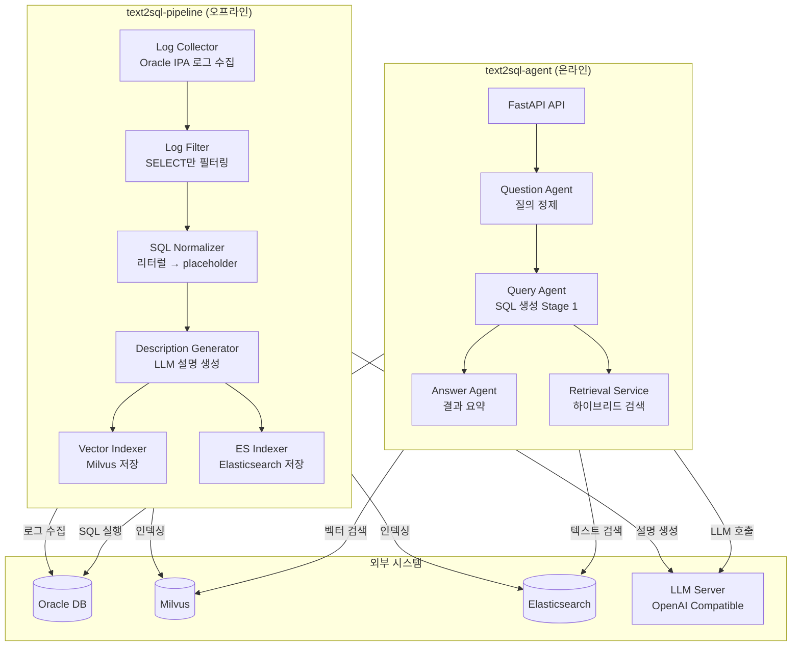

### 1.2 데이터 흐름

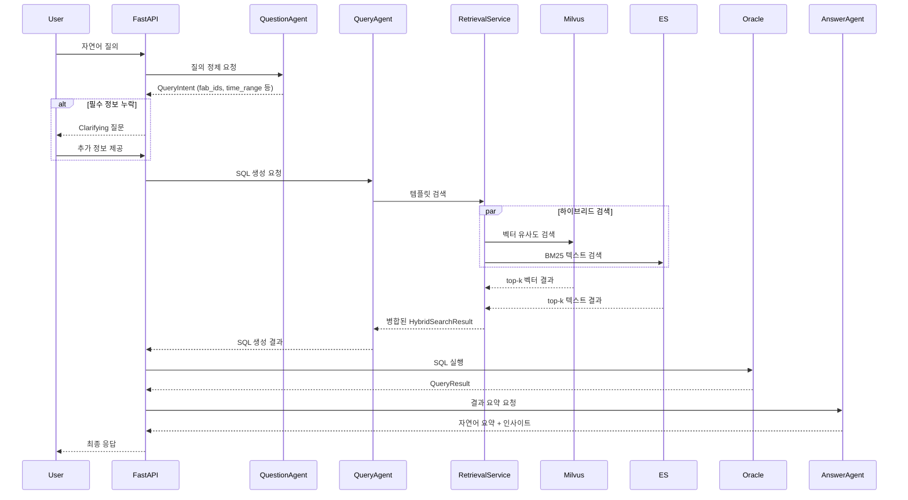

---

## 2. 발견된 개선점

### 2.1 구조적 문제점

#### 🔴 P1 (Critical): 모델 중복 및 불일치

| 영역 | text2sql-pipeline | text2sql-agent | 문제점 |
|------|-------------------|----------------|--------|
| SQLTemplate | `dataclass` 기반 | `Pydantic BaseModel` 기반 | 동일 개념의 다른 구현 |
| 설정 관리 | `TEXT2SQL_` prefix | 각각 다른 prefix (`LLM_`, `MILVUS_` 등) | 환경변수 혼란 |
| 임베딩 차원 | 하드코딩 없음 | 기본값 1536 (OpenAI) | 불일치 가능성 |

**현재 코드 비교:**

```python
# text2sql-pipeline/src/text2sql/core/models.py
@dataclass
class SQLTemplate:
    template_id: str
    template_text: str
    description: str
    tables: list[str]
    columns: list[str]
    embedding: Optional[list[float]] = None
    exec_count: int = 0

# text2sql-agent/src/text2sql/models/base.py
class SQLTemplate(BaseModel):
    id: str  # 다른 필드명!
    sql_template: str  # 다른 필드명!
    sql_normalized: str
    tables: list[str] = Field(default_factory=list)
    columns: list[str] = Field(default_factory=list)
    description: str
    domain_tags: list[str] = Field(default_factory=list)
    exec_count: int = Field(default=0)
    created_at: datetime = Field(default_factory=datetime.now)
```

#### 🟠 P2 (High): 공통 코드 미분리

두 프로젝트에서 중복되는 코드:
- 임베딩 서비스 클라이언트
- Milvus/ES 어댑터
- 설정 로딩 로직
- 로깅 설정

#### 🟡 P3 (Medium): Stage 2 미구현

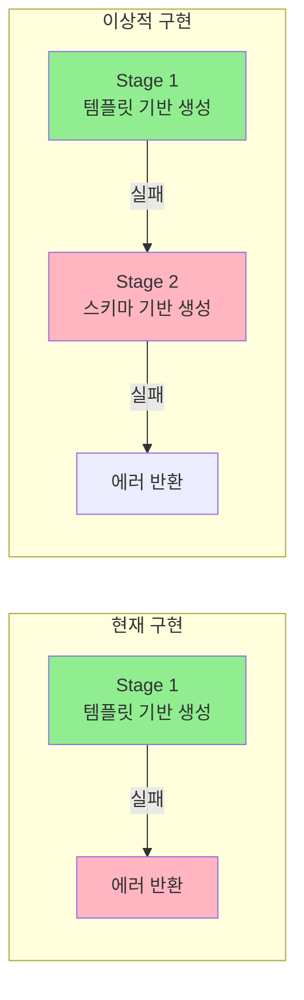

---

### 2.2 아키텍처 개선안

#### 개선된 모노레포 구조 제안

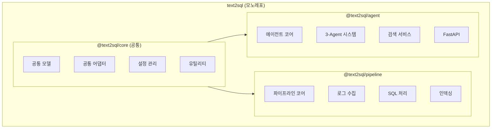

**권장 디렉토리 구조:**

```
text2sql/
├── packages/
│   ├── core/                    # 공통 패키지
│   │   ├── src/text2sql_core/
│   │   │   ├── models/          # 통합된 도메인 모델
│   │   │   ├── adapters/        # DB/Vector/LLM 어댑터
│   │   │   ├── config.py        # 통합 설정
│   │   │   └── protocols.py     # 인터페이스 정의
│   │   ├── pyproject.toml
│   │   └── tests/
│   │
│   ├── pipeline/                # 오프라인 파이프라인
│   │   ├── src/text2sql_pipeline/
│   │   │   ├── ingestor/
│   │   │   ├── processor/
│   │   │   └── indexer/
│   │   └── pyproject.toml
│   │
│   └── agent/                   # 온라인 에이전트
│       ├── src/text2sql_agent/
│       │   ├── agents/
│       │   ├── services/
│       │   └── api/
│       └── pyproject.toml
│
├── pyproject.toml               # 워크스페이스 루트
├── .env.example
└── docker-compose.yml
```

---

### 2.3 세부 개선 항목

#### 2.3.1 모델 통합

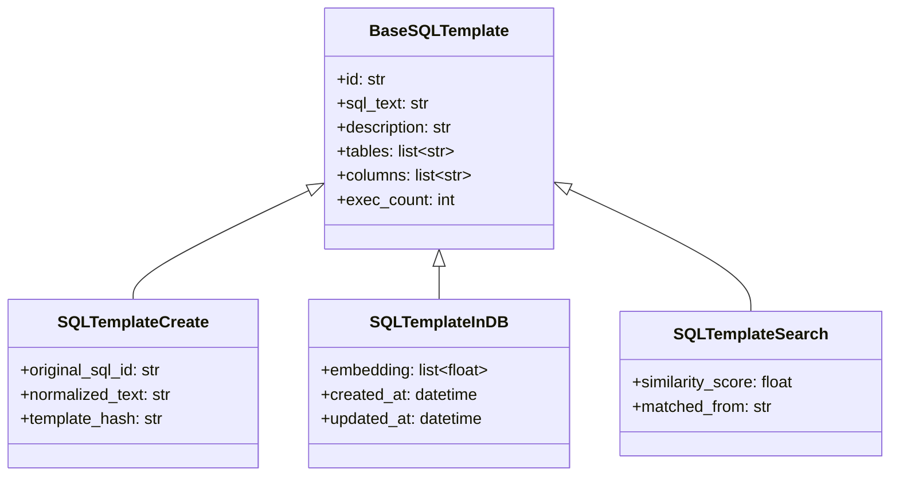

#### 2.3.2 설정 통합

```python
# 권장 설정 구조
class UnifiedSettings(BaseSettings):
    """통합 설정 - 모든 프로젝트에서 공유"""
    
    model_config = SettingsConfigDict(
        env_prefix="TEXT2SQL_",  # 통일된 prefix
        env_nested_delimiter="__",
        env_file=".env",
    )
    
    # 공통 설정
    environment: str = "dev"
    debug: bool = True
    
    # 외부 시스템
    oracle: OracleSettings
    milvus: MilvusSettings
    elasticsearch: ElasticsearchSettings
    llm: LLMSettings
    embedding: EmbeddingSettings
    
    # 에이전트 전용
    agent: AgentSettings | None = None
    
    # 파이프라인 전용
    pipeline: PipelineSettings | None = None
```

#### 2.3.3 에러 핸들링 강화

현재 문제점:
- 일반 `Exception` 사용이 많음
- 에러 컨텍스트 부족
- 재시도 로직 미비

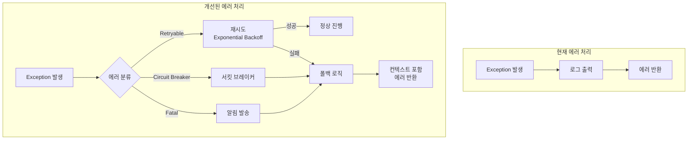

#### 2.3.4 테스트 전략 강화

| 현재 상태 | 개선 방향 |
|----------|----------|
| 단위 테스트만 존재 | 통합 테스트 + E2E 테스트 추가 |
| 외부 의존성 Mock만 사용 | Testcontainers로 실제 인프라 테스트 |
| 피처 플래그 없음 | 점진적 배포를 위한 피처 플래그 도입 |

```python
# 권장: Testcontainers 기반 통합 테스트
@pytest.fixture(scope="session")
def milvus_container():
    with MilvusContainer() as container:
        yield container

@pytest.fixture(scope="session") 
def es_container():
    with ElasticsearchContainer() as container:
        yield container

async def test_hybrid_search_real_infra(milvus_container, es_container):
    """실제 인프라 기반 하이브리드 검색 테스트"""
    # ...
```

---

## 3. 의존성 개선

### 3.1 버전 불일치 해결

| 패키지 | pipeline 버전 | agent 버전 | 권장 버전 |
|--------|--------------|------------|----------|
| pydantic | >=2.0.0 | >=2.0.0 | ^2.5.0 |
| langchain-openai | >=1.0.0 | >=0.3.0 | ^1.2.0 |
| pytest-asyncio | >=0.23.0 | >=0.21.0 | ^0.23.0 |

### 3.2 누락된 의존성 추가 권장

```toml
[project.dependencies]
# 모니터링
prometheus-client = "^0.19.0"
opentelemetry-api = "^1.22.0"
opentelemetry-sdk = "^1.22.0"

# 서킷 브레이커
tenacity = "^8.2.0"

# 구조화된 로깅
structlog = "^24.1.0"

# 비동기 작업
celery = "^5.3.0"  # 파이프라인 백그라운드 작업용
redis = "^5.0.0"
```

---

## 4. 성능 최적화

### 4.1 임베딩 캐싱

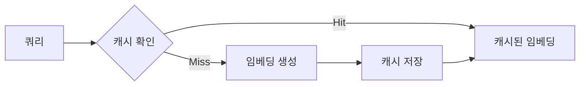

```python
# 권장 구현
class CachedEmbeddingService:
    def __init__(self, embedding_service, redis_client):
        self._service = embedding_service
        self._cache = redis_client
        self._ttl = 3600 * 24  # 24시간
    
    async def embed(self, text: str) -> list[float]:
        cache_key = f"embed:{hashlib.md5(text.encode()).hexdigest()}"
        
        if cached := await self._cache.get(cache_key):
            return json.loads(cached)
        
        embedding = await self._service.embed(text)
        await self._cache.setex(cache_key, self._ttl, json.dumps(embedding))
        return embedding
```

### 4.2 검색 병렬화 개선

현재 `RetrievalService.search_templates()`에서 순차 실행되는 부분을 개선:

```python
# 현재 (순차)
vector_results = await self._vector_store.search(query_vector, top_k=k * 2)
text_results = await self._search_engine.search(...)

# 개선 (병렬)
import asyncio

vector_task = self._vector_store.search(query_vector, top_k=k * 2)
text_task = self._search_engine.search(...)

vector_results, text_results = await asyncio.gather(
    vector_task, text_task,
    return_exceptions=True
)
```

### 4.3 배치 처리 개선

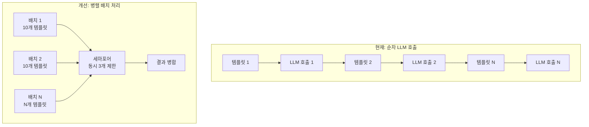

---

## 5. 보안 개선

### 5.1 SQL Injection 방지 강화

```python
# 현재 - 기본적인 키워드 검사만
def _validate_sql(self, sql: str) -> str | None:
    normalized = sql.strip().upper()
    if not normalized.startswith("SELECT"):
        return "SELECT 쿼리만 생성할 수 있습니다."
    # ...

# 개선 - 파싱 기반 검증
from sqlparse import parse as sql_parse

def _validate_sql(self, sql: str) -> str | None:
    try:
        parsed = sql_parse(sql)
        if len(parsed) != 1:
            return "단일 SQL 문만 허용됩니다."
        
        stmt = parsed[0]
        if stmt.get_type() != "SELECT":
            return "SELECT 쿼리만 생성할 수 있습니다."
        
        # 서브쿼리 내 위험 키워드 검사
        tokens = stmt.flatten()
        # ...
    except Exception as e:
        return f"SQL 파싱 실패: {e}"
```

### 5.2 비밀 정보 관리

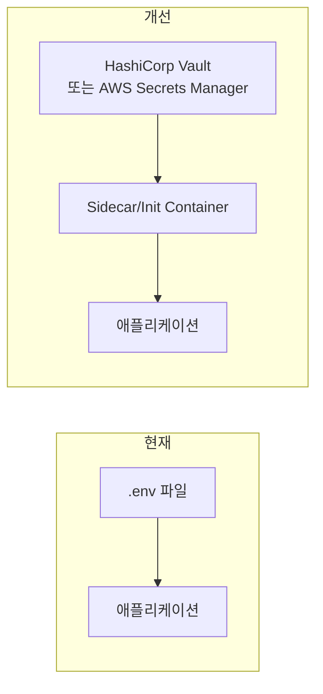

### 5.3 Rate Limiting

A2A 설정에 rate_limit이 있지만 실제 구현이 필요:

```python
from fastapi import Request
from slowapi import Limiter
from slowapi.util import get_remote_address

limiter = Limiter(key_func=get_remote_address)

@router.post("/query")
@limiter.limit("10/minute")  # 분당 10회 제한
async def process_query(request: Request, ...):
    ...
```

---

## 6. 관측성 (Observability) 개선

### 6.1 분산 트레이싱

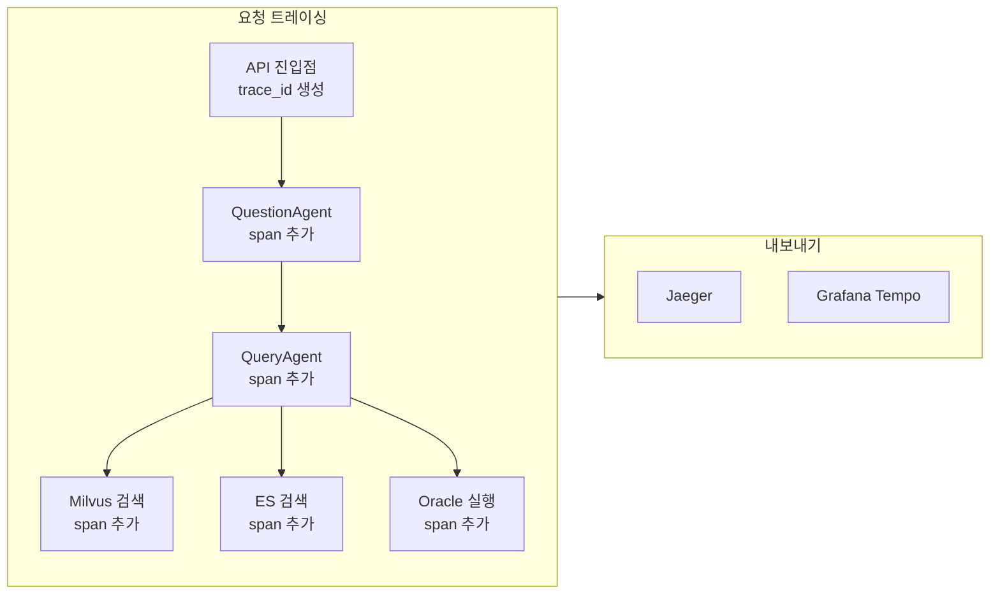

### 6.2 메트릭 수집

```python
from prometheus_client import Counter, Histogram, Gauge

# 비즈니스 메트릭
query_total = Counter(
    "text2sql_query_total",
    "총 쿼리 수",
    ["status", "stage"]
)

query_latency = Histogram(
    "text2sql_query_latency_seconds",
    "쿼리 처리 시간",
    ["stage"],
    buckets=[0.1, 0.5, 1.0, 2.0, 5.0, 10.0]
)

template_cache_hit = Gauge(
    "text2sql_template_cache_hit_ratio",
    "템플릿 캐시 히트율"
)
```

---

## 7. 우선순위별 액션 플랜

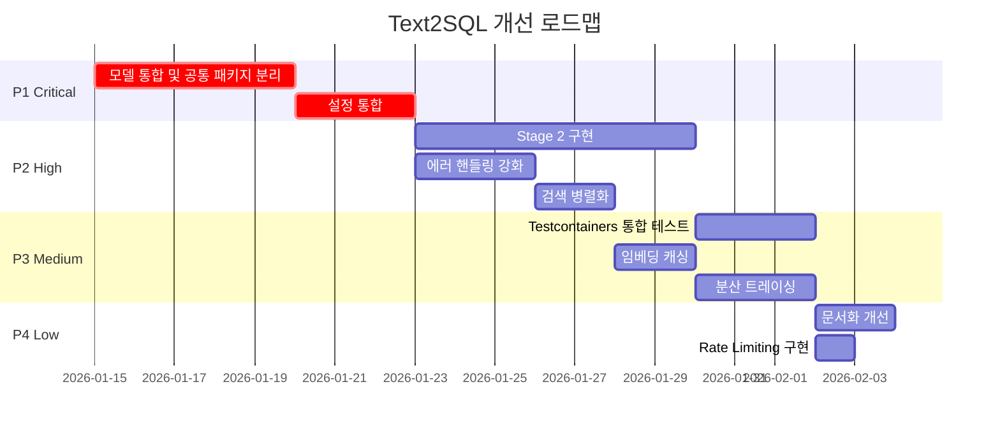

---

## 8. 결론 및 요약

### 8.1 핵심 개선 포인트

| 우선순위 | 영역 | 현재 상태 | 개선 방향 | 예상 효과 |
|---------|------|----------|----------|----------|
| 🔴 P1 | 모델 통합 | 2개 프로젝트에 중복 | 공통 core 패키지 분리 | 유지보수성 50% ↑ |
| 🔴 P1 | 설정 관리 | prefix 불일치 | 통합 설정 체계 | 배포 복잡도 ↓ |
| 🟠 P2 | Stage 2 | 미구현 | 스키마 기반 SQL 생성 | 성공률 30% ↑ |
| 🟠 P2 | 병렬 검색 | 순차 실행 | asyncio.gather 활용 | 검색 속도 40% ↑ |
| 🟡 P3 | 캐싱 | 없음 | Redis 임베딩 캐시 | LLM 비용 20% ↓ |
| 🟡 P3 | 테스트 | Mock only | Testcontainers | 품질 신뢰도 ↑ |

### 8.2 예상 ROI

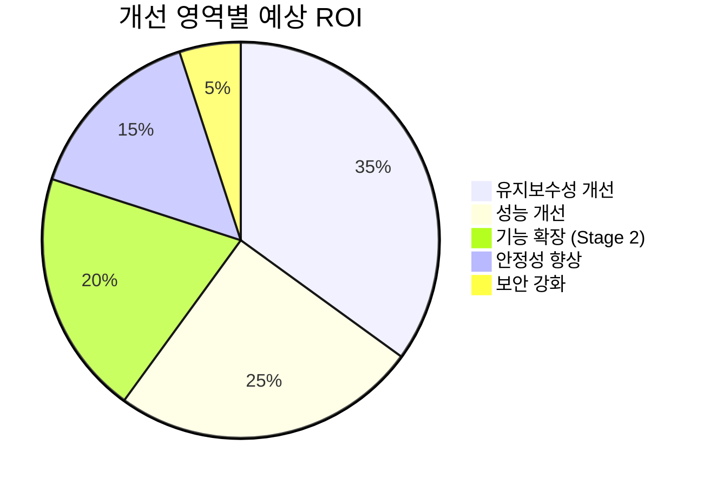

### 8.3 즉시 실행 가능한 Quick Wins

1. **검색 병렬화**: `asyncio.gather` 적용 (1시간 소요)
2. **SQL 검증 강화**: `sqlparse` 도입 (2시간 소요)
3. **로깅 개선**: `structlog` 도입 (3시간 소요)
4. **헬스체크 개선**: 각 컴포넌트 상세 상태 반환 (1시간 소요)

---

## 부록: 참고 자료

- [LangChain Agent Documentation](https://python.langchain.com/docs/agents/)
- [Milvus Best Practices](https://milvus.io/docs/performance_faq.md)
- [FastAPI Best Practices](https://fastapi.tiangolo.com/tutorial/best-practices/)
- [Pydantic Settings Management](https://docs.pydantic.dev/latest/concepts/pydantic_settings/)
